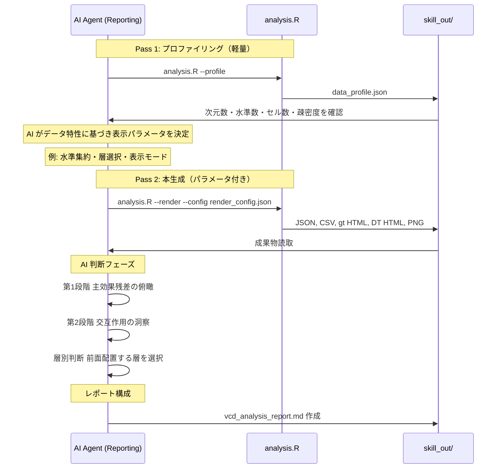

# ワークフロー（2パス方式）

このスキルはデータ特性に応じた最適な可視化を行うため、以下の2パス方式を採用しています。

```mermaid
sequenceDiagram
    participant AI as AI Agent (Reporting)
    participant R as analysis.R
    participant Out as skill_out/

    Note over AI,R: Pass 1: プロファイリング（軽量）
    AI->>R: analysis.R --profile
    R->>Out: data_profile.json
    Out->>AI: 次元数・水準数・セル数・疎密度を確認

    Note over AI: AI がデータ特性に基づき表示パラメータを決定
    Note over AI: 例: 水準集約・層選択・表示モード

    Note over AI,R: Pass 2: 本生成（パラメータ付き）
    AI->>R: analysis.R --render --config render_config.json
    R->>Out: JSON, CSV, gt HTML, DT HTML, PNG
    Out->>AI: 成果物読取

    Note over AI: AI 判断フェーズ
    AI->>AI: 第1段階 主効果残差の俯瞰
    AI->>AI: 第2段階 交互作用の洞察
    AI->>AI: 層別判断 前面配置する層を選択

    Note over AI: レポート構成
    AI->>Out: vcd_analysis_report.md 作成
```