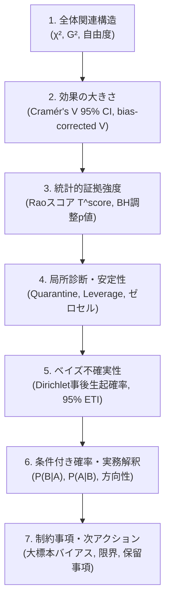

# AI Narrative ガイドライン — 7ステップ考察契約

本ドキュメントは、vcd-categorical-analysis v4.0 における Pass 2 AI Narrative（`executive_summary.md`）の作成順序および禁止事項を規定する。

---

## 7ステップ標準考察順序（必須）

エージェントは必ず以下の順序で考察を記述し、P値単独判定や断定的な過大解釈を行ってはならない。

### ステップ 1: 全体関連構造（Global Association）

- Pearson $\chi^2$ 統計量、尤度比 Deviance $G^2$、自由度、および全体 $p$ 値を報告する。
- 独立モデル全体の適合度・連関の有無を把握する。

### ステップ 2: 効果の大きさ（Effect Size & Confidence Intervals）

- 未補正 Cramér's $V$ と Bergsma (2013) bias-corrected $\tilde{V}$ の双方を報告する。
- 非心カイ二乗反転による 95% 信頼区間 `[lower, upper]` を示し、点推定値の不確実性を評価する。

### ステップ 3: 統計的証拠強度（Evidence Strength & Dual-Filter）

- 各セルの局所対数効果比 $\log(O/E)$ および Rao スコア検定統計量 $T^{\rm score}$ を確認する。
- 大標本（$N \ge 2000$）の場合、大標本 Dual-Filter 基準（$|\log(O/E)| \ge 0.50$ かつ $T^{\rm score} \ge 3.84$）を満たす候補セルにフォーカスする。小標本での過小検出や大標本での微小効果の過大解釈を防止する。

### ステップ 4: 局所診断と安定性（Quarantine & Leverage）

- 観測度数0（$O=0$）、期待度数小（$E < 5$）、高レバレッジ（$h \ge 0.80$）による Quarantine セルを確認し、候補から除外された理由を明記する。
- ゼロ観測セルは $\log(O/E) = -\infty$（未定義・負の無限大）であり、数値0として扱ってはならない。

### ステップ 5: 事後不確実性と信用区間（Bayesian Credible Intervals）

- 対称 Dirichlet 事前分布（$\alpha=1.0$）に基づく事後生起確率 $\pi_{ij}$ の 95% ETI（Equal-Tailed Interval）を報告する。
- 頻度論の点推定値とベイズ信用区間の幅を対比し、データの情報量を評価する。

### ステップ 6: 条件付き割合と実務的意味（Conditional Probabilities）

- 行条件付き確率 $P(B_j \mid A_i)$ および列条件付き確率 $P(A_i \mid B_j)$ の事後平均を示し、現場での意思決定に直結する比率（例: 治療群における改善率）として解説する。

### ステップ 7: 制約事項・解釈保留・次アクション（Limitations & Actions）

- 観察研究・実世界データ特有の選択バイアス、未測定交絡、サンプリング偏りを明記する。
- 3次元以上の交絡や層別解析が必要な場合は、正本スキル `vcd-bayesian-evidence-analysis` への移行を推奨する。

---

## 禁止事項（厳守）

1. **P値単独判定の禁止**: $p < 0.05$ のみをもって「有意な関連がある」「効果が大きい」と結論付けてはならない。
2. **ゼロセル対数比の0扱い禁止**: $O=0$ のセルを「対数比0（差なし）」と誤認してはならない（$-\infty$ であり完全隔離対象）。
3. **英語本文の禁止**: 専門用語・数式記号を除き、本文はすべて自然な日本語で作成する。
4. **残差符号の未確認解釈禁止**: 観測が期待より多いのか少ないのかの方向性を残差符号および $\log(O/E)$ で確認せずに論じてはならない。
