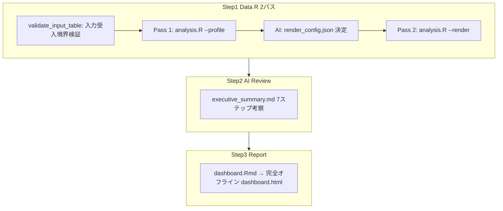
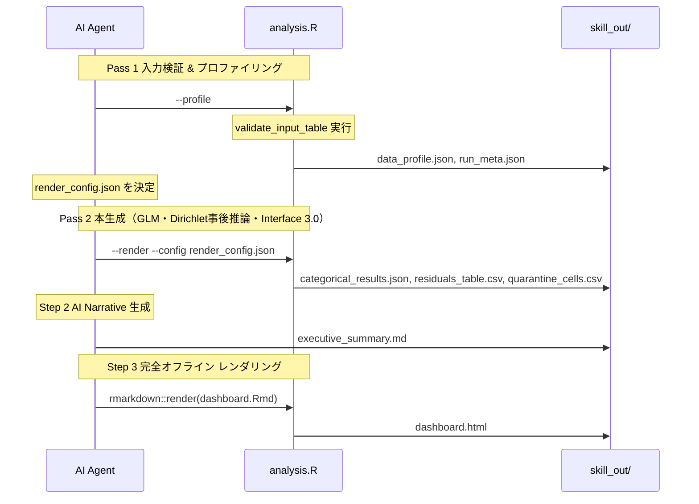

# ワークフロー（エージェント3ステップ + R 2パス）

## 入力受入境界と事前検証（Pass 0/入力ゲート）

1. **次元数（Arity）**: 厳密に2（$I \ge 2, J \ge 2$）。3次元以上の入力は即時フェイルファスト停止（`INVALID_INPUT_ARITY`）し、3次元正本スキル `vcd-bayesian-evidence-analysis` へ委譲案内を出力する。
2. **度数契約**: 総度数 $N = \sum n_{ij} > 0$、有限非負整数（整数の度数データのみ許容）。欠測、負値、非整数重み度数、無限大は即時停止（`INVALID_FREQUENCY_VALUES`）。
3. **構造的ゼロ（発生不能セル）の入力禁止**: 本エンジンは完全2次元名義分割表専用である。構造的ゼロ（不完全分割表・準独立モデル）が指定された場合は即時フェイルファスト停止（`STRUCTURAL_ZERO_NOT_SUPPORTED`）し、専用解析を案内する。観測度数0はすべてサンプリングゼロとして一貫して扱い、Quarantine（`ZERO_OBSERVED`）に分類する。

---

## 全体フロー

## Step 1 詳細（R 2パス）

## 非推奨・禁止事項

- 3次元データのサイレント集約や強引な2次元化処理。
- 構造的ゼロを観測ゼロと混同して準独立モデルを独立モデルとして誤推定すること。
- `vcd-categorical-reporting` を別スキルとして必須後続にしない（考察は本スキル Step 2 で完結）。
