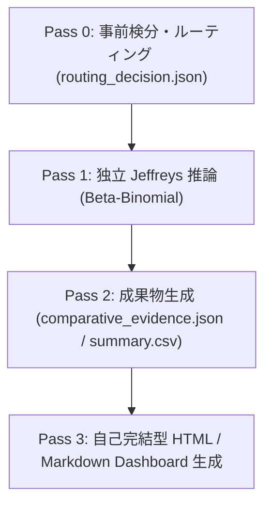

# VCD Categorical Reporting: Comparative Evidence Reporting (v3)

独立 2 群（または対照群 vs 各群）のカテゴリカル頻度データ、臨床安全性（Safety: SOC/PT）、リアルワールドデータ（RWD: 傷病名/処置）、処方集（Prescription）データを対象とし、Jeffreys 事前分布に基づく多項/二値ベイズ推論またはブートストラップ推論を用いて、**比較エビデンス報告（Comparative Evidence Reporting）**を自己完結型 HTML / Markdown ダッシュボードとして生成する。

---

## 鉄則（Iron Laws）

1. **推定値・区間の厳格分離**:
   - ベイズ推論では点推定値 `source: "posterior_median"`、区間 `method: "posterior_eti"`（等裾信用区間）を出力する。
   - ブートストラップ推論では `source: "observed_sample_estimate"`、`method: "bootstrap_percentile"` を出力する。
2. **解釈・ナラティブガード**:
   - **同等の誤認禁止**: 「統計的非有意（信頼区間・信用区間が 0 を跨ぐ）であることは、治療群間の同等性・非劣性を意味しない」旨を明記し、同等と断定してはならない。
   - **方向確率の因果過大解釈禁止**: 事後確率 $P(RD > 0)$ またはブートストラップ支持比率が 0.95 を超えても、未調整観察データにおいて因果的優越性を主張してはならない。
   - **探索的スクリーニング免責**: 多テーマ一括スクリーニング時は、家族ワイズ第1種過誤率（FWER）が制御されていない探索的スクリーニングである旨の免責事項を必須記載する。
3. **視覚エンコーディング契約**:
   - セルや行の背景色は、方向確率 $P(RD > 0)$ 単独で決定してはならない。実務領域（`target_excess`, `practical_neutral`, `reference_excess`）と U-grade（U0〜U3）の組み合わせによってのみ色調を付与する（`primary_delta` が設定されていない場合は色調ハイライトを無効化する）。
4. **完全自己完結型成果物（Zero-External-Asset 原則）**:
   - 生成される HTML は、外部 CDN（Google Fonts, DataTables CDN 等）やローカルの OS 絶対パス（`/Users/` 等）を一切含まない完全オフライン仕様とする。
5. **出力ディレクトリ規約**:
   - 出力先は `<out>/run_<first16>[_N]/`（推奨: `evidence_runs/vcd_categorical_reporting/run_<canonical_id>[_N]/`）とし、run ディレクトリ直下に完全隔離する。

---

## ワークフロー

### 1. 入力データと Pass 0 ルーティング

入力データは、Pass 0（`vcd-pass0-consultation`）により検証され、非整数カウントの排除、被験者重複診断、MedDRA バージョン確認を経た後にルーティング決定（`routing_decision.json`）を受け取ります。

### 2. コントラスト算出と出力成果物

本スキルは、以下の標準成果物を隔離 run ディレクトリ内に生成します：

- `comparative_evidence.json`: 構造化 JSON エビデンス
- `comparative_summary.csv`: 主要要約指標一覧 CSV
- `comparative_report.md`: 日本語エビデンス Markdown レポート
- `dashboard.html`: 自己完結型完全オフライン HTML ダッシュボード

---

## レガシー互換性

以前の 2 段階レガシーレポートテンプレート（`vcd_analysis_report.md` 等）は、`references/legacy_report_template.md` として保全されています。
