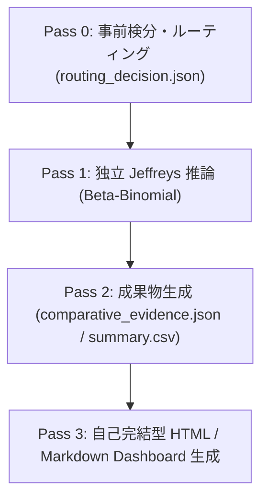

# VCD Categorical Reporting: Comparative Evidence Reporting (v3)

独立 2 群（または対照群 vs 各群）のカテゴリカル頻度データ、臨床安全性（Safety: SOC/PT）、リアルワールドデータ（RWD: 傷病名/処置）、処方集（Prescription）データを対象とし、Jeffreys 事前分布に基づく多項/二値ベイズ推論またはブートストラップ推論を用いて、**比較エビデンス報告（Comparative Evidence Reporting）**を自己完結型 HTML / Markdown ダッシュボードとして生成する。

---

## 鉄則（Iron Laws）

1. **推定値・区間の厳格分離**:
   - ベイズ推論では点推定値 `source: "posterior_median"`、区間 `method: "posterior_eti"`（等裾信用区間）を出力する。
   - ブートストラップ推論では `source: "observed_sample_estimate"`、`method: "bootstrap_percentile"` を出力する。
2. **解釈・ナラティブガード**:
   - **同等の誤認禁止**: 「統計的非有意（信頼区間・信用区間が 0 を跨ぐ）であることは、治療群間の同等性・非劣性を意味しない」旨を明記し、同等と断定してはならない。
   - **方向確率の因果過大解釈禁止**: 事後確率 $P(RD > 0)$ またはブートストラップ支持比率が 0.95 を超えても、未調整観察データにおいて因果的優越性を主張してはならない。
   - **探索的スクリーニング免責**: 多テーマ一括スクリーニング時は、家族ワイズ第1種過誤率（FWER）が制御されていない探索的スクリーニングである旨の免責事項を必須記載する。
3. **実務領域評価の実行条件**:
   - Safetyの新規比較解析では、登録済み方針`rare_ae_exploratory_v1`を自動適用する。既定値がない用途・領域は合意できるまでPass 0で止める。
4. **視覚エンコーディング契約**:
   - セルや行の背景色は、方向確率 $P(RD > 0)$ 単独で決定してはならない。実務領域（`target_excess`, `practical_neutral`, `reference_excess`）と U-grade（U0〜U3）の組み合わせによってのみ色調を付与する（利用者が評価省略を明示した例外実行では、未評価セルを無彩色にする）。
5. **完全自己完結型成果物（Zero-External-Asset 原則）**:
   - 生成される HTML は、外部 CDN（Google Fonts, DataTables CDN 等）やローカルの OS 絶対パス（`/Users/` 等）を一切含まない完全オフライン仕様とする。
6. **出力ディレクトリ規約**:
   - 出力先は `<out>/run_<first16>[_N]/`（推奨: `evidence_runs/vcd_categorical_reporting/run_<canonical_id>[_N]/`）とし、run ディレクトリ直下に完全隔離する。

---

## ワークフロー

```mermaid
flowchart TD
  p0["Pass 0: 事前検分・ルーティング (routing_decision.json)"] --> p1["Pass 1: 独立 Jeffreys 推論 (Beta-Binomial)"]
  p1 --> p2["Pass 2: 成果物生成 (comparative_evidence.json / summary.csv)"]
  p2 --> p3["Pass 3: 自己完結型 HTML / Markdown Dashboard 生成"]
```

### 1. 入力データと Pass 0 ルーティング

入力データは、Pass 0（`vcd-pass0-consultation`）により検証され、非整数カウントの排除、被験者重複診断、MedDRA バージョン確認を経た後にルーティング決定（`routing_decision.json`）を受け取ります。

### 実務領域評価の必須確認

本スキルで新規の比較解析を行う際は、実務領域・U-Gradeを評価することを標準とする。この実行条件は本スキルの運用規約であり、共通エンジンや他スキルにおける `none / null` の互換仕様を変更するものではない。コード・文書保守、既存成果物の読解、未評価表示の回帰テストは対象外とする。

1. **Pass 0で閾値を確定する**
   - 利用者と実務的な差の意味、閾値、単位、適用テーマを確認し、承認済みの設定JSONに `practical_difference.mode = "fixed_delta"`、`primary_delta`、`unit` を記録する。
   - Safety用途では承認済みの既定値 `primary_delta = 0.001`（割合尺度）と感度候補 `delta_thresholds = [0.0001, 0.0005, 0.001, 0.005]` を自動利用する。利用者指定値はそれを優先する。別用途やPT別閾値が必要で既定方針にない場合だけ確認する。データを見て閾値を選ばない。
   - 完了条件：適用した既定方針または利用者指定値が明確である。

2. **設定を検証し、計算引数へ明示的に搬送する**
   - 標準Safety実行では単一の有限な割合尺度 `0 < primary_delta <= 1` を必須とし、null・欠落・ゼロ・負数・非有限値・複数値を計算前に拒否する。設定JSONの `mode` は `fixed_delta` と整合させる。明示的な省略は `allow_unevaluated = TRUE` のみに限り、JSONと実行記録に例外理由を残す。
   - `unit = "proportion"` はそのまま、`per_100` は100で、`per_1000` は1000で割り、割合尺度に変換する。定義域の検証には共有の [`normalize_delta_value()`](../../shared/practical_difference_policy.R) を参照し、ゼロの拒否は本スキルで追加確認する。例えば100人あたり2人は `0.02` に相当するが、推奨既定値ではない。
   - 単位変換後の割合値を `generate_comparative_report(..., primary_delta = <割合尺度の値>)` に渡す。関数の引数省略時はSafety方針0.001が適用され、JSONの自動読込はしない。`delta_thresholds` は感度検討用であり、主閾値の代替ではない。
   - 元設定の値・単位、変換後の値、実際に渡した引数の対応と設定来歴を隔離run内に記録する。`routing_decision.json` の閾値が元設定と一致し、元設定の単位で正規化すると計算引数と一致することを確認する。routing JSONには単位が搬送されないため、元設定の `unit` を照合に用いる。共通の `validate_pass0_config()` は現状でゼロ・負数等を十分に拒否せず、mode矛盾の警告だけでは値が除去されないため、その成功だけを実行許可にしない。
   - 完了条件：承認済み設定から計算引数への対応が確認でき、設定矛盾や渡し忘れがない。

3. **最終成果物の提示前に評価結果を検査する**
   - `comparative_evidence.json` の全 `contrasts` で、`practical_region_support` と `resolution_grade` を確認する。標準実行では前者に承認済みの割合尺度 `primary_delta` が入り、後者の `grade` が U0〜U3、`dominant_region` が `target_excess` / `practical_neutral` / `reference_excess` であることを受入条件とする。
   - `evidence_overrides` を使う場合も各contrastの正本を検査する。描画関数の引数を指定しただけでは、既存overrideの `NONE` を評価済みに変更できない。評価を必要とするoverrideに閾値が適用されていない場合は、適切なデザインエンジンでの再計算について相談する。
   - 1件でも想定外の `NONE`、欠落、設定との不一致があれば、成功・完了と報告せず最終レポートの提示を停止する。生成済みの隔離runは保全し、該当contrastと原因を示してPass 0へ戻る。表示層でU-Gradeを補完しない。
   - 完了条件：全対象の評価結果と設定の整合を確認してから、HTML・Markdownを完成成果物として提示する。

**重篤事象レビュー**：重篤事象は共通閾値やU-Gradeにかかわらず別途レビューする。実務的中立を安全性保証と解釈しない。PT名だけで重篤性を分類しない。

**明示的な評価省略の例外**：利用者が実務領域評価の省略を明示した場合だけ、対象と理由を承認済み設定の `reporting_purpose` 等に記録し、`mode = "none"`、`primary_delta = null`、計算引数 `primary_delta = NULL`、`allow_unevaluated = TRUE` をそろえる。「解析して」という一般的な指示や既存JSONの `none` だけを省略の承認とみなさない。省略した対象では `NONE / none` と未評価理由を保持し、U3や実務的中立と区別する。全行未評価の結果は、評価省略を合意したレポートとしてのみ提示する。

### 2. コントラスト算出と出力成果物

本スキルは、以下の標準成果物を隔離 run ディレクトリ（`evidence_runs/vcd_categorical_reporting/run_<canonical_id>[_N]/`）内に生成します：

- `comparative_evidence.json`: 構造化 JSON エビデンス（top-level = `comparative-evidence-batch-v1`、`contrasts[*]` = `comparative-evidence-v1` 準拠）
- `comparative_summary.csv`: 主要要約指標一覧 CSV（6大概念列および全来歴列を保持）
- `comparative_report.md`: 日本語エビデンス Markdown レポート（`1.33 [N/A]` 等の統一样式）
- `dashboard.html`: 自己完結型完全オフライン HTML ダッシュボード（外部 CDN / 絶対パス 0 件）

### 3. 数理挙動契約と安全性集計規約

1. **参照群ゼロ発生時の確定契約 (Zero Reference Events)**:
   - 参照群のイベント発生数がゼロ（$x_R = 0$）の場合、相対リスク（RR）の理論的期待値は発散（$E(RR) = \infty$）します。
   - 点推定値（中央値）および 95% ETI は正しく報告しつつ、`mean = null`、`mean_is_finite = false`、`rr_diagnostic = "ZERO_REFERENCE_RISK"` を確定します。
   - レポート上には明確な数値的不安定性警告コールアウトを表示し、リスク差（RD）が主対比として健全に機能していることを案内します。
2. **多重比較スクリーニング免責 (Multiplicity Disclaimer)**:
   - 複数テーマ・多数の有害事象（PT）の一括スクリーニングにおいては、事後方向確率 $P(RD > 0)$ やランキングは探索的優先順位付けのための指標であり、ファミリーワイズ過誤率（FWER）や偽発見率（FDR）の厳格な制御を主張してはなりません。
3. **安全性データの重複排除規約 (Safety SOC/PT Invariant)**:
   - MedDRA 等の有害事象集計において、同一被験者が同一 SOC 内で複数の異なる PT を発症した場合、SOC レベルの件数は「当該 SOC を発現した被験者数」としてユニークに集約（Deduplicated）されます。
   - したがって、「SOC の症例数 $\ne$ 構成する各 PT の症例数の単純和」となることが仕様であり、整合性違反ではありません。

---

## レガシー互換性

以前の 2 段階レガシーレポートテンプレートは、[`references/report-template.md`](references/report-template.md) として保全されています。本スキルでの新規分析は、上記「比較エビデンス報告（v3）」を標準とします。
