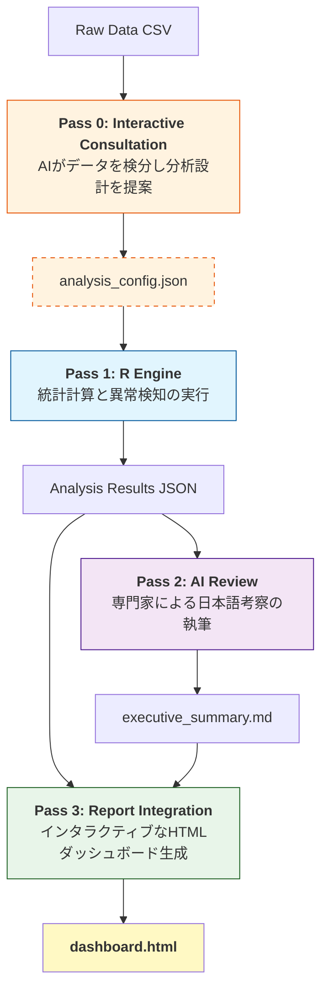

# agentic-evidence-analysis

[](LICENSE)
[](https://www.r-project.org/)

**AIエージェントおよびRユーザーのための、エビデンス駆動型カテゴリカルデータ分析スキルセット**

大標本データにおける「P値の罠」を克服し、ベイズ因子、エビデンススコア、効果量を用いて「統計的有意性」と「実質的意義」を峻別する分析パイプラインを提供します。

---

## これは何？

サンプルサイズが非常に大きい場合（N > 5,000）、従来のカイ二乗検定（P値）では、実務的に無視できるほど微小な偏りであってもすべて「統計的に有意」と判定されてしまいます。これは**P値の飽和問題**と呼ばれます。

本ツールキットは、AIエージェント（Antigravity, Cursor, Gemini CLI等）やRユーザーが、以下の指標に基づいて真に注目すべきエビデンスを抽出するための「スキル」と「スクリプト」を提供します。

| 指標 | 数式 | 意味 |
|---|---|---|
| **Evidence Score** | r² − k·log(N) > 0 | セル単位の逸脱が、統計的ノイズ（BICペナルティ）を超えているか |
| **Bayes Factor (BF₁₀)** | EBIC/BIC 近似 | 独立モデル（関連なし）に対する、飽和モデル（関連あり）の尤もらしさ |
| **Cramér's V / Fei** | 効果量 | 関連性の実質的な強さ（0〜1） |

---

## 4-Pass 分析パイプライン

本ツールキットは、以下の 4 ステップ（Pass）で分析を完結させます。



1. **Pass 0**: AIがデータの水準数や度数を事前に検分し、次元削減（変数の絞り込み）や層別解析をユーザーに提案。Pass 1 の入力を固定するための **`analysis_config.json`** を作成します。
2. **Pass 1**: Rスクリプトがベイズ因子、エビデンススコア、標準化残差を計算。`--config` 引数で Pass 0 の設定を読み込み、中間成果物（JSON）を出力します。
3. **Pass 2**: AIが中間成果物を読み解き、背景知識を交えた日本語のエグゼクティブ・サマリー (`executive_summary.md`) を執筆します。
4. **Pass 3**: RMarkdownが統計数値とAI考察を統合し、インタラクティブ・ダッシュボード (`dashboard.html`) を生成します。

---

## スキル一覧 (AI Agent Skills)

| スキル名 | 役割 |
|---|---|
| **vcd-pass0-consultation** | **【New】** データ検分、次元削減、層別解析の提案。分析の「次の一手」をガイド。 |
| **vcd-bayesian-evidence-analysis** | **【主力】** ベイズ因子と Evidence Score による多次元エビデンス分析。 |
| **vcd-categorical-analysis** | 名義カテゴリの独立性検定、残差分析、モザイクプロット生成。 |
| **questionnaire-batch-analysis** | アンケート集計。複数設問の設定に基づき、ダッシュボードを自動量産。 |
| **vcd-categorical-reporting** | 成果物を読み取り、意思決定者向けの「判断ファースト」レポートを作成。 |

各スキルには詳細な `SKILL.md` があり、エージェントが自律的に手順を参照します。

---

## クイックスタート

### AIエージェント（Gemini CLI / Cursor 等）で使う

プロジェクトのルートに `.agent/` ディレクトリをコピーし、以下のように依頼してください。

> 「`data.csv` を分析したい。まずは `vcd-pass0-consultation` スキルでデータの性質を調べて、分析の軸を提案して。」

### Rユーザーとして使う（手動実行）

```bash
# Pass 0: データの検分
Rscript .agent/shared/inspect_data.R examples/titanic.csv

# Pass 1: 統計計算（Pass 0が生成したconfigを使用）
Rscript .agent/skills/vcd-bayesian-evidence-analysis/templates/analysis.R \
  --config output/titanic/run_v1/analysis_config.json
```

**出力ディレクトリの形**はスキルごとに異なります。`vcd-bayesian-evidence-analysis` は `--output_dir` 直下に `run_<run_idの先頭16文字>/` を作ります（`runs/<id>/` ではありません）。`vcd-categorical-analysis` や `questionnaire-batch-analysis` は `--run-id` 利用時に `runs/<id>/` 配下にまとまります。詳細は各スキルの `.agent/skills/.../SKILL.md` を参照してください。

---

## English Description

**Evidence-driven categorical data analysis skills for AI coding agents and R users.**

This toolkit provides a set of **AI agent skills** and **R-based analysis pipelines** to overcome the "P-value trap" in large-sample data (N > 5,000). It replaces traditional significance testing with Bayes Factors, Evidence Scores, and effect sizes.

### 4-Pass Pipeline
1. **Pass 0 (Consultation)**: AI proposes analysis design based on data inspection.
2. **Pass 1 (Computation)**: R engine computes Bayes Factors and Evidence Scores.
3. **Pass 2 (Insight)**: AI writes an expert narrative from results.
4. **Pass 3 (Reporting)**: RMarkdown renders an interactive HTML dashboard.

### Core Metrics
- **Evidence Score**: `r² − k·log(N)`. Positive values indicate substantive evidence beyond noise.
- **Bayes Factor (BF₁₀)**: Quantifies strength of evidence for association.
- **Cramér's V**: Measures practical strength of association (0 to 1).

---

## 統計リファレンス (Evidence Criteria)

| 指標 | 閾値 | 解釈 |
|---|---|---|
| **Evidence Score** | > 0 | 実質的エビデンス（BICペナルティを上回る逸脱） |
| **BF₁₀** | > 100 | 決定的エビデンス (Decisive) |
| **BF₁₀** | 30–100 | 極めて強いエビデンス |
| **BF₁₀** | 10–30 | 強いエビデンス |
| **Cramér's V** | > 0.5 | 非常に強い関連 |
| **Cramér's V** | > 0.3 | 中程度の関連 |

詳細な数学的定義については [docs/reference/](docs/reference/) を参照してください。

---

## ライセンス

[MIT](LICENSE)
