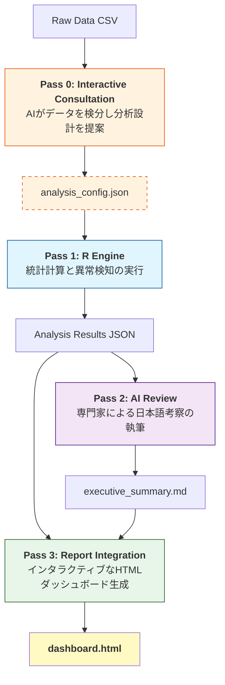

# agentic-evidence-analysis

[](LICENSE)
[](https://www.r-project.org/)

**AIエージェントおよびRユーザーのための、エビデンス駆動型カテゴリカルデータ分析スキルセット**  
*Evidence-Driven Categorical Data Analysis Skills for AI Agents & R Users.*

大標本データ（RWD、臨床・疫学データ、アンケート等）における「P値の罠」を克服し、4軸セル診断（Effect × Evidence × Influence × Stability）、Leverage補正局所Score統計量、明示式BIC、および全体効果量を用いて「統計的有意性」と「実質的意義」を峻別する分析パイプラインを提供します。

---

## 背景：なぜエビデンス駆動なのか？

サンプルサイズが非常に大きい場合（$N > 2,000$）、従来のカイ二乗検定（P値）では、実務的に無視できるほど微小な偏りであってもすべて「統計的に有意（$p < 0.001$）」と判定されてしまいます（**P値の飽和問題**）。

2016年のアメリカ統計学会（ASA）「P値に関する声明」に基づき、本ツールキットは以下の原則を実装しています：

1. **P値は仮説とデータの矛盾度を示すにすぎない**: 効果の大きさや研究の重要性を証明しない。
2. **$p < 0.05$ の二択評価を廃止する**: 思考停止の有意・非有意判定を行わない。
3. **効果量・信頼区間・モデル尤度を併用する**: 「差の大きさ」と「証拠の強さ」を峻別する。

---

## 4-Pass 分析パイプライン

本ツールキットは、AIエージェントと統計スクリプトが協調する 4 ステップ（Pass）で分析を実行します。


```mermaid
graph TD
  Data[Raw Data CSV] --> P0["<b>Pass 0: Interactive Consultation</b><br/>AIがデータを検分し分析設計を提案"]
  P0 --> CFG[analysis_config.json]
  CFG --> P1["<b>Pass 1: R Engine</b><br/>統計計算と異常検知の実行"]
  P1 --> JSON[Analysis Results JSON]
  JSON --> P2["<b>Pass 2: AI Review</b><br/>専門家による日本語考察の執筆"]
  P2 --> MD[executive_summary.md]
  JSON & MD --> P3["<b>Pass 3: Report Integration</b><br/>インタラクティブなHTMLダッシュボード生成"]
  P3 --> HTML[dashboard.html]

  style P0 fill:#fff3e0,stroke:#e65100
  style CFG fill:#fff3e0,stroke:#e65100,stroke-dasharray: 5 5
  style P1 fill:#e1f5fe,stroke:#01579b
  style P2 fill:#f3e5f5,stroke:#4a148c
  style P3 fill:#e8f5e9,stroke:#1b5e20
  style HTML font-weight:bold,fill:#fff9c4
```

1. **Pass 0 (Interactive Consultation)**: AIがデータの水準数や度数を事前に検分し、次元削減（変数の絞り込み）や層別解析をユーザーに提案。Pass 1 の入力を固定する **`analysis_config.json`** を作成します。
2. **Pass 1 (R Engine Computation)**: Rスクリプトがベイズ因子、エビデンススコア、標準化残差を計算。`--config` 引数で Pass 0 の設定を読み込み、中間成果物（JSON）を出力します。
3. **Pass 2 (AI Review & Narrative)**: AIが専門コンサルタントとして中間成果物を読み解き、背景知識を交えた日本語のエグゼクティブ・サマリー (`executive_summary.md`) を執筆します。必要に応じて `quality_check.md` で解釈保留や図表整合を確認します。
4. **Pass 3 (Report Integration)**: RMarkdownが統計数値とAI考察を統合し、インタラクティブ・ダッシュボード (`dashboard.html`) を生成します。

---

## 利用者向け標準出力構造

新しい分析では、最初に `output/<project>/` を開いてください。ここを分析プロジェクトの案内所とし、Pass 0 の相談記録と各 Skill の正式 run を同じプロジェクト単位で追跡します。

```text
output/<project>/
├── README.md
├── 00_consultation/
│   ├── inspection_results.json
│   ├── data_analysis_scope.md
│   └── analysis_config.json
├── 10_bayesian/
│   └── run_<id>/
├── 10_categorical/
│   └── run_<id>/
└── 10_questionnaire/
    └── runs/<id>/
```

| 場所 | 役割 | 最初に確認するファイル |
|---|---|---|
| `00_consultation/` | Pass 0 の検分・分析設計・設定 | `inspection_results.json`, `data_analysis_scope.md`, `analysis_config.json` |
| `10_bayesian/run_<id>/` | Bayesian の正式 run | `run_handover.json`, `evidence_results.json`, `dashboard.html` |
| `10_categorical/run_<id>/` | Categorical の正式 run | `run_handover.json`, `categorical_results.json`, `dashboard.html` |
| `10_questionnaire/runs/<id>/` | Questionnaire の正式 run | `run_handover.json`, `summary.csv`, `dashboard.html` |

初学者は `run_handover.json` に記載された `run_output_dir` を次の工程の入力として使い、`run_<id>` の名前を手作業で推測しません。大学院生・研究者は、`data_analysis_scope.md` と `analysis_config.json` を分析計画、`run_meta.json` と `results_manifest.json` を再現性・監査証跡として確認してください。

各 Skill の既定値である `skill_out/` は、既存 run と後方互換のために残ります。`analysis_config.json` の `output_dir` を指定した場合は、その値が正式 run の親ディレクトリになります。`docs/Artifacts/` は計画・設計・検証文書の保存先であり、統計計算成果物の保存先ではありません。

---

## スキル一覧 (AI Agent Skills)

本リポジトリで提供されるスキル一覧です（`.agents/skills/` に配置）：

| スキル名 | 種別 | 主な役割 |
|---|---|---|
| **vcd-pass0-consultation** | 事前相談 | データ検分、次元削減、層別解析の提案。分析の「次の一手」をガイド。 |
| **vcd-bayesian-evidence-analysis** | 主力解析 | 4軸セル診断（Effect/Evidence/Influence/Stability）と明示式BICによる多次元エビデンス分析。 |
| **vcd-categorical-analysis** | 名義解析 | 名義カテゴリ分析。R 2パス・executive_summary・quality_check・ダッシュボード生成。 |
| **questionnaire-batch-analysis** | バッチ処理 | アンケート集計。複数設問の設定に基づき、ダッシュボードを自動量産。 |
| **vcd-categorical-reporting** | 参照用 | （レガシー参照用テンプレート。新規は `vcd-categorical-analysis` を推奨） |

---

## エビデンス判定基準 (Evidence Criteria: 4軸フレームワーク)

大標本データにおける関連性と実質的意義を、標本サイズ $N$ の影響を峻別する以下の **4軸独立フレームワーク（Effect × Evidence × Influence × Stability）** で評価します：

| 評価軸 | 主要指標 | 数式 / 定義 | 判定基準・解釈 | 大標本（$N$増大時）の挙動 |
|---|---|---|---|---|
| **Effect（実質的効果量）** | **局所効果比**<br/>**標準化差**<br/>**全体効果量** | $\log(O_i / E_i)$<br/>$e_i = \frac{y_i - \hat{\mu}_i}{\sqrt{\hat{\mu}_i \cdot N}}$<br/>Cramér's V / Fei | $> 0$ (過剰), $< 0$ (過少)<br/>実務的乖離の大きさ<br/>$> 0.1$ (実質的有意), $> 0.5$ (大効果) | **標本サイズ $N$ に 100% 不変**。<br/>実務的・臨床的有意性の主判定。 |
| **Evidence（証拠強度）** | **Leverage補正局所Score**<br/>**モデル間明示式BIC**<br/>**局所対数P値** | $T_i^{\rm score} = \frac{r_{P,i}^2}{1 - h_{ii}}$<br/>$\Delta\mathrm{BIC} = \Delta G^2 - \Delta df \cdot \ln N$<br/>$\ln p$ (upper tail) | 自由度1のカイ二乗値（局所LRT $\Delta G_i^2$ の二次近似）<br/>$> 10$ (強い証拠), $> 100$ (決定的)<br/>アンダーフロー防止した正確な有意度 | **標本数 $N$ に比例して増大**。<br/>統計的有意性の判定。 |
| **Influence（構造影響度）** | **Leverage (梃子力)** | $h_{ii} = \text{hatvalues}(fit)$ | モデル適合を左右するセルの制約度（0〜1） | 分割表配置と周辺和で定まり、**$N$ に不変**。 |
| **Stability（数値的安定性）** | **診断ステータス** | ゼロセル、$\hat{\mu} < 5$、境界推定 | `REGULAR` (正常) / `QUARANTINED` (隔離) | 標本サイズ増大に伴い推定安定。 |

> [!NOTE]
> **旧セルScore（$r_i^2 - k \cdot \log(N)$）の廃止について**:  
> 従来の旧セルScoreは、局所ダミー再適合による尤度比統計量 $\Delta G_i^2$ と大きく乖離し、また標本サイズ $N$ の増大に伴って全セルが正値化する「エビデンス飽和」を引き起こすため、**非推奨・廃止**としました。セル診断は上記 4軸体系に基づき、標本数に不変な Effect（効果量）を最優先として解釈します。

> 数学的定義および統計モデルの詳細は [docs/Archives/archived_summary_002_0908.md](docs/Archives/archived_summary_002_0908.md) を参照してください。

---

## クイックスタート

### 動作環境要件
- **R**: >= 4.0 (`vcd`, `gnm`, `rmarkdown` 等の関連パッケージ)
- **Pandoc**: HTMLダッシュボード生成に必要

### 1. AIエージェントで使う（推奨）
Agent Skills 対応のCLIやエディタ（Antigravity, Cursor, Gemini CLI等）からスキルをインストールします：

```bash
npx skills add syrius2000/agentic-evidence-analysis
```

導入後、エージェントに対話形式で依頼します：

> 「`data.csv` を分析したい。まずは `vcd-pass0-consultation` スキルでデータの性質を調べて、分析の軸を提案して。」

### 2. Rスクリプトとして手動実行する

```bash
# Pass 0: データの検分
Rscript .agents/shared/inspect_data.R examples/titanic.csv \
  --out-dir output/titanic/00_consultation/

# Pass 1: 統計計算（Pass 0で生成された analysis_config.json を指定）
Rscript .agents/skills/vcd-bayesian-evidence-analysis/templates/analysis.R \
  --config output/titanic/00_consultation/analysis_config.json
```

`analysis_config.json` を Pass 0 の確定CLIで作成するときは、Bayesian なら `output/titanic/10_bayesian/`、Categorical なら `output/titanic/10_categorical/`、Questionnaire なら `output/titanic/10_questionnaire/` を `--output-dir` に指定します。

`--out-dir=`、`--out-dir ""`、空の第2位置引数など、空のout-dirは拒否され、ファイルシステムのrootへは書き込みません。

**出力ディレクトリ規則**:
- `vcd-bayesian-evidence-analysis`: `output/<project>/10_bayesian/run_<first16>[_N]/` を標準例とし、実装上は指定した out root 直下に作成。
- `vcd-categorical-analysis`: `output/<project>/10_categorical/run_<first16>[_N]/` を標準例とし、run ID未指定時はJST日時、衝突時はsuffixを付与。
- `questionnaire-batch-analysis`: `output/<project>/10_questionnaire/runs/<id>[_N]/` を標準例とし、run ID未指定時はJST日時を使う。
- いずれも正式な次工程のパスは、Pass 1 が生成する `run_handover.json` から取得する。

実装上の共通契約は、Bayesian/Categorical では `<out>/run_<first16>[_N]/`、Questionnaire では `<out>/runs/<id>[_N]/` です。

---

## リポジトリ管理方針 & アーキテクチャ

- **統計分析の正本リポジトリ**: この `agentic-evidence-analysis` リポジトリを、同名5スキル、統計schema、統計品質契約、Rテンプレート、統計回帰テストの唯一の正本とします。
- **他リポジトリとの責務分離**:
  - `Productivity-Skill`: 一般コード・SQLコード理解を担当します。
  - `rwd-mysql-skill-toolkit`: RWD/DB実行・統合ハブを担当します。
  - DB/SQL/Python実行補助をこのリポジトリへ複製せず、統計仕様・実装の変更はこの正本へ反映します。
- **スキルツリー**: `.agents/skills` を公式管理対象とし、旧 `.cursor/skills` は管理しません。

---

## おすすめの読み方

1. `vcd-pass0-consultation` でデータの水準数、欠損、セルの疎密、層別の必要性を確認する。
2. [docs/reference/stats_categorical.md](docs/reference/stats_categorical.md) で期待度数、Pearson residual、Cramér's V / Fei を確認する。
3. 大標本または多次元表では [docs/Archives/archived_summary_002_0908.md](docs/Archives/archived_summary_002_0908.md) で 4軸セル診断と明示式BICモデル選択の検証履歴を確認する。
4. [docs/reference/](docs/reference/) 配下の各種リファレンスでモデル選択（GLM/GNM）と尺度の扱いを確認する。
5. 統計的有意性と実務的意義を峻別したエグゼクティブ・サマリーを作成する。

---

## ライセンス

[MIT](LICENSE)
