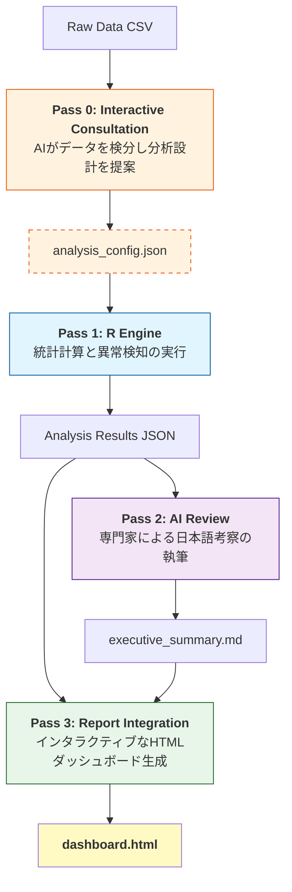

# agentic-evidence-analysis

[](LICENSE)
[](https://www.r-project.org/)

**AIエージェントおよびRユーザーのための、エビデンス駆動型カテゴリカルデータ分析スキルセット**  
*Evidence-Driven Categorical Data Analysis Skills for AI Agents & R Users.*

大標本データ（RWD、臨床・疫学データ、アンケート等）における「P値の罠」を克服し、ベイズ因子、エビデンススコア、効果量を用いて「統計的有意性」と「実質的意義」を峻別する分析パイプラインを提供します。

---

## 背景：なぜエビデンス駆動なのか？

サンプルサイズが非常に大きい場合（$N > 2,000$）、従来のカイ二乗検定（P値）では、実務的に無視できるほど微小な偏りであってもすべて「統計的に有意（$p < 0.001$）」と判定されてしまいます（**P値の飽和問題**）。

2016年のアメリカ統計学会（ASA）「P値に関する声明」に基づき、本ツールキットは以下の原則を実装しています：

1. **P値は仮説とデータの矛盾度を示すにすぎない**: 効果の大きさや研究の重要性を証明しない。
2. **$p < 0.05$ の二択評価を廃止する**: 思考停止の有意・非有意判定を行わない。
3. **効果量・信頼区間・モデル尤度を併用する**: 「差の大きさ」と「証拠の強さ」を峻別する。

---

## 4-Pass 分析パイプライン

本ツールキットは、AIエージェントと統計スクリプトが協調する 4 ステップ（Pass）で分析を実行します。


```mermaid
graph TD
  Data[Raw Data CSV] --> P0["<b>Pass 0: Interactive Consultation</b><br/>AIがデータを検分し分析設計を提案"]
  P0 --> CFG[analysis_config.json]
  CFG --> P1["<b>Pass 1: R Engine</b><br/>統計計算と異常検知の実行"]
  P1 --> JSON[Analysis Results JSON]
  JSON --> P2["<b>Pass 2: AI Review</b><br/>専門家による日本語考察の執筆"]
  P2 --> MD[executive_summary.md]
  JSON & MD --> P3["<b>Pass 3: Report Integration</b><br/>インタラクティブなHTMLダッシュボード生成"]
  P3 --> HTML[dashboard.html]

  style P0 fill:#fff3e0,stroke:#e65100
  style CFG fill:#fff3e0,stroke:#e65100,stroke-dasharray: 5 5
  style P1 fill:#e1f5fe,stroke:#01579b
  style P2 fill:#f3e5f5,stroke:#4a148c
  style P3 fill:#e8f5e9,stroke:#1b5e20
  style HTML font-weight:bold,fill:#fff9c4
```

1. **Pass 0 (Interactive Consultation)**: AIがデータの水準数や度数を事前に検分し、次元削減（変数の絞り込み）や層別解析をユーザーに提案。Pass 1 の入力を固定する **`analysis_config.json`** を作成します。
2. **Pass 1 (R Engine Computation)**: Rスクリプトがベイズ因子、エビデンススコア、標準化残差を計算。`--config` 引数で Pass 0 の設定を読み込み、中間成果物（JSON）を出力します。
3. **Pass 2 (AI Review & Narrative)**: AIが専門コンサルタントとして中間成果物を読み解き、背景知識を交えた日本語のエグゼクティブ・サマリー (`executive_summary.md`) を執筆します。必要に応じて `quality_check.md` で解釈保留や図表整合を確認します。
4. **Pass 3 (Report Integration)**: RMarkdownが統計数値とAI考察を統合し、インタラクティブ・ダッシュボード (`dashboard.html`) を生成します。

---

## スキル一覧 (AI Agent Skills)

本リポジトリで提供されるスキル一覧です（`.agents/skills/` に配置）：

| スキル名 | 種別 | 主な役割 |
|---|---|---|
| **vcd-pass0-consultation** | 事前相談 | データ検分、次元削減、層別解析の提案。分析の「次の一手」をガイド。 |
| **vcd-bayesian-evidence-analysis** | 主力解析 | ベイズ因子 ($BF_{10}$) と Evidence Score による多次元エビデンス分析。 |
| **vcd-categorical-analysis** | 名義解析 | 名義カテゴリ分析。R 2パス・executive_summary・quality_check・ダッシュボード生成。 |
| **questionnaire-batch-analysis** | バッチ処理 | アンケート集計。複数設問の設定に基づき、ダッシュボードを自動量産。 |
| **vcd-categorical-reporting** | 参照用 | （レガシー参照用テンプレート。新規は `vcd-categorical-analysis` を推奨） |

---

## エビデンス判定基準 (Evidence Criteria)

大標本データにおける関連性と実質的意義を以下の基準で評価します：

| 指標 | 数式 / 定義 | 閾値 / 判定 | 解釈 |
|---|---|---|---|
| **Evidence Score** | $r^2 - k \cdot \log(N)$ | $> 0$ | 実質的エビデンス（セル単位の逸脱がBICペナルティを超えている） |
| **Bayes Factor ($BF_{10}$)** | EBIC / BIC 近似 | $> 100$<br/>$30 \sim 100$<br/>$10 \sim 30$ | 決定的エビデンス (Decisive)<br/>極めて強いエビデンス (Very Strong)<br/>強いエビデンス (Strong) |
| **Cramér's V / Fei** | 効果量（0〜1） | $> 0.5$<br/>$> 0.3$<br/>$> 0.1$ | 非常に強い関連<br/>中程度の関連<br/>実務的に意味のある最小限の関連 |

> 数学的定義および統計モデルの詳細は [docs/reference/](docs/reference/) を参照してください。

---

## クイックスタート

### 動作環境要件
- **R**: >= 4.0 (`vcd`, `gnm`, `rmarkdown` 等の関連パッケージ)
- **Pandoc**: HTMLダッシュボード生成に必要

### 1. AIエージェントで使う（推奨）
Agent Skills 対応のCLIやエディタ（Antigravity, Cursor, Gemini CLI等）からスキルをインストールします：

```bash
npx skills add syrius2000/agentic-evidence-analysis
```

導入後、エージェントに対話形式で依頼します：

> 「`data.csv` を分析したい。まずは `vcd-pass0-consultation` スキルでデータの性質を調べて、分析の軸を提案して。」

### 2. Rスクリプトとして手動実行する

```bash
# Pass 0: データの検分
Rscript .agents/shared/inspect_data.R examples/titanic.csv \
  --out-dir output/<project>/run_<id>/

# Pass 1: 統計計算（Pass 0で生成された analysis_config.json を指定）
Rscript .agents/skills/vcd-bayesian-evidence-analysis/templates/analysis.R \
  --config output/titanic/run_v1/analysis_config.json
```

`--out-dir=`、`--out-dir ""`、空の第2位置引数など、空のout-dirは拒否され、ファイルシステムのrootへは書き込みません。

**出力ディレクトリ規則**:
- `vcd-bayesian-evidence-analysis`: `--output_dir` 直下に `run_<run_idの先頭16文字>/` を作成。
- `vcd-categorical-analysis`: 常に `<out>/run_<first16>[_N]/` へ出力（run ID未指定時はJST日時、衝突時はサフィックス付与）。
- `questionnaire-batch-analysis`: `--run-id` 利用時に `runs/<id>/` 配下へ出力。

---

## リポジトリ管理方針 & アーキテクチャ

- **統計分析の正本リポジトリ**: この `agentic-evidence-analysis` リポジトリを、同名5スキル、統計schema、統計品質契約、Rテンプレート、統計回帰テストの唯一の正本とします。
- **他リポジトリとの責務分離**:
  - `Productivity-Skill`: 一般コード・SQLコード理解を担当します。
  - `rwd-mysql-skill-toolkit`: RWD/DB実行・統合ハブを担当します。
  - DB/SQL/Python実行補助をこのリポジトリへ複製せず、統計仕様・実装の変更はこの正本へ反映します。
- **スキルツリー**: `.agents/skills` を公式管理対象とし、旧 `.cursor/skills` は管理しません。

---

## おすすめの読み方

1. `vcd-pass0-consultation` でデータの水準数、欠損、セルの疎密、層別の必要性を確認する。
2. [docs/reference/stats_categorical.md](docs/reference/stats_categorical.md) で期待度数、Pearson residual、Cramér's V / Fei を確認する。
3. 大標本または多次元表では [docs/reference/stats_bayesian.md](docs/reference/stats_bayesian.md) で Evidence Score と $BF_{10}$ を確認する。
4. [docs/reference/](docs/reference/) 配下の各種リファレンスでモデル選択（GLM/GNM）と尺度の扱いを確認する。
5. 統計的有意性と実務的意義を峻別したエグゼクティブ・サマリーを作成する。

---

## ライセンス

[MIT](LICENSE)
