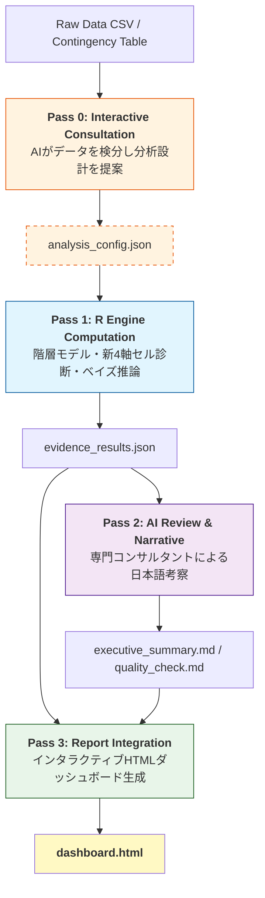

# agentic-evidence-analysis

[](LICENSE)
[](https://www.r-project.org/)

**AIエージェントおよび統計エンジニアのための、エビデンス駆動型カテゴリカルデータ分析スキルセット**
*Evidence-Driven Categorical Data Analysis Skills for AI Agents & Statistical Engineers.*

リアルワールドデータ（RWD）、臨床・疫学調査、アンケート集計などの大規模カテゴリカルデータにおいて、「統計的有意性と実用的有意性の乖離（P値の呪い）」を克服し、**全体構造、効果量、証拠強度、数値安定性、統計的不確実性** を明確に切り分ける高信頼な分析パイプラインを提供します。

---

## 背景：なぜエビデンス駆動なのか？

サンプルサイズ $N$ が大規模（数万〜数十万件）になると、実務的に無意味な微小な偏りであっても検定統計量は巨大化し、$p < 0.0001$ のように P 値は容易に極小化（飽和）します。

2016年のアメリカ統計学会（ASA）「P値に関する声明」に基づき、本ツールキットは以下の原則を徹底しています：

1. **P 値は仮説とデータの矛盾度を示す指標に過ぎない**: 効果の大きさや研究・実務上の重要性を直接証明しない。
2. **$p < 0.05$ の二択判定（有意・非有意）を廃止する**: 思考停止の機械的足切りを行わない。
3. **「効果の大きさ（Effect）」と「証拠の強さ（Evidence）」を峻別する**: 標本サイズ $N$ に依存しない効果量と、標本サイズに比例する統計的確信度を分離する。

---

## 4-Pass 分析パイプライン (Strict Execution Sequence)

本ツールキットは、AI エージェントと R 統計エンジンが協調する厳格な 4 ステップ（Pass）で分析を実行します。


```mermaid
graph TD
  Data[Raw Data CSV / Contingency Table] --> P0["<b>Pass 0: Interactive Consultation</b><br/>AIがデータを検分し分析設計を提案"]
  P0 --> CFG[analysis_config.json]
  CFG --> P1["<b>Pass 1: R Engine Computation</b><br/>階層モデル・新4軸セル診断・ベイズ推論"]
  P1 --> JSON[evidence_results.json]
  JSON --> P2["<b>Pass 2: AI Review & Narrative</b><br/>専門コンサルタントによる日本語考察"]
  P2 --> MD[executive_summary.md / quality_check.md]
  JSON & MD --> P3["<b>Pass 3: Report Integration</b><br/>インタラクティブHTMLダッシュボード生成"]
  P3 --> HTML[dashboard.html]

  style P0 fill:#fff3e0,stroke:#e65100
  style CFG fill:#fff3e0,stroke:#e65100,stroke-dasharray: 5 5
  style P1 fill:#e1f5fe,stroke:#01579b
  style P2 fill:#f3e5f5,stroke:#4a148c
  style P3 fill:#e8f5e9,stroke:#1b5e20
  style HTML font-weight:bold,fill:#fff9c4
```

1. **Pass 0 (Interactive Consultation / 事前相談)**:
   AI がデータの水準数、観測度数、欠測、疎セルを事前に検分し、次元削減や層別解析をユーザーに提案。Pass 1 の入力を固定する **`analysis_config.json`**（Single Source of Truth）を作成します。
2. **Pass 1 (R Engine Computation / 統計計算)**:
   R スクリプトが 9 階層対数線形モデル、総度数 $N$ 基準の明示式 BIC、新 4 軸セル診断、多項 Dirichlet 事後推論、事後予測チェック（PPP-value）を高速かつ決定論的に計算し、`evidence_results.json` を出力します。
3. **Pass 2 (AI Review & Narrative / 専門家考察)**:
   AI が専門統計コンサルタントとして構造化結果を読み解き、背景ドメイン知識を交えた日本語エグゼクティブ・サマリー (`executive_summary.md`) を執筆します。品質保留や隔離セルは `quality_check.md` に明記します。
4. **Pass 3 (Report Integration / レポート統合)**:
   `render_report.R`（RMarkdown）が統計結果と AI 考察を統合し、層別ヒートマップやセル診断表を備えたスタンドアローンな HTML ダッシュボード (`dashboard.html`) を生成します。

---

## 現代的カテゴリカル分析の 4 つの柱

```
                    【現代的カテゴリカル分析の 4 つの柱】
┌────────────────────────────────────────────────────────────────────────┐
│  1. 全体構造の階層比較（Global Model Hierarchy）                       │
│     → 9 階層対数線形モデル（M1〜M9）と総度数 N 基準の明示式 BIC        │
│       BIC_explicit = -2 ln L + p ln N                                  │
├────────────────────────────────────────────────────────────────────────┤
│  2. 新 4 軸セル診断フレームワーク（Four-Axis Cell Diagnostics）          │
│     → Effect（効果量: 標本数不変 log(O/E), e_i, d_i）                   │
│     → Evidence（証拠強度: 標本数比例 Rao Score T_i^score, ln P）        │
│     → Influence（影響度: ハット行列 Leverage h_ii）                    │
│     → Stability（数値安定性: O_i=0, E_i<5.0, h_ii>=0.80 の隔離判定）   │
├────────────────────────────────────────────────────────────────────────┤
│  3. 大標本 Dual-Filter 原則（N > 2,000）                               │
│     → Step 1: Effect スクリーニング（|log(O/E)| >= 0.50）              │
│     → Step 2: Evidence フィルタリング（T_i^score >= 3.84, ノイズ排除） │
├────────────────────────────────────────────────────────────────────────┤
│  4. 多項 Dirichlet 事後推論と不確実性評価                               │
│     → 共役事前分布による事後平均、点ごとの 95% 信用区間（HDI/ETI）     │
│     → Freeman-Tukey 統計量による事後予測チェック（PPP-value）           │
└────────────────────────────────────────────────────────────────────────┘
```

### 指標の読み分けガイド

| 問いの次元 | 採用指標 | 数理的性質と解釈 |
| :--- | :--- | :--- |
| **全体の連関構造** | 9 階層対数線形モデル（M1〜M9）、ポアソン完全対数尤度による明示式 BIC | 相互独立、条件付き独立、均一連関、3 次交互作用のどれがデータを最良に説明するか |
| **差の大きさ（現象）** | 局所対数効果比 $\log(O_i/E_i)$、標準化差 $e_i$、率差 $d_i$ | 標本サイズ $N$ に依存しない乗法的・絶対的な乖離の大きさ |
| **証拠の強さ（確信度）** | Rao の局所スコア検定統計量 $T_i^{\rm score} = \frac{r_{P,i}^2}{1-h_{ii}}$、対数 P 値 $\ln(P)$ | 偶然の標本誤差ではない統計的確信度（$N$ に比例） |
| **モデル改善量** | 局所逸脱度改善 $\Delta G_i^2 / N$ | 1 観測あたりの逸脱度改善（KL 乖離縮小）。標準化効果量とは区別 |
| **数値安定性と影響度** | ハット行列 Leverage $h_{ii}$、Stability フラグ（`QUARANTINED` / `REGULAR`） | 観測ゼロ $O_i=0$、疎セル $E_i < 5.0$、過大レバレッジ $h_{ii} \ge 0.80$ を自動隔離 |
| **統計的不確実性** | 多項 Dirichlet 事後分布、条件付き割合の 95% 信用区間（HDI/ETI） | 点ごとの事後信用区間、Freeman-Tukey 事後予測チェック（PPP-value） |

> [!NOTE]
> 旧プロトタイプの「旧エビデンススコア（$r^2 - k\ln N$）」は大標本下で全セルが正値化（エビデンス飽和）してフィルタ機能を喪失するため、現行システムでは**監査専用列（audit-only）**としてのみ保持し、真の信号判定や合否判定には一切使用しません。

---

## 提供スキル一覧 (Agent Skills)

本リポジトリで提供されるスキル一覧です（`.agents/skills/` 配下）：

| スキル名 | 種別 | 主な役割と守備範囲 |
| :--- | :--- | :--- |
| **vcd-pass0-consultation** | 事前相談 | データ検分、次元削減・層別解析の提案、`analysis_config.json` の作成 |
| **vcd-bayesian-evidence-analysis** | 3次元正本 | 3次元集計表の 9 階層対数線形モデル、新 4 軸セル診断、明示式 BIC、Dirichlet 事後推論、HTML レポート生成 |
| **vcd-categorical-analysis** | 2次元解析 | 名義 2 変数の全体効果量（Cramér's V、Bergsma 補正）、残差分析、executive_summary・ダッシュボード生成 |
| **questionnaire-batch-analysis** | バッチ処理 | アンケート複数設問の設定ファイルに基づく自動一括集計とサマリー量産 |
| **vcd-categorical-reporting** | 参照用 | （レガシーテンプレートの再現・互換保守用。新規分析は上記 3 スキルを推奨） |

---

## クイックスタート

### 動作環境要件
- **R**: >= 4.0（標準 `stats` に加え、`jsonlite`, `dplyr`, `readr`, `htmltools`, `rmarkdown`）
- **Pandoc**: HTML ダッシュボードのレンダリングに必要

### 1. AI エージェントで使う（推奨）
Agent Skills 対応ツール（Antigravity, Cursor, Gemini CLI 等）から本スキルを呼び出します：

> 「`examples/titanic.csv` を Class × Sex × Survived で分析したい。まずは `vcd-pass0-consultation` スキルでデータの性質を検分して、分析設定を作って。」

### 2. R コマンドラインから実行する

```bash
# Pass 0: データの事前検分
Rscript .agents/shared/inspect_data.R examples/titanic.csv \
  --out-dir output/titanic/run_01/

# Pass 1: 3次元統計計算（Pass 0 で作成した設定を指定）
Rscript .agents/skills/vcd-bayesian-evidence-analysis/templates/three_way/analysis.R \
  --config output/titanic/run_01/analysis_config.json

# Pass 3: ダッシュボード生成
Rscript .agents/skills/vcd-bayesian-evidence-analysis/templates/three_way/render_report.R \
  output/titanic/run_01/run_<run_idの先頭16文字>/
```

---

## 参考文献・一次情報ポータル

本ツールキットの統計数理手法は、国際的に認知された学術論文および標準教科書（一次情報）に厳密に依拠しています。詳細な数理導出と文献一覧は [docs/reference/README.md](docs/reference/README.md) をご覧ください。

- **局所スコア検定理論**: Rao, C. R. (1948). *Proc. Camb. Phil. Soc.* [DOI:10.1017/S0305004100024038](https://doi.org/10.1017/S0305004100024038)
- **GLM 診断とレバレッジ**: Pregibon, D. (1981). *Ann. Statist.* [DOI:10.1214/aos/1176345513](https://doi.org/10.1214/aos/1176345513)
- **モデル選択基準 (BIC)**: Schwarz, G. (1978). *Ann. Statist.* [DOI:10.1214/aos/1176344136](https://doi.org/10.1214/aos/1176344136)
- **対数線形モデル**: Agresti, A. (2013). *Categorical Data Analysis* (3rd ed.). Wiley.
- **多項 Dirichlet 事後推論**: Good, I. J. (1965). *The Estimation of Probabilities*. MIT Press.
- **ベイズデータ解析**: Gelman, A. et al. (2013). *Bayesian Data Analysis* (3rd ed.). CRC Press.
- **効果量基準**: Cohen, J. (1988). *Statistical Power Analysis for the Behavioral Sciences* (2nd ed.). LEA.
- **P 値声明**: Wasserstein, R. L., & Lazar, N. A. (2016). *Amer. Statist.* [DOI:10.1080/00031305.2016.1154108](https://doi.org/10.1080/00031305.2016.1154108)

---

## ライセンス

[MIT License](LICENSE)
