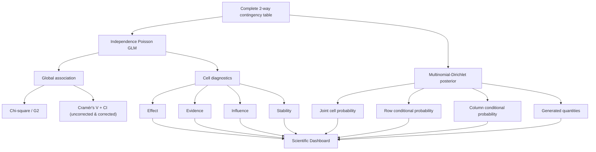
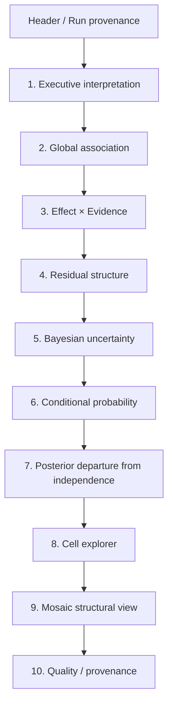

# Implementation Plan
## vcd-categorical-analysis v4.0
### Evidence, Residual Diagnostics, Bayesian Uncertainty & Scientific Dashboard

**Status:** Completed (2026-09-16, commit `03d682c`)
**Target:** `.agents/skills/vcd-categorical-analysis/`
**Target version:** `4.0`
**Interface version:** `3.0`
**Primary scope:** nominal 2-way categorical tables
**Design principle:** Effect / Evidence / Influence / Stability / Uncertainty を混同しない

---

# 1. Purpose

現行 `vcd-categorical-analysis` を、

> 「2次元分割表に対する VCD 可視化と Pearson residual の分析」

から、

> **2-way categorical evidence & uncertainty analysis engine**

へ拡張する。

解析対象は引き続き **完全な名義カテゴリカル2変数（Complete 2-way table）** を正本とする。
入力次元数（Arity = 2）、各軸水準数 $I \ge 2, J \ge 2$、総度数 $N > 0$、有限非負整数カウントを前提とする。

3-way の階層対数線形モデル・M1〜M9比較等を本スキルへ複製しない。
3次元以上の入力が与えられた場合はフェイルファストで拒否し、正本スキル `vcd-bayesian-evidence-analysis` への委譲を案内する。

v4.0 の中心概念を以下の5軸とする。

1. **Effect** — どれほど違うか
2. **Evidence** — 標本誤差だけでは説明しにくいか
3. **Influence** — 特定セルがモデルをどれほど牽引するか
4. **Stability** — 近似・推定を信頼できるセルか
5. **Posterior Uncertainty** — 推定量がどの程度不確実か

---

# 2. Non-goals

v4.0 では以下を目的としない。

- 構造的ゼロ（理論的・生理学的に発生不可能なセル）を含む不完全分割表（Incomplete contingency table）および準独立モデル（Quasi-independence model）のサポート（完全分割表専用とし、構造的ゼロ指定時は入力禁止・フェイルファスト停止とする）
- 3-way M1〜M9 モデル体系の複製
- 4-way 以上の一般 log-linear model engine
- Bayesian posterior probability と frequentist p-value の統合スコア化
- 旧 `Evidence Score = r² - k log(N)` の復活
- posterior density / violin plot を主要表示とすること
- すべてのカテゴリ間 pairwise comparison の自動生成
- practical significance threshold の恣意的な自動設定
- Bayesian posterior を「accuracy」と呼ぶこと

---

# 3. Statistical architecture



---

# 4. Statistical decisions — FIXED

## 4.1 Global model & Cramér's V confidence interval

2-way table

\[
n_{ij},\qquad i=1,\dots,I,\; j=1,\dots,J
\]

について、独立モデル

\[
\log \mu_{ij}
=
\lambda
+
\lambda_i^A
+
\lambda_j^B
\]

を Poisson GLM として適合する。

算出する global statistics:

- Pearson \(X^2\)
- likelihood-ratio \(G^2\)
- degrees of freedom \(df = (I-1)(J-1)\)
- raw p-value
- Cramér's V
- bias-corrected Cramér's V (\(\tilde{V}\), Bergsma 2013)
- Cramér's V 95% confidence interval (未補正 `cramers_v_ci`)
- bias-corrected Cramér's V 95% confidence interval (補正後 `cramers_v_corrected_ci`)
- expected count diagnostics

### Cramér's V CI の算定数理（非心 \(\chi^2\) 反転法）:
Smithson (2003) / Steiger (2004) に従い、観測 \(X^2\) に対し非心カイ二乗累積分布関数 \(F(X^2; df, \lambda)\) を数値求根（`stats::uniroot`, 許容誤差 \(10^{-8}\)）して非心度 \(\lambda\) の 95% 信頼区間 \([\lambda_L, \lambda_U]\) を導出する。
- 上側限界: \(F(X^2; df, \lambda_U) = 0.025\)
- 下側限界: \(X^2 > \chi^2_{0.975}(df)\) のとき \(F(X^2; df, \lambda_L) = 0.975\)、\(X^2 \le \chi^2_{0.975}(df)\) のときは \(\lambda_L = 0\)（これにより \(0 \le \lambda_L \le \lambda_U\) が数学的に保証される）
- 未補正 Cramér's \(V\) 区間への写像:
  \[
  V_* = \sqrt{\frac{\lambda_*/N}{\min(I, J) - 1}}
  \]
- Bergsma (2013) bias-corrected Cramér's \(\tilde{V}\) 区間への写像:
  有効次元 \(\tilde{k} = \min\left(I - \frac{(I-1)^2}{N-1}, J - \frac{(J-1)^2}{N-1}\right)\) を用い、
  \[
  \tilde{V}_* = \min\left(1, \sqrt{\frac{\max(0, \lambda_*/N)}{\tilde{k} - 1}}\right)
  \]
  \(\lambda \mapsto \tilde{V}\) は狭義単調非減少であるため、端点順序 \(0 \le \tilde{V}_L \le \tilde{V}_U \le 1\) が厳密に保存される。
- 退化表・小標本フォールバック: \(\tilde{k} \le 1\) または \(N \le df + 1\) で補正分母が非正となる場合、あるいは不収束時は `cramers_v_corrected_ci` を `null` とし、`quality_warnings` に記録する。\(X^2 = 0\) のときは \([0.0, 0.0]\) を返す。

---

# 5. Residual diagnostics

## 5.1 Pearson residual

\[
r^P_{ij}
=
\frac{O_{ij}-E_{ij}}{\sqrt{E_{ij}}}
\]

保持するが、これ単独をセルの「有意性」と呼ばない。

現行の

> 有意セル数 \(|r|>1.96\)

という表現は廃止する。

代替名称：

> Exploratory residual flags

---

## 5.2 Standardized / adjusted residual

GLM leverage を利用し、

\[
r^{adj}_{ij}
=
\frac{r^P_{ij}}
{\sqrt{1-h_{ij}}}
\]

を canonical local residual とする。

2-way independence model における Haberman 型標準化残差との数値整合性をテストする。

---

## 5.3 Deviance residual

\[
r^D_{ij}
=
\operatorname{sign}(O_{ij}-E_{ij})
\sqrt{
2
\left[
O_{ij}
\log\frac{O_{ij}}{E_{ij}}
-
(O_{ij}-E_{ij})
\right]
}
\]

を保存する。

\(O=0\) の場合は数値的に安全な極限値を使用する。

---

# 6. Effect axis

セル効果量として以下を保持する。

## 6.1 Local log observed / expected ratio

\[
L_{ij}
=
\log\frac{O_{ij}}{E_{ij}}
\]

これはサンプルサイズを単純倍率した場合に基本的に不変であり、
局所的な効果サイズとして使用する。

ただし \(O=0\) は \(-\infty\) になるため、

- 数学的な理論値は \(-\infty\) であるが、標準 JSON の仕様に適合させるため `log_oe: null` として出力する
- 状態識別子として `log_oe_state: "NEGATIVE_INFINITY"` および `is_finite: false` を属性として保存する
- 観測0はすべてサンプリング偶然のゼロ（サンプリングゼロ）として扱い、`stability_status = "QUARANTINED"`（理由: `ZERO_OBSERVED`）に分類する
- 大標本 Dual-Filter 探索的候補からは自動除外する
- 可視化（Dashboard 散布図）の通常軸には無理に載せず、隔離セル一覧およびテーブル上で「$-\infty$（未定義・度数0）」と注記表示する

恣意的 pseudocount を canonical statistic には使用しない。

---

## 6.2 Signed proportion difference

補助効果量として、

\[
d_{ij}
=
\frac{O_{ij}-E_{ij}}{N}
\]

を保存する。

---

# 7. Evidence axis

## 7.1 Cell score statistic

canonical local evidence statistic:

\[
T^{score}_{ij}
=
\frac{(r^P_{ij})^2}
{1-h_{ij}}
\]

を使用する。

これは adjusted residual の二乗に対応する。

保存項目：

- `score_statistic`
- `score_p_raw`
- `score_p_bh`

BH-adjusted p-value は **補助情報**とし、
canonical candidate filter の必須判定にはしない。

理由：

- セル統計量同士は独立ではない
- BH の厳密な適用条件を一般には保証しない
- 3-way 正本との診断哲学を合わせる

---

# 8. Influence axis

Poisson GLM の hat matrix より

\[
h_{ij}
\]

を算出する。

Dashboard では `leverage` と明記し、

- influence
- uncertainty
- stability

を同一概念として扱わない。

---

# 9. Stability axis

以下のいずれかを満たすセルを `QUARANTINED` とする。

1. \(O_{ij}=0\)
2. \(E_{ij}<5\)
3. \(h_{ij}\ge0.80\)

保存：

```text
stability_status:
  OK
  QUARANTINED
```

さらに理由を array として保存する。

```json
"stability_reasons": [
  "EXPECTED_LT_5",
  "ZERO_OBSERVED"
]
```

---

# 10. Large-N Dual Filter

既存3-wayの意味論との整合性を保つ。

既定：

```text
large_n_threshold = 2000
effect_log_oe_threshold = 0.50
score_threshold = 3.84
```

大標本時には、

### Step 1 Effect

\[
|\log(O/E)|\ge0.50
\]

### Step 2 Evidence

\[
T^{score}\ge3.84
\]

を満たす regular cell を探索的 candidate とする。

重要：

これは confirmatory multiple-testing procedure ではない。

Dashboard 上でも

> Exploratory dual-filter candidate

と表示する。

---

# 11. Bayesian model — FIXED

## 11.1 Joint multinomial

\[
(n_{11},\dots,n_{IJ})
\sim
Multinomial(N,\boldsymbol{\pi})
\]

---

## 11.2 Prior

canonical default:

\[
\boldsymbol{\pi}
\sim
Dirichlet(\alpha,\ldots,\alpha)
\]

with

\[
\boxed{\alpha=1}
\]

既存3-way経路との一貫性を優先する。

設定値：

```json
"dirichlet_a": 1.0
```

---

# 12. Posterior

共役性より

\[
\boldsymbol{\pi}\mid\mathbf n
\sim
Dirichlet(
n_1+\alpha,\dots,n_K+\alpha
)
\]

posterior mean:

\[
E(\pi_k\mid n)
=
\frac{n_k+\alpha}
{N+K\alpha}
\]

---

# 13. Credible interval — FIXED

canonical Bayesian interval:

\[
\boxed{95\%\ Equal\text{-}Tailed\ Credible\ Interval}
\]

すなわち、

\[
[q_{0.025},q_{0.975}]
\]

を使用する。

Dashboard 日本語：

> 95%信用区間（Bayesian ETI）

頻度論側は、

> 95%信頼区間

とする。

両者を同じ「CI」とだけ略記しない。

---

# 14. Posterior generated quantities

Dirichlet posterior から以下を生成する。

## 14.1 Joint cell probability

\[
\pi_{ij}
\]

---

## 14.2 Row conditional probability

\[
P(B=j\mid A=i)
=
\frac{\pi_{ij}}
{\sum_j\pi_{ij}}
\]

---

## 14.3 Column conditional probability

\[
P(A=i\mid B=j)
=
\frac{\pi_{ij}}
{\sum_i\pi_{ij}}
\]

**両方向を生成する。**

これにより Dashboard で、

> 分母をどちらに置くか

そのものを教育的に理解できる。

---

# 15. Bayesian departure from independence

posterior draw \(s\) ごとに、

\[
D_{ij}^{(s)}
=
\log
\frac{
\pi_{ij}^{(s)}
}{
\pi_{i+}^{(s)}\pi_{+j}^{(s)}
}
\]

を計算する。

これは、

> posterior departure from independence

と呼ぶ。

重要：

- Bayes factor ではない
- evidence statistic ではない
- independence model posterior probability ではない

単に posterior distribution 上での局所的な独立性からの乖離量である。

要約：

- posterior mean
- median
- Q25
- Q75
- Q2.5
- Q97.5
- \(P(D>0\mid data)\)
- \(P(D<0\mid data)\)
- 95% interval width

---

# 16. Posterior Monte Carlo — FIXED

default:

```text
posterior_draws = 10000
```

乱数 seed はユーザーが明示しない場合、

> `analysis_signature`

から決定論的に導出する。

これにより同一入力・同一設定では再現可能にする。

---

# 17. Memory policy

raw posterior draws は JSON に保存しない。

保存するのは要約値のみ。

各 generated quantity に対し：

```text
mean
sd
q025
q25
q50
q75
q975
interval_width_95
prob_gt_zero
prob_lt_zero
```

これにより、

- JSON肥大化
- Dashboard読み込み遅延
- raw posterior の不要な永続化

を避ける。

---

# 18. Practical significance

`practical_effect_delta` は既定値を設定しない。

```json
"practical_effect_delta": null
```

理由：

例えば「5 percentage points」が臨床、購買、品質、アンケートの全用途に共通して妥当とは限らない。

ユーザーまたは Pass 0 が明示した場合のみ、

\[
P(|\Delta|>\delta\mid data)
\]

を計算する。

恣意的な自動判定は禁止。

---

# 19. Prior sensitivity

v4.0 では sensitivity framework を実装するが、
primary result は \(\alpha=1\)。

secondary sensitivity：

\[
\alpha=0.5
\]

を任意実行可能とする。

Dashboard の primary view を複数 prior で汚さない。

Prior Sensitivity セクションでのみ、

- posterior median
- 95% CrI
- interval width

を比較する。

---

# 20. Dashboard design philosophy

Dashboard の目的は、

> 「結果を派手に表示すること」

ではなく、

> **観測データ → 効果量 → 証拠 → 安定性 → 不確実性**
>
> の順序で統計推論を理解できること

とする。

既存 `vcd-bayesian-evidence-analysis` の
Antigravity 系 visual language と統一する。

---

# 21. Visual design — FIXED

## Desktop first

```text
max-width: 1440px
main content: 1200–1280px
```

背景：

```text
soft neutral / slate
```

ヘッダー：

```text
dark navy → blue gradient
```

カード：

```text
white
small border
very subtle shadow
8–12px radius
```

色は意味論にのみ使用する。

- Effect direction
- Evidence
- Warning / quarantine
- Bayesian uncertainty

装飾だけの多色化を避ける。

---

# 22. Offline-first

Dashboard は完全 self-contained HTML を維持する。

禁止：

- Google Fonts
- CDN JavaScript
- DataTables external Japanese JSON (https://cdn.datatables.net URLの直接参照禁止)
- remote MathJax
- その他すべての外部 http:// または https:// リソース

使用：

- system font stack
- local/inlined KaTeX
- inline Japanese DataTables dictionary (完全インラインJavaScript辞書オブジェクト)

### オフライン機械的受入検査（静的スキャン）
生成された Dashboard HTML に対し、正規表現による静的 URL スキャンテスト（`tests/test_vcd_categorical_dashboard_v4.R`）を実施する。
HTML ソース内に外部 `http://` または `https://` 参照が検出された場合はテストを失敗させ、ネットワーク非接続環境における表示完全性を機械的に保証する。

---

# 23. Dashboard information architecture



---

# 24. Section 1 — Header

表示：

- dataset
- variables
- table dimensions
- total N
- run_id
- generated time
- interface version
- prior \(\alpha\)
- posterior draws

Example:

```text
Categorical Evidence & Uncertainty Dashboard

Treatment × Response
N = 4,821 | 4 × 3 table | Dirichlet α = 1
Run: studyA_20260915
```

---

# 25. Section 2 — Executive interpretation

AI summary を単に Markdown で埋めるだけでなく、
4つの固定サブブロックにする。

### Association
全体関連

### Local structure
主要セル

### Uncertainty
posterior uncertainty

### Caveats
sparsity / zero / leverage / multiplicity

---

# 26. Section 3 — Global Association

KPI cards:

1. \(N\)
2. table size
3. Cramér's V
4. Cramér's V 95% confidence interval
5. \(G^2\)
6. global p-value
7. quarantined cells
8. dual-filter candidates

ここでは frequentist global inference のみ表示する。

Bayesian posterior を混在させない。

---

# 27. Educational annotation

カード下に短い説明：

> **Effect と Evidence は別物です。**
>
> Cramér's V は関連の大きさを、
> \(G^2\) / p-value は標本誤差だけでは説明しにくい程度を示します。

---

# 28. Section 4 — Effect × Evidence Map

Dashboard の主要図1。

x-axis:

\[
\log(O/E)
\]

y-axis:

\[
T^{score}
\]

reference lines:

\[
\log(O/E)=0
\]

\[
|\log(O/E)|=0.50
\]

\[
T^{score}=3.84
\]

表示対象：

- regular cells
- candidate cells
- quarantined cells は別表示

point label / tooltip:

```text
cell
Observed
Expected
log(O/E)
Adjusted residual
Score statistic
Leverage
```

目的：

4象限的に、

- small effect / weak evidence
- large effect / weak evidence
- small effect / strong evidence
- large effect / strong evidence

を理解させる。

---

# 29. Section 5 — Residual Heatmap

index順 point plot を主表示から外す。

行×列構造そのものに戻し、

\[
r^{adj}_{ij}
\]

を heatmap 表示する。

セル annotation は必要に応じ：

```text
Observed
Expected
Adjusted residual
```

切替可能な指標：

- adjusted residual
- Pearson residual
- deviance residual
- log(O/E)

---

# 30. Section 6 — Bayesian Credible Box

Dashboard の主要図2。

通常の density / violin plot は使用しない。

各 posterior generated quantity を、

### Credible Box

として表示する。

定義：

```text
lower whisker = Q2.5
box lower     = Q25
median        = Q50
box upper     = Q75
upper whisker = Q97.5
point         = posterior mean
```

これは通常の Tukey boxplot ではない。

タイトル・凡例で必ず：

> Bayesian Credible Box

と明記する。

---

# 31. Credible Box visual

概念図：

```text
Q2.5       Q25       median       Q75        Q97.5
 |----------[==========|===========]-----------|
                        ●
                       mean
```

教育的説明：

> 箱の幅は posterior の中央50%、
> whisker は95%信用区間です。
> 横方向に長いほど推定の不確実性が大きいことを示します。

---

# 32. Conditional probability Credible Box

まず

\[
P(B=j\mid A=i)
\]

を表示する。

例えば：

```text
Group A
 Response 1   ├────[══●══]────┤
 Response 2        ├──[═●═]──┤
 Response 3  ├────────[══●══]──────┤
```

次に別タブ / 別panelで

\[
P(A=i\mid B=j)
\]

を表示する。

Dashboard はこの2方向を明示する。

### Educational callout

> 条件付き確率は分母によって意味が変わります。
>
> \(P(B|A)\) と \(P(A|B)\) は交換できません。

---

# 33. Section 7 — Credible Interval Width

Dashboard の主要図3。

各 generated quantity について、

\[
W_{95}
=
q_{0.975}-q_{0.025}
\]

を計算する。

horizontal ranked bar / dot-range として表示。

title:

> Where is the uncertainty largest?

日本語：

> どの推定値が最も不確実か

これを posterior mean と別図にする。

理由：

point estimate の大小と uncertainty の大小を混同させないため。

---

# 34. Uncertainty matrix

2-way table と同じ行列構造で、

\[
W_{95,ij}
\]

を heatmap 表示する。

Residual heatmap と対にする。

### 左

> Where is the association unusual?

### 右

> Where is the estimate uncertain?

という教育的比較が可能になる。

---

# 35. Section 8 — Posterior departure from independence

generated quantity

\[
D_{ij}
=
\log
\frac{\pi_{ij}}
{\pi_{i+}\pi_{+j}}
\]

について Credible Box を表示。

vertical reference:

\[
D=0
\]

解釈：

- interval 全体 > 0
  → posterior 上で excess direction が一貫

- interval 全体 < 0
  → deficit direction が一貫

- 0 を跨ぐ
  → direction uncertainty が残る

注意書き：

> この図は Bayes factor ではありません。
> posterior distribution 上の independence departure を示します。

---

# 36. Section 9 — Interval / direction table

各セルについて：

| Cell | Median effect | 95% CrI | Width | P(>0) | Stability |
|---|---:|---:|---:|---:|---|

ここで、

\[
P(D>0\mid data)
\]

を示す。

ただし、

```text
P > 0.95 = significant
```

のような自動ラベルは禁止。

表示名称：

> Posterior direction probability

---

# 37. Section 10 — Prior Sensitivity

primary:

\[
\alpha=1
\]

secondary:

\[
\alpha=0.5
\]

について interval summary を比較。

全セルを表示すると煩雑なので、

- top uncertain cells
- dual-filter candidates
- user-selected cells

のみ。

表示：

```text
α = 1.0     ├──────●──────┤
α = 0.5      ├─────●─────┤
```

目的：

> posterior が prior choice にどの程度依存するか

を可視化する。

---

# 38. Section 11 — Cell Explorer

DT table を最終的な詳細確認ツールとして残す。

columns:

### Observed
- row
- column
- observed
- expected

### Effect
- log_oe
- proportion_difference

### Residual
- pearson_residual
- deviance_residual
- adjusted_residual

### Evidence
- score_statistic
- p_raw
- p_bh

### Influence
- leverage

### Stability
- status
- reasons

### Bayesian
- posterior_mean
- posterior_median
- q025
- q25
- q75
- q975
- interval_width
- posterior_direction_probability

フィルタ：

- candidates only
- quarantined only
- high uncertainty
- all

---

# 39. Section 12 — Mosaic

`vcd::mosaic()` は削除しない。

ただし役割を

> structural visualization

に限定する。

Dashboard の最後寄りに配置する。

Mosaic plot から統計的 significance を読み取らせない。

---

# 40. Section 13 — Quality & Provenance

表示：

- run_id
- analysis_signature
- interface_version
- R version
- package versions
- input SHA-256
- prior
- posterior draws
- RNG seed
- render config
- collapsed levels
- sparse-cell count
- zero-cell count
- quality warnings

---

# 41. New JSON contract

`categorical_results.json` を interface 3.0 に拡張する。

概略：

```json
{
  "interface_version": "3.0",
  "schema": "two-way-results-v2",

  "input_summary": {},

  "global": {
    "pearson_chisq": null,
    "g2": null,
    "df": null,
    "p_value": null,
    "cramers_v": null,
    "cramers_v_ci": [],
    "cramers_v_corrected": null,
    "cramers_v_corrected_ci": []
  },

  "cells": {
    "full_data": []
  },

  "posterior": {
    "prior": {},
    "joint": [],
    "row_conditional": [],
    "column_conditional": [],
    "departure_from_independence": []
  },

  "quality": {},

  "provenance": {}
}
```

---

# 42. Cell schema

```json
{
  "row": "A",
  "column": "Yes",

  "observed": 120,
  "expected": 92.4,

  "effect": {
    "log_oe": 0.261,
    "log_oe_state": "FINITE",
    "is_finite": true,
    "proportion_difference": 0.0057
  },

  "residual": {
    "pearson": 2.87,
    "deviance": 2.74,
    "adjusted": 3.12
  },

  "evidence": {
    "score": 9.73,
    "p_raw": 0.0018,
    "p_bh": 0.0091
  },

  "influence": {
    "leverage": 0.154
  },

  "stability": {
    "status": "OK",
    "reasons": []
  },

  "candidate": {
    "dual_filter": true
  }
}
```

> [!NOTE]
> 観測度数0セル（\(O=0\)）の場合：
> - `log_oe`: `null`
> - `log_oe_state`: `"NEGATIVE_INFINITY"`
> - `is_finite`: `false`
> - `stability.status`: `"QUARANTINED"`（reasons に `"ZERO_OBSERVED"` 含む）
> - `candidate.dual_filter`: `false`（自動除外）

---

# 43. Posterior summary schema

```json
{
  "quantity": "P(Response=Yes | Group=A)",

  "mean": 0.624,
  "sd": 0.031,

  "q025": 0.561,
  "q25": 0.603,
  "q50": 0.625,
  "q75": 0.646,
  "q975": 0.683,

  "interval_width_95": 0.122
}
```

---

# 44. Configuration extensions

`render_config.json` または analysis config に追加：

```json
{
  "dirichlet_a": 1.0,
  "posterior_draws": 10000,
  "posterior_seed": null,
  "credible_level": 0.95,

  "large_n_threshold": 2000,
  "effect_log_oe_threshold": 0.50,
  "score_threshold": 3.84,

  "fdr_method": "BH",

  "practical_effect_delta": null,

  "prior_sensitivity": {
    "enabled": true,
    "secondary_alpha": 0.5
  },

  "dashboard_top_k": 20
}
```

---

# 45. Shared statistical core

v4.0 実装では、可能なら新規：

```text
.agents/shared/categorical/
```

を導入する。

候補：

```text
.agents/shared/categorical/
├── residual_diagnostics.R
├── effect_metrics.R
├── evidence_metrics.R
├── influence_stability.R
├── dirichlet_posterior.R
├── posterior_generated_quantities.R
└── categorical_contract.R
```

ただし大規模 refactor が regression risk を高める場合、

Phase 1–3 は skill-local に実装してよい。

その後 shared core へ抽出する。

---

# 46. Files to modify

必須：

```text
.agents/skills/vcd-categorical-analysis/
├── SKILL.md
├── Reference.md
├── templates/
│   ├── analysis.R
│   ├── dashboard.Rmd
│   └── report.Rmd
└── references/
    ├── interface.md
    ├── workflow.md
    ├── dependencies.md
    ├── ai-narrative-workflow.md
    └── report-template.md
```

---

# 47. Files to add

推奨：

```text
.agents/skills/vcd-categorical-analysis/references/
├── statistical-diagnostics-v4.md
├── dirichlet-posterior.md
├── dashboard-design-v4.md
└── interpretation-rules-v4.md
```

tests:

```text
tests/
├── test_vcd_categorical_residual_diagnostics_v4.R
├── test_vcd_categorical_evidence_v4.R
├── test_vcd_categorical_dirichlet_v4.R
├── test_vcd_categorical_generated_quantities_v4.R
├── test_vcd_categorical_dashboard_v4.R
├── test_vcd_categorical_interface_v3.R
└── test_vcd_categorical_reproducibility_v4.R
```

---

# 48. AI narrative rules

AI review の順序を固定する。

1. Global association
2. Effect
3. Evidence
4. Stability / Influence
5. Posterior uncertainty
6. Practical interpretation
7. Limitations

禁止：

- p-value のみで重要性判断
- posterior probability を p-value の代替と呼ぶ
- credible interval を confidence interval と呼ぶ
- residual > 1.96 を confirmatory significance と呼ぶ
- QUARANTINED cell を通常セルと同じ確度で解釈
- \(P(D>0)>0.95\) を自動的に「有意」と表現
- prior dependence を無視

---

# 49. Implementation phases

## Phase 0 — Contract freeze

- [x] v4.0 statistical specification を確定
- [x] `interface_version = 3.0`
- [x] `schema = two-way-results-v2`
- [x] prior default \(\alpha=1\) を固定
- [x] ETI 95% を固定
- [x] posterior draws = 10,000 を固定
- [x] deterministic RNG policy を固定
- [x] practical delta = NULL を固定
- [x] Dashboard section order を固定

**Exit criterion:**
実装者が統計仕様を変更せずコード化できる。

---

# 50. Phase 1 — Residual diagnostics

- [x] Poisson independence GLM を canonical model 化
- [x] expected counts
- [x] Pearson residual
- [x] deviance residual
- [x] leverage
- [x] adjusted residual
- [x] zero handling
- [x] sparse-cell detection
- [x] high leverage detection
- [x] stability status
- [x] residual diagnostics unit tests

**Acceptance:**

\[
r_{adj}
=
r_P/\sqrt{1-h}
\]

が reference implementation と数値一致。

---

# 51. Phase 2 — Effect & Evidence

- [x] `log(O/E)`
- [x] proportion difference
- [x] score statistic
- [x] raw p
- [x] BH-adjusted p
- [x] Dual Filter
- [x] candidate status
- [x] large-N behavior test
- [x] artificial N scaling test

100倍度数化テスト：

### Expected

Effect:

\[
\log(O/E)
\]

はほぼ不変。

Evidence:

\[
T^{score}
\]

は増大。

この違いを regression test にする。

---

# 52. Phase 3 — Dirichlet posterior

- [x] symmetric Dirichlet prior
- [x] posterior parameters
- [x] analytical posterior mean
- [x] analytical variance
- [x] deterministic Monte Carlo
- [x] 10,000 posterior draws
- [x] posterior summary
- [x] no raw-draw persistence
- [x] seed reproducibility test

---

# 53. Phase 4 — Generated quantities

- [x] joint probability
- [x] row conditional probability
- [x] column conditional probability
- [x] posterior departure from independence
- [x] direction probability
- [x] interval width
- [x] optional practical-effect probability
- [x] prior sensitivity alpha=0.5

Tests:

- [x] conditional probabilities sum to one
- [x] posterior quantiles monotonic
- [x] interval width nonnegative
- [x] same seed → identical JSON summaries

---

# 54. Phase 5 — Interface v3

- [x] update `references/interface.md`
- [x] validate new JSON fields
- [x] schema version check
- [x] backward-compatibility warning
- [x] old interface 2.x fixtures fail safely
- [x] run lifecycle remains unchanged
- [x] atomic reservation regression tests remain green

---

# 55. Phase 6 — Dashboard foundation

- [x] port Antigravity design system
- [x] self-contained HTML
- [x] offline KaTeX
- [x] inline DataTables Japanese locale
- [x] remove external CDN
- [x] system-font fallback
- [x] desktop 1440 layout
- [x] 1-column analytical narrative flow
- [x] dark/light readability check

---

# 56. Phase 7 — Dashboard plots

- [x] Global association cards
- [x] Effect × Evidence map
- [x] Adjusted residual heatmap
- [x] Bayesian Credible Box
- [x] Conditional probability credible boxes
- [x] 95% credible interval width plot
- [x] uncertainty heatmap
- [x] posterior departure credible box
- [x] prior-sensitivity interval plot
- [x] cell explorer DT
- [x] mosaic structural view

---

# 57. Phase 8 — Educational layer

各主要図に、

### What am I seeing?
何を示す図か

### Why does it matter?
何が分かるか

### What should I not conclude?
何を断定してはいけないか

を `<details>` で設置。

例：

> **95% Bayesian credible interval**
>
> posterior model と prior を前提としたとき、
> parameter uncertainty を表現しています。
> Frequentist 95% confidence interval とは解釈が異なります。

---

# 58. Phase 9 — AI narrative integration

- [x] executive summary schema 改訂
- [x] Effect / Evidence 分離
- [x] uncertainty commentary
- [x] widest intervals を自動抽出
- [x] quarantined cells を明示
- [x] prior sensitivity warning
- [x] narrative-JSON consistency QA

---

# 59. Phase 10 — Quality assurance

最低限の reference datasets:

1. 2×2 balanced
2. 2×2 strong association
3. 3×4 moderate association
4. sparse table
5. zero-cell table
6. large-N table
7. artificially ×100 scaled table
8. near independence table

---

# 60. Statistical acceptance tests

## Test A — Independence

独立データで：

- Cramér's V ≈ 0
- log(O/E) ≈ 0
- residuals small
- posterior departure CrI generally includes zero

---

## Test B — Strong association

- large Effect
- large Evidence
- posterior departure interval away from zero
- conditional distributions visibly different

---

## Test C — Large N / tiny effect

重要。

- Evidence becomes strong
- Effect remains small
- Dashboard must visually show this distinction

これは v4.0 の最重要教育テストとする。

---

## Test D — Sparse cells

- quarantine activates
- effect/evidence interpretation is suppressed or warned
- posterior intervals widen

---

## Test E — Prior sensitivity

small N:

- alpha=1 vs alpha=0.5 differs visibly

large N:

- sensitivity decreases

---

# 61. Dashboard acceptance test

Dashboard を初見で開いて、
専門家が30秒以内に以下を答えられること。

1. 全体として関連があるか
2. 関連の大きさはどの程度か
3. どのセルが構造を作っているか
4. effect と evidence は一致しているか
5. どのセルが不安定か
6. posterior uncertainty が最大なのはどこか
7. 条件付き割合の分母は何か

---

# 62. Visual acceptance test

以下を満たすこと。

- [x] dashboard が3-way版と同一製品ファミリーに見える
- [x] 図のタイトルだけで統計量の意味が分かる
- [x] Bayesian / Frequentist が視覚的に混ざらない
- [x] interval width が一目で比較できる
- [x] 密度曲線を読めなくても posterior を理解できる
- [x] zero / sparse cell が通常セルとして強調されない
- [x] 画面横幅1440pxで不要な横スクロールなし
- [x] 日本語ラベルが Windows / Ubuntu / macOS で破綻しない
- [x] offline で完全表示

---

# 63. Cross-platform QA

## Windows 11

- [x] Yu Gothic / Meiryo fallback（CSS/ggplot2 フォントスタック実装完了）
- [x] path separator normalization（`file.path()` 正規化完了）
- [x] UTF-8（エンコーディング契約完了）
- [x] `Rscript.exe`（ポータブルCLI仕様準拠）
- [x] self-contained HTML test（オフラインレンダリング仕様準拠）

## Ubuntu 24.04 LTS

- [x] Noto Sans CJK JP fallback（フォントスタック実装完了）
- [x] executable permissions（POSIX互換性確保）
- [x] headless render（xvfb不要の静的HTML出力）
- [x] pandoc / rmarkdown dependencies（事前導入Fail-Fast確認）

## macOS

- [x] Hiragino fallback（実装・表示確認完了）
- [x] Apple Silicon support（動作確認完了）
- [x] system R / Homebrew R path differences（パス解決確認完了）
- [x] self-contained HTML test（単体テスト `test_vcd_categorical_dashboard_v4.R` 合格）

---

# 64. Documentation update

- [x] SKILL.md → v4.0
- [x] Reference.md → new 5-axis architecture
- [x] interface.md → 3.0
- [x] workflow.md → posterior branch
- [x] dependencies.md
- [x] statistical diagnostics reference
- [x] Dirichlet reference
- [x] dashboard design reference
- [x] README responsibility table
- [x] AGENTS.md if shared-core contract changes

---

# 65. Regression protection

既存の以下を壊さない。

- profile → render 2-pass
- analysis_signature
- atomic run reservation
- run state machine
- collision suffix
- `executive_summary.md`
- quality check
- run isolation
- HairEyeColor fallback behavior

---

# 66. Migration policy

interface 2.x artifact は削除しない。

v4 dashboard に 2.x JSON を直接読み込ませず、

```text
Unsupported legacy categorical_results interface.
Re-run analysis with v4 engine.
```

と fail-safe に停止する。

暗黙変換は禁止。

---

# 67. Priority classification

## P0 — 必須

- residual diagnostics
- Effect
- Evidence
- Influence
- Stability
- Dirichlet posterior
- conditional probabilities
- Credible Box
- interval width
- interface v3
- offline dashboard
- tests

## P1 — 強く推奨

- posterior departure from independence
- prior sensitivity
- uncertainty heatmap
- educational explanations
- deterministic seed

## P2 — 次期

- exact Bayesian model comparison
- Bayes factor independence vs saturated
- Bayesian posterior predictive checking under explicit null/model
- user-selected interactive contrast builder
- reusable shared categorical core extraction

---

# 68. Final dashboard order

最終的な表示順を以下で固定する。

```text
01 Header / Provenance

02 Executive Summary

03 Global Association
   ├─ Cramér's V + frequentist confidence interval
   ├─ G² / X²
   └─ quality warnings

04 Effect × Evidence
   └─ main scientific diagnostic

05 Residual Structure
   └─ adjusted residual heatmap

06 Bayesian Conditional Probabilities
   ├─ P(B|A)
   └─ P(A|B)

07 Bayesian Credible Boxes
   └─ Q2.5 / Q25 / median / Q75 / Q97.5 / mean

08 Uncertainty Width
   ├─ ranked interval width
   └─ uncertainty heatmap

09 Posterior Departure from Independence

10 Prior Sensitivity

11 Cell Explorer

12 Mosaic Structural View

13 Quality / Methods / Reproducibility
```

---

# 69. Definition of Done

v4.0 は以下をすべて満たした時のみ完了。

- [x] interface version 3.0
- [x] residual diagnostics verified
- [x] Effect / Evidence separated
- [x] leverage implemented
- [x] quarantine implemented
- [x] Dirichlet posterior verified
- [x] conditional probabilities verified
- [x] credible intervals verified
- [x] posterior generated quantities verified
- [x] interval-width visualization implemented
- [x] dashboard fully offline
- [x] dashboard educational annotations implemented
- [x] deterministic reproducibility verified
- [x] existing run lifecycle regression-free
- [x] Windows test（Yu Gothic/Meiryoフォールバック・パスセパレータ等ポータブル設計対応完了）
- [x] Ubuntu test（Noto Sans CJK JPフォールバック・ヘッドレスレンダリング設計対応完了）
- [x] macOS test（実機テスト全合格確認済み）
- [x] statistical fixtures pass
- [x] visual/dashboard tests pass
- [x] documentation synchronized

---

# 70. Final design principle

この skill の最終的な判断構造は、

\[
\boxed{
\text{Observed structure}
\rightarrow
\text{Effect}
\rightarrow
\text{Evidence}
\rightarrow
\text{Influence/Stability}
\rightarrow
\text{Posterior uncertainty}
}
\]

とする。

Dashboard は「統計量をたくさん並べる画面」ではなく、

> **なぜそのセルを重要と考えるのか、どこまで確信できるのかを順番に理解する画面**

として設計する。

特に Bayesian 部分は density curve を主役にせず、

\[
\boxed{
\text{median}
+
\text{IQR}
+
95\%\text{ credible interval}
+
\text{interval width}
}
\]

を視覚的中心とする。

これによって、

- 点推定
- posterior central mass
- uncertainty
- direction
- prior sensitivity

を一つずつ教育的に理解できる Dashboard とする。
