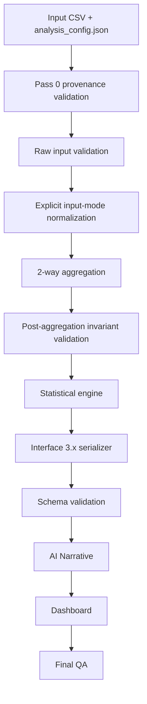

# Implementation Plan
## vcd-categorical-analysis v4.1
### Contract Repair, Statistical Correctness, Pass-0 Provenance & Verification Hardening

**Status:** Proposed / implementation-ready  
**Target:** `.agents/skills/vcd-categorical-analysis/`  
**Base:** v4.0 / Interface 3.0  
**Proposed target version:** 4.1  
**Interface:** 原則 `3.0` を維持。breaking schema change が必要な場合のみ `3.1` を検討する。  
**Primary scope:** Complete nominal 2-way contingency tables only

---

# 1. Purpose

v4.0 で導入された

- Effect
- Evidence
- Influence
- Stability
- Posterior Uncertainty

の5軸分離という設計を維持したまま、**仕様上完成していることになっているが、実コード・試験・成果物契約が追随していない箇所を修復する**。

v4.1 の主目的は新規統計手法の追加ではない。

> **「仕様・実装・テスト・成果物・Pass 0 provenance が同じ契約を表現する状態」**

を完成条件とする。

---

# 2. Current-state assessment

## 2.1 P0 — 2-way only 契約と実行コードが矛盾している

v4 specification は **Arity=2 のみを受理し、3-way 以上は計算せず fail-fast する**ことを MUST としている。`workflow.md` でも3次元以上を `INVALID_INPUT_ARITY` で停止し、`vcd-bayesian-evidence-analysis` へ委譲する契約になっている。 

しかし現在の `analysis.R` は、

- default vars が `Hair,Eye,Sex`
- 入力省略時に3-way `HairEyeColor`
- Main / 2-way / saturated model の legacy log-linear 分析
- 3-way以上の場合の legacy `categorical_results.json` fallback

を依然として保持している。   

これは後方互換というより、v4.0 の canonical contract と競合する第二の実行系になっている。

### Required action

`analysis.R` から3-way execution branchを除去する。

3-way legacyコードを保存する必要がある場合は、

```text
legacy/
  analysis_v2_1_threeway.R
  report_v1_legacy.Rmd
```

等へ明示的に隔離し、v4 canonical entrypoint からは到達不能にする。

---

# 3. P0 — Input validation must precede all analysis

現状では `--render` 時、

```text
load_input_data
  ↓
apply_aggregation
  ↓
generate_profile
  ↓
generate_data / GLM / CSV / plots
  ↓
generate_categorical_results_json
  ↓
validate_input_table
```

という順序になっている。

これは fail-fast 契約と逆である。

さらに `apply_aggregation()` は `sum(..., na.rm=TRUE)` を利用しているため、frequency列に変換失敗由来の `NA` が存在しても、**入力検証より先に情報が消失する可能性**がある。

## Target flow



### Mandatory invariants

解析計算を開始する前に最低限、

\[
\text{arity}=2,\quad
I\ge2,\quad
J\ge2,\quad
N>0
\]

および、

\[
n_{ij}\in\{0,1,2,\ldots\}
\]

を保証する。

加えて、

- categorical variables の `NA`
- frequency の `NA/NaN/Inf`
- negative frequency
- non-integer frequency
- zero marginal row
- zero marginal column
- duplicated/ambiguous column names
- structural-zero declaration

を明示的に処理する。

---

# 4. P0 — Raw data と aggregated data を暗黙判定しない

現在は指定された frequency column が見つからない場合に raw individual-level data とみなし、自動集約する経路が存在する。

これは便利だが、

> `--freq Freqency`

のような単純なtypoまで raw data と解釈する危険がある。

## New contract

明示的に、

```json
{
  "input_mode": "aggregated"
}
```

または

```json
{
  "input_mode": "individual"
}
```

を設定する。

### aggregated

`freq` は必須。存在しなければ停止。

### individual

`freq` は使用しない。各rowを1 observationとして明示的に集計。

`auto` mode は canonical production path では使用しない。

---

# 5. P0 — Pass 0 / SHA-256 contract を2-way経路に接続する

`sha256-inspection-contract-improvement-plan.md` で提案された主要部分は、共有層では既にかなり実装されている。

`inspect_data.R` は現在、

- `inspection_contract_version = "2.0"`
- canonical `input_sha256`
- legacy alias `file_sha256`
- SHA-256生成失敗時 fail-fast

を実装している。

さらに `.agents/shared/pass0_contract.R` には、

```r
validate_pass0_provenance()
```

が存在し、

- inspection artifact SHA
- inspection input SHA
- config provenance SHA
- actual input SHA
- target skill
- inspection status

をfail-closedで検証できる。

一方、現行 `vcd-categorical-analysis/templates/analysis.R` はこの共通契約を source / invoke していない。設定ファイルから input / vars / freq 等を読むだけである。

## Required implementation

```r
source(".agents/shared/pass0_contract.R")

validate_pass0_provenance(
    config_data     = config_data,
    config_path     = config_path,
    expected_skill  = "vcd-categorical-analysis",
    repo_root       = repo_root
)
```

を canonical config-driven path の入口に導入する。

SHA計算コードを vcd-categorical-analysis 内へ複製してはならない。

---

# 6. P0 — v4 tests are not sufficient evidence of completion

OpenSpec tasks では、

```text
test_vcd_categorical_input_validation.R
test_vcd_categorical_residual_diagnostics_v4.R
test_vcd_categorical_evidence_v4.R
test_vcd_categorical_dirichlet_v4.R
test_vcd_categorical_generated_quantities_v4.R
test_vcd_categorical_interface_v3.R
test_vcd_categorical_dashboard_v4.R
```

などの試験が完了済みとして記録されている。

しかしskill-local `tests/` の現状は、

```text
test_logic.R
verify_skill.sh
```

のみである。

しかも `test_logic.R` は HairEyeColor 3-way、legacy aggregation、legacy plotting 等を多く検査しており、v4 statistical modules のacceptance testとしては不十分である。

`verify_skill.sh` も入力を指定せず HairEyeColor legacy成果物を期待する構造である。

## Required action

OpenSpec checkbox は一旦再オープンする。

**「ファイル存在」「実際に実行」「期待値を検証」**の三条件を満たした項目だけを `[x]` に戻す。

---

# 7. P1 — Dual-Filter small-N logic bug

仕様は、

\[
N\ge2000
\]

の場合のみ、

\[
|\log(O/E)|\ge0.50
\]

かつ

\[
T^{score}\ge3.84
\]

を満たすregular cellを `dual_filter_candidate` とする。

ところが現実装は `N < 2000` の `else` branch でも同条件を満たすセルを candidate にしている。

## Fix

```r
is_candidate <-
    N >= large_n_threshold &&
    is_finite &&
    quarantine_status == "ACTIVE" &&
    abs(log_oe) >= effect_threshold &&
    score_statistic >= score_threshold
```

とする。

small-Nで同様の情報を表示したい場合は、

```text
effect_evidence_flag
```

等の別フィールドとし、`dual_filter_candidate` と混同しない。

---

# 8. P1 — Canonical analysis signature を一つにする

現在は実質的に3種類のsignatureが存在する。

### Run directory signature

input SHA + vars + freq 等をdigestしているが、内部 `interface_version` が `"1.0"` のまま。

### Posterior RNG signature

```r
paste(data_label, vars[1], vars[2], sep="_")
```

を渡している。

### Result JSON signature

serializer が、

```r
digest(list(glob, cells_list))
```

から新たに生成している。

これでは同じ語 `analysis_signature` が異なる意味を持つ。

## Canonical signature

一度だけ、

\[
S=
SHA256(
\text{engine version},
\text{input SHA},
\text{config SHA},
\text{vars},
\text{freq},
\text{prior},
\text{thresholds},
\text{aggregation policy}
)
\]

として生成する。

この `S` を、

- run identity
- deterministic RNG seed derivation
- categorical_results.json
- run_meta.json
- dashboard provenance

の全箇所で共有する。

---

# 9. P1 — Posterior contract mismatch

`compute_dirichlet_posterior()` 自体のdefaultは10,000 drawsだが、canonical entrypointからは `n_draws=5000L` と明示的に上書きされている。 

一方OpenSpecは既定10,000 drawsを要求する。

## Fix

production default:

```text
posterior_draws = 10000
```

を一箇所で定義する。

テスト用にdraw数を減らす場合は、

```text
test_mode
```

または明示的configで変更し、production JSONには実draw数を必ず記録する。

---

# 10. P1 — practical delta contract violation

v4計画では `practical delta = NULL` を固定する方針があり、恣意的な practical-effect threshold の自動判定はnon-goalである。 

しかし `compute_dirichlet_posterior()` は、

```r
delta = 0.05
```

をdefaultに持ち、すべてのcellについて

```r
prob_practical_delta
```

を常時計算している。

## Fix

```r
delta = NULL
```

をcanonical defaultとする。

```r
if (!is.null(delta)) {
    ...
}
```

の場合だけ practical-effect probability を生成する。

また結果には、

```json
"practical_effect": {
  "enabled": false,
  "delta": null
}
```

のように設定状態を明示する。

---

# 11. P1 — Prior sensitivity analysis is under-implemented

OpenSpecは、感度分析を有効化した場合、

- $\alpha=0.5$
- posterior median
- 95% ETI

を比較可能にすることを要求している。

現在は主として posterior analytic mean の差だけを比較し、

```text
max_absolute_mean_diff
```

を返している。

## v4.1

最低限、

```text
primary
sensitivity
difference
```

の3ブロックを持ち、

- median
- Q2.5
- Q97.5
- interval width
- direction probability

を比較可能にする。

---

# 12. P1 — Expected-count diagnosticsをglobal qualityへ追加

v4計画では expected count diagnostics を含める設計だが、現在のglobal outputには主に、

- $N$
- dimensions
- $\chi^2$
- $G^2$
- p-values
- Cramér's V

のみが保存される。

global qualityとして最低限、

```json
{
  "expected_count_diagnostics": {
    "min_expected": 0.0,
    "n_expected_lt_1": 0,
    "n_expected_lt_5": 0,
    "proportion_expected_lt_5": 0.0,
    "asymptotic_chisq_reliable": true
  }
}
```

を追加する。

これはcell quarantineとは別概念である。

---

# 13. P1 — Zero-margin invariant

あるrowまたはcolumnの総度数が0の場合、

\[
E_{ij}=0
\]

となり、

\[
(O-E)/\sqrt{E}
\]

が定義できない。

現在の入力検証は `N>0` と各変数の水準数は確認するが、positive marginal totals を明示的には保証していない。

## Add invariant

\[
n_{i+}>0\quad\forall i
\]

\[
n_{+j}>0\quad\forall j
\]

を要求する。

違反時は、

```text
ZERO_MARGIN_NOT_SUPPORTED
```

で停止する。

---

# 14. P1 — Schema should become an executable contract

現行SchemaはInterface 3.0の基本構造を定義しているが、posterior cell の制約やprovenance内容などは比較的緩い。

## Harden schema

以下を検討する。

```text
additionalProperties: false
```

を主要objectへ適用。

さらに、

- SHA-256 pattern
- row/col levels
- posterior median / ETI
- prior sensitivity
- expected-count diagnostics
- input provenance
- config provenance
- engine version
- thresholds used
- posterior draws
- deterministic seed

を明示する。

### Cross-field invariant tests

JSON Schemaだけで表現しづらい以下はR testで確認する。

\[
\#cells = I\times J
\]

\[
0\le p\le1
\]

\[
Q_{0.025}\le Q_{0.50}\le Q_{0.975}
\]

\[
0\le V_L\le V\le V_U\le1
\]

および、

```text
log_oe == null
⇔ log_oe_state == NEGATIVE_INFINITY
```

等。

---

# 15. P1 — Provenance blockを分析監査に耐える形へ拡張

現行serializerのprovenanceは、

- run_id
- timestamp
- R version
- platform

が中心である。

v4.1では以下を追加する。

```json
{
  "engine_version": "4.1",
  "interface_version": "3.0",
  "input_sha256": "...",
  "inspection_results_sha256": "...",
  "analysis_config_sha256": "...",
  "analysis_signature": "...",
  "posterior_seed": 123456,
  "posterior_draws": 10000
}
```

可能であれば `git_commit` も記録する。

---

# 16. P1 — Run stateを一本化する

現在、

- `run_meta.json` の `run_state`
- validation error時の `run_state.json`

が併存する。

さらに `update_run_state()` のallowed stateには `failed` がない一方、input specificationは `status: failed` を要求する。 

## Canonical lifecycle

```text
allocated
   ↓
validated
   ↓
profile_complete
   ↓
render_in_progress
   ↓
render_complete
```

失敗時はどのstateからでも、

```text
failed
```

へ遷移可能にする。

error code と message を同一canonical state artifactへ記録する。

---

# 17. P1 — Dashboard implementation does not match declared completion

OpenSpec taskは residual heatmap、uncertainty matrix、independence departure、Mosaic等を含む10-section相当のScientific Dashboardを完了済みとしている。

現行 `dashboard.Rmd` の明示的section構成は実質、

1. Executive Summary
2. Global Association
3. Effect × Evidence
4. Cell Explorer
5. Dirichlet Posterior
6. Quality & Provenance

である。 

したがって、現時点で「Dashboard Phase completed」と扱うべきではない。

## Target sections

1. Executive Summary
2. Global Association & Effect Size
3. Effect × Evidence Map
4. Adjusted Residual Heatmap
5. Cell Explorer
6. Joint Posterior Credible Intervals
7. Conditional Probability Intervals
8. Uncertainty / ETI Width View
9. Posterior Departure from Independence + Prior Sensitivity
10. Structural Mosaic + Quality / Provenance

ただし表示過多を防ぐため、大表ではtop-Nや折り畳み表示を用いる。

---

# 18. P1 — Offline test must validate generated HTML

`self_contained: true` や `mathjax: null` を設定しただけではoff-line guaranteeにはならない。

必ずrendered HTMLに対して、

```text
https://
http://
src="//
href="//
```

等の外部参照を検査する。

ただし HTML namespace、schema URI、埋込データ等を誤検出しないようallowlist方式を用いる。

さらに可能なら headless browser smoke test で、

- JavaScript errorなし
- DataTable生成
- figure存在
- section数
- executive summary挿入

を確認する。

---

# 19. P2 — Legacy artifactsをcanonical treeから隔離

`templates/report.Rmd` は自身を、

> Categorical analysis (vcd, up to 3-way) [LEGACY v1.x]

と明記し、1〜3wayを受理している。

またトップレベル `Reference.md` も3-way以上のlog-linear modelを本スキルの機能のように説明している。

一方 `SKILL.md` はcomplete nominal 2-way onlyと明記している。

## Repair

canonical documentation hierarchyを、

```text
SKILL.md
Reference.md
references/
templates/
```

ですべて2-way v4.1へ統一する。

legacy materialは、

```text
legacy/
```

または `docs/Archives/` へ移動する。

---

# 20. P2 — Shared quality contract vocabulary cleanup

`.agents/shared/analysis_quality_contract.md` は `vcd-categorical-analysis` を適用対象としている一方、AI review標準や可視化QAに旧 `Evidence Score` という語が残っている。

後段では旧Evidence Scoreを使わない旨も記載されているため、同じ契約文書内で語彙が競合している。

v4.1では、

```text
Effect
Evidence
Influence
Stability
Posterior Uncertainty
```

をcanonical vocabularyとする。

旧Evidence Scoreはlegacy-only sectionに隔離する。

---

# 21. Implementation phases

## Phase 0 — Re-open contract

対象:

```text
docs/Artifacts/Implementation-plan-vcd-categorical-analysis-v4.0.md
openspec/changes/vcd-categorical-analysis-v4/
```

Tasks:

- v4.0 Completed を historical status とする
- v4.1 repair changeを新設
- 未検証の `[x]` をv4.1では継承しない
- acceptance evidenceを再構築

**Exit:** specと現コードの差分が明示されている。

---

## Phase 1 — Entry point & input gate

対象:

```text
templates/analysis.R
R/validate_input.R
.agents/shared/pass0_contract.R
```

Tasks:

- 3-way legacy execution removal
- canonical 2-way fail-fast
- Pass0 provenance validation
- input_mode導入
- missing policy固定
- zero-margin検査
- validation-first ordering
- failed lifecycle導入

**Exit:** 不正入力では統計モデル・図・結果CSVを一切生成しない。

---

## Phase 2 — Statistical correctness

対象:

```text
R/residual_diagnostics.R
R/effect_evidence_metrics.R
R/dirichlet_posterior.R
.agents/shared/categorical/cramers_v_ci.R
```

Tasks:

- Dual-Filter N threshold修正
- expected-count diagnostics
- posterior draws 10,000
- practical delta default NULL
- prior sensitivity interval化
- numerical invariant guards
- extreme sparse / zero-cell tests

**Exit:** reference calculationsと数値許容誤差内で一致。

---

## Phase 3 — Reproducibility & provenance

Tasks:

- canonical analysis_signature
- input/config/inspection SHA保存
- deterministic RNG derivation統一
- run_meta/result/dashboard同一signature
- provenance fixture追加

**Exit:** 同一input + configでcanonical statistical JSONが再現する。

timestamp等の非決定項目を除外した比較を行う。

---

## Phase 4 — Interface contract

対象:

```text
schemas/categorical_results_v3.json
references/interface.md
R/serializer_v3.R
```

Tasks:

- schema hardening
- posterior generated quantities完成
- sensitivity schema
- expected-count quality
- provenance schema
- actual JSON schema validation
- old fixture fail-safe test

**Exit:** output JSON がmachine validationを通過する。

---

## Phase 5 — Dashboard completion

対象:

```text
templates/dashboard.Rmd
```

Tasks:

- missing analytical views追加
- top-N degradation policy
- zero/quarantine visual semantics
- offline static scan
- browser smoke test
- Windows/macOS/Ubuntu font fallback

**Exit:** 仕様化されたsectionと機械QAが一致。

---

## Phase 6 — Test reconstruction

新規または再構築:

```text
tests/test_vcd_categorical_input_validation_v41.R
tests/test_vcd_categorical_pass0_contract_v41.R
tests/test_vcd_categorical_residuals_v41.R
tests/test_vcd_categorical_effect_evidence_v41.R
tests/test_vcd_categorical_dirichlet_v41.R
tests/test_vcd_categorical_signature_v41.R
tests/test_vcd_categorical_schema_v41.R
tests/test_vcd_categorical_dashboard_v41.R
tests/test_vcd_categorical_e2e_v41.R
```

### Golden datasets

最低限、

```text
2x2 balanced
2x2 strong association
RxC moderate association
zero observed cells
expected count < 5
high leverage
N = 1999
N = 2000
N = 2001
zero marginal row
zero marginal column
NA frequency
negative frequency
non-integer frequency
3-way input
structural-zero marker
large-N scaled table
```

をfixture化する。

特に、

\[
N=1999,\;2000,\;2001
\]

はDual-Filter境界試験として必須。

---

# 22. Acceptance matrix

| ID | Acceptance |
|---|---|
| AC-01 | 3-way inputはモデル計算前に `INVALID_INPUT_ARITY` |
| AC-02 | invalid frequencyはaggregation前に停止 |
| AC-03 | Pass0 SHA三者照合が成功 |
| AC-04 | input改変後はfail-closed |
| AC-05 | N=1999でDual-Filter candidate=FALSE |
| AC-06 | N>=2000かつ条件充足セルのみcandidate |
| AC-07 | zero/quarantined cellはcandidateにならない |
| AC-08 | canonical production posterior draws=10000 |
| AC-09 | practical delta未指定ならprobabilityを計算しない |
| AC-10 | same input/config → same statistical JSON |
| AC-11 | schema validation pass |
| AC-12 | posterior quantiles monotonic |
| AC-13 | conditional probabilities sum to 1 within tolerance |
| AC-14 | positive marginal totals invariant |
| AC-15 | generated dashboard has no external dependency |
| AC-16 | required dashboard sections render |
| AC-17 | current 2-way fixtures pass Windows/macOS/Linux CI |
| AC-18 | legacy 3-way code is unreachable from canonical entrypoint |

---

# 23. Statistical tolerance policy

Floating-point比較は `identical()` に依存しない。

例:

\[
|x_{\mathrm{impl}}-x_{\mathrm{ref}}|
\le
\epsilon_{\mathrm{abs}}
+
\epsilon_{\mathrm{rel}}|x_{\mathrm{ref}}|
\]

を使用する。

推奨初期値:

```text
analytic statistics:
  abs = 1e-10
  rel = 1e-8

Monte Carlo summaries:
  tolerance defined from MCSE
```

Monte Carlo outputについて固定seedだけを理由に理論値一致とみなさず、

\[
MCSE \approx \frac{s}{\sqrt{M}}
\]

を考慮したテストも追加する。

---

# 24. Commit boundaries

実装は最低限以下の独立commitへ分ける。

```text
1. contract: reopen categorical v4.1 repair spec
2. fix: enforce two-way input gate and remove legacy runtime path
3. fix: wire pass0 SHA provenance contract
4. fix: repair dual-filter and posterior defaults
5. feat: unify analysis signature and provenance
6. feat: harden interface schema
7. feat: complete dashboard analytical views
8. test: rebuild categorical v4.1 verification suite
9. docs: remove legacy ambiguity and close OpenSpec
```

一つの巨大commitにしない。

---

# 25. QA strategy

この改修はstatistical engine、Pass0 contract、schema、run lifecycleを同時に触るため **strict QA** とする。

レビューは実装者の自己説明から始めず、

```text
Spec
 ↓
Tests
 ↓
Implementation
 ↓
Evidence
```

のblind-first順序で行う。

最低限以下を独立再現する。

```text
1. 3-way rejection
2. invalid-frequency rejection
3. SHA mismatch rejection
4. N=1999 / 2000 / 2001 Dual-Filter boundary
5. zero-cell handling
6. deterministic posterior reproduction
7. schema validation
8. dashboard offline validation
9. complete E2E run
```

---

# 26. Definition of Done

v4.1をCompletedと呼べるのは、

1. specとentrypointが2-way onlyで一致する。
2. input validationがすべての統計処理より前に実行される。
3. Pass0 SHA provenanceが実入力まで連結される。
4. canonical analysis signatureが一つだけ存在する。
5. Dual-Filterのlarge-N semanticsが正しい。
6. posterior configurationが仕様と一致する。
7. practical thresholdを無断で仮定しない。
8. schemaが実際にmachine validationされる。
9. OpenSpecに記載したtestが実在して成功する。
10. Dashboardの宣言機能と実装機能が一致する。
11. legacy 3-way経路がcanonical runtimeから排除される。
12. independent QA evidenceが保存される。

場合に限る。

---

# 27. Non-goals

v4.1では以下を追加しない。

- 3-way log-linear model
- quasi-independence model
- ordinal association model
- automatic practical-significance threshold
- frequentist/Bayesian統合スコア
- machine-learning classifier
- arbitrary pairwise testing engine

これらは別skillまたは別changeとして扱う。

---

# 28. Proposed priority

実装順は、

```text
P0
 ├─ two-way-only entrypoint
 ├─ validation-first
 ├─ Pass0 SHA connection
 └─ real v4 tests
      ↓
P1
 ├─ Dual-Filter correction
 ├─ signature/provenance
 ├─ posterior contract
 ├─ schema
 └─ dashboard completion
      ↓
P2
 ├─ legacy cleanup
 └─ documentation vocabulary cleanup
```

とする。

統計機能やDashboardを追加する前にP0を完了させること。

---

# 提案

v4.0を直接「修正済み」と上書きするのではなく、

> **`vcd-categorical-analysis-v4.1-repair`**

という新しいOpenSpec changeを作り、v4.0をbaselineとして保存することを推奨する。

特に最初の実装PRでは機能追加を避け、

1. 3-way経路排除
2. validation-first
3. Pass0 provenance接続
4. Dual-Filter境界修正
5. v4.1 test skeleton

だけに限定すると、QAが非常に容易になる。

---

# 批判的立場

v4.0の最大の弱点は統計理論そのものではなく、**「文書上の完成度が実装上の完成度を先行している」**ことである。

OpenSpec taskをすべて `[x]` にし、Implementation Planを `Completed` に変更している一方で、canonical entrypointには3-way legacy経路が残り、計画されたtest suiteも十分に対応していない。したがって、現在の最大リスクは新しい手法の不足ではなく、**verification evidenceの信頼性**である。

v4.1では「機能数」よりも、

\[
\boxed{
Purpose
\rightarrow
Contract
\rightarrow
Implementation
\rightarrow
Test
\rightarrow
Evidence
}
\]

の一致を完成条件とすべきである。