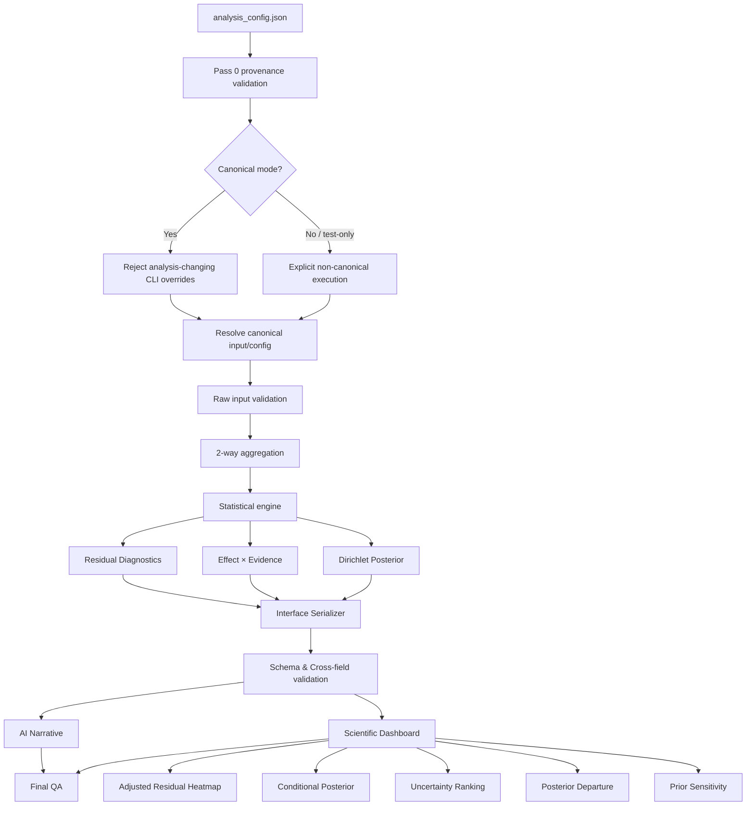

# Implementation Plan

# vcd-categorical-analysis v4.2

## Dashboard Analytical Completion & Provenance Boundary Hardening

Status: Proposed
Target: `.agents/skills/vcd-categorical-analysis/`
Change Type: Feature completion + contract hardening
Risk Profile: Medium-High
QA Profile: Strict
Interface Target: Preserve Interface 3.0 unless schema extension requires additive 3.1

---

# 1. Purpose

`vcd-categorical-analysis` v4.1 で確立した以下の設計原則を維持したまま、
解析結果の科学的可視化を完成させる。

1. Effect と Evidence を分離する
2. Frequentist diagnostics と Bayesian uncertainty を分離する
3. Quarantine / numerical reliability を解析結果から分離する
4. Pass 0 provenance を canonical input boundary とする
5. 同一入力・同一設定から再現可能な解析結果を得る

今回の改修目的は次の2点である。

A. Dashboard analytical views の完成
B. Pass 0 provenance を迂回可能な CLI override escape hatch の除去

---

# 2. Primary Goals

## Goal A — Scientific Dashboard Completion

現在の Dashboard に次の5分析ビューを追加する。

1. Adjusted Residual Heatmap
2. Conditional Posterior
3. Uncertainty Ranking
4. Posterior Departure from Independence
5. Prior Sensitivity Visualization

これらは単なる装飾ではなく、
それぞれ異なる scientific question に対応させる。

| View                      | Scientific Question                                      |
| ------------------------- | -------------------------------------------------------- |
| Adjusted Residual Heatmap | 独立性から局所的にどのセルが逸脱しているか               |
| Conditional Posterior     | 一方のカテゴリを条件としたとき他方の確率分布はどうなるか |
| Uncertainty Ranking       | どのセル・条件付き確率の推定が最も不確実か               |
| Posterior Departure       | 独立性からの乖離について事後分布は何を示すか             |
| Prior Sensitivity         | 結論が prior specification に依存していないか            |

---

## Goal B — Provenance Escape Hatch Closure

現在の canonical 実行では、

1. `analysis_config.json`
2. Pass 0 provenance validation
3. CLI override

の順に処理されるため、
Pass 0 で検証した input/config と異なる解析条件を
CLI から差し込める可能性がある。

以下を invariant とする。

> canonical analysis では、
> Pass 0 によって承認された input/config が
> 実際に解析される唯一の input/config でなければならない。

---

# 3. Non-Goals

今回の改修では以下を行わない。

- 3-way 以上への再拡張
- 新しい仮説検定の大量追加
- effect size metric の追加
- 任意の自動 practical threshold 導入
- Interface の不必要な breaking change
- Dashboard framework 全面刷新
- JavaScript frontend 化
- Shiny 化
- 外部 CDN 依存
- Pass 0 contract の二重実装

---

# 4. Target Pipeline



---

# 5. Workstream A

# Provenance Boundary Hardening

## A1. Canonical CLI Policy

canonical execution で許可する CLI 引数を限定する。

Allowed:

```text
--config
--out
--label
```

原則として以下は canonical execution では禁止する。

```text
--data
--vars
--freq
--input-mode
--practical-delta
--prior-alpha
```

解析内容を変更するパラメータはすべて
`analysis_config.json` に記録されること。

---

## A2. Override Rejection

canonical execution 中に analysis-changing CLI option が指定された場合、

```text
CANONICAL_CONFIG_OVERRIDE_FORBIDDEN
```

として fail-fast する。

例:

```bash
Rscript analysis.R \
  --config analysis_config.json \
  --data another.csv
```

は解析を開始してはならない。

---

## A3. Actual Input SHA Revalidation

CLI override を禁止した場合でも、
実解析直前に actual input SHA を再計算する。

Invariant:

```text
SHA(actual input)
==
Pass0.input_sha256
==
Config.input_sha256
```

不一致時:

```text
PROVENANCE_SHA_MISMATCH
```

で停止する。

---

## A4. Canonical Config Integrity

解析条件を signature 作成前に canonicalize する。

Canonical signature input:

```text
engine_version
input_sha256
config_sha256
vars
freq
input_mode
prior_alpha
practical_delta
aggregation_policy
relevant thresholds
```

署名生成後に解析条件が変更されてはならない。

---

## A5. Explicit Non-Canonical Mode

unit test / development 目的で Pass 0 を迂回する必要がある場合、
暗黙の bypass は禁止する。

必要であれば明示的に:

```text
execution_mode = "development"
```

または内部 test helper を使用する。

production/canonical path とは完全に分離する。

禁止:

```text
if missing config:
    silently continue
```

---

# 6. Workstream B

# Adjusted Residual Heatmap

## Scientific Purpose

Pearson residual ではなく adjusted residual を主表示とし、
セル単位で独立性からの局所逸脱を可視化する。

主表示量:

$$
r_{ij}^{adj}
=
\frac{O_{ij}-E_{ij}}
{\sqrt{E_{ij}(1-p_{i+})(1-p_{+j})}}
$$

---

## Requirements

- x-axis: column category
- y-axis: row category
- fill/value: adjusted residual
- center = 0
- positive / negative direction が明示される
- quarantined cell を視覚的に区別
- exact numeric value 表示可能
- large table では label suppression または top-N policy
- visual ordering を deterministic にする

---

## Statistical Interpretation

Dashboard 内に以下を明示する。

```text
Adjusted residual は局所的な独立性逸脱の診断量であり、
effect size そのものではない。
```

---

# 7. Workstream C

# Conditional Posterior Visualization

## Scientific Purpose

joint posterior のみではなく、

$$
P(B=j \mid A=i)
$$

および

$$
P(A=i \mid B=j)
$$

を可視化する。

---

## Required Quantities

posterior engine から少なくとも:

```text
mean
median
q025
q975
ETI width
```

を取得する。

現在 mean/sd のみなら serializer を additive extension する。

---

## Dashboard Views

### C1. P(B | A)

各 row category ごとに column probabilities を表示。

### C2. P(A | B)

各 column category ごとに row probabilities を表示。

推奨表示:

```text
point + 95% ETI
```

カテゴリが多い場合:

```text
small multiples
```

または

```text
top-N + table fallback
```

---

## Invariants

各 posterior draw について:

$$
\sum_j P(B=j|A=i)=1
$$

$$
\sum_i P(A=i|B=j)=1
$$

数値誤差を除き成立すること。

---

# 8. Workstream D

# Uncertainty Ranking

## Scientific Purpose

「大きな効果」ではなく、

> どの推定が最も不確実か

を独立に示す。

---

## Primary Metric

joint posterior:

$$
U_{ij}
=
q_{0.975}(\pi_{ij})
-
q_{0.025}(\pi_{ij})
$$

すなわち posterior ETI width。

---

## Secondary Metrics

必要に応じて:

```text
posterior SD
conditional posterior ETI width
```

---

## Dashboard

ランキング形式:

```text
Rank
Cell
Posterior median
95% ETI
ETI width
Observed count
Expected count
Quarantine status
```

---

## Important Constraint

Uncertainty ranking を

```text
important cells
significant cells
effect cells
```

として表現してはならない。

Uncertainty は Effect/Evidence と別軸である。

---

# 9. Workstream E

# Posterior Departure from Independence

## Scientific Purpose

独立性からの局所乖離:

$$
D_{ij}
=
\log
\frac{\pi_{ij}}
{\pi_{i+}\pi_{+j}}
$$

について事後分布を可視化する。

---

## Required Summary

各セルについて:

```text
log_divergence_mean
log_divergence_median
log_divergence_q025
log_divergence_q975
log_divergence_eti_width
prob_dir_positive
```

---

## Dashboard Visualization

推奨:

```text
forest plot
```

x-axis:

```text
posterior log departure
```

reference line:

```text
0 = independence
```

表示:

```text
median + 95% ETI
```

---

## Interpretation

```text
ETI が 0 をまたぐか否かのみで
機械的な「有意/非有意」判定を行わない。
```

posterior probability と interval を
descriptive evidence として表示する。

---

# 10. Workstream F

# Prior Sensitivity Visualization

## Scientific Purpose

主事前:

```text
Dirichlet alpha = 1.0
```

と sensitivity prior:

```text
Dirichlet alpha = 0.5
```

を比較する。

---

## Required Comparison

各セルについて:

```text
primary median
sensitivity median
median shift

primary q025/q975
sensitivity q025/q975

primary ETI width
sensitivity ETI width
ETI width difference
```

---

## Dashboard Views

### F1. Median Shift Plot

x-axis:

```text
primary posterior median
```

y-axis:

```text
sensitivity posterior median
```

reference:

```text
y = x
```

---

### F2. Largest Prior Sensitivity Table

top-N:

```text
cell
primary median
sensitivity median
absolute median shift
primary ETI width
sensitivity ETI width
```

---

## Interpretation

prior sensitivity は
「モデルが間違っている」という意味ではない。

特に sparse cells で
prior influence が強くなる可能性を示す診断とする。

---

# 11. Dashboard Target Structure

最終 Dashboard は以下を推奨する。

```text
01 Executive Summary

02 Global Association & Effect Size
   - Pearson χ²
   - G²
   - Cramér's V
   - corrected V
   - expected-count diagnostics

03 Effect × Evidence
   - log(O/E)
   - Rao score
   - Dual-Filter

04 Adjusted Residual Structure
   - adjusted residual heatmap

05 Cell Explorer
   - observed
   - expected
   - residuals
   - leverage
   - quarantine
   - evidence metrics

06 Joint Posterior
   - posterior cell probability
   - 95% ETI

07 Conditional Posterior
   - P(B|A)
   - P(A|B)

08 Uncertainty Ranking
   - ETI width ranking

09 Posterior Departure from Independence
   - log posterior departure
   - 95% ETI
   - P(direction > 0)

10 Prior Sensitivity
   - alpha=1 vs alpha=0.5
   - median shift
   - interval width comparison

11 Quality & Provenance
   - run_id
   - analysis_signature
   - input SHA
   - config SHA
   - engine version
   - posterior draws
   - deterministic seed
   - quarantine count
   - expected-count diagnostics
```

---

# 12. Serializer / Schema Changes

原則 Interface 3.0 を維持する。

additive extension で対応できる場合は
breaking version up を行わない。

追加候補:

```json
{
  "posterior": {
    "conditional": {},
    "departure_from_independence": {},
    "uncertainty": {},
    "sensitivity_analysis": {}
  }
}
```

または既存 cell posterior object に
必要なフィールドを追加する。

---

## Required Cross-Field Invariants

### Conditional probability

```text
0 <= probability <= 1
```

```text
sum conditional probabilities ≈ 1
```

### Quantiles

```text
q025 <= median <= q975
```

### ETI width

```text
eti_width = q975 - q025
eti_width >= 0
```

### Sensitivity

```text
median_shift
=
abs(primary_median - sensitivity_median)
```

### Departure

```text
0 <= prob_dir_positive <= 1
```

---

# 13. Testing Strategy

## 13.1 Provenance Boundary Tests

Create:

```text
tests/test_vcd_categorical_cli_contract.R
```

Cases:

```text
canonical + --data override      => FAIL
canonical + --vars override      => FAIL
canonical + --freq override      => FAIL
canonical + --input-mode         => FAIL
canonical + altered input file   => FAIL
canonical + untouched input      => PASS
canonical + --out                => PASS
canonical + --label              => PASS
```

Expected error:

```text
CANONICAL_CONFIG_OVERRIDE_FORBIDDEN
```

or provenance mismatch:

```text
PROVENANCE_SHA_MISMATCH
```

---

## 13.2 Adjusted Residual Heatmap Tests

Create:

```text
tests/test_vcd_categorical_dashboard_residual_heatmap.R
```

Verify:

```text
adjusted residual data present
correct row/column mapping
positive/negative values preserved
quarantine visually represented
large table fallback works
```

---

## 13.3 Conditional Posterior Tests

Create:

```text
tests/test_vcd_categorical_conditional_posterior.R
```

Verify:

```text
conditional probabilities in [0,1]
conditional sums ≈ 1
q025 <= median <= q975
same signature -> same summaries
```

---

## 13.4 Uncertainty Ranking Tests

Create:

```text
tests/test_vcd_categorical_uncertainty_ranking.R
```

Verify:

```text
eti_width >= 0
ranking descending
ties deterministic
quarantined cells not silently removed
```

---

## 13.5 Posterior Departure Tests

Create:

```text
tests/test_vcd_categorical_posterior_departure.R
```

Verify:

```text
log departure finite when valid
q025 <= median <= q975
prob_dir_positive in [0,1]
independent simulated table approximately centered near 0
strong association shifts posterior departure appropriately
```

---

## 13.6 Prior Sensitivity Tests

Create:

```text
tests/test_vcd_categorical_prior_sensitivity.R
```

Verify:

```text
alpha 1.0 result exists
alpha 0.5 sensitivity result exists
median_shift correctly calculated
ETI widths correctly calculated
sparse cells show valid intervals
deterministic result under same analysis signature
```

---

## 13.7 Dashboard Offline Tests

Extend/create:

```text
tests/test_vcd_categorical_dashboard_v42.R
```

Verify:

```text
all required 11 sections exist
no external HTTP/HTTPS dependency
MathML renders
DataTables self-contained
required plots generated
large table degradation path works
```

---

# 14. Golden Test Cases

最低限以下を固定ケースとして使用する。

```text
G01 2x2 balanced independence
G02 2x2 strong positive association
G03 3x4 moderate association
G04 sparse table
G05 observed zero cell
G06 expected < 5 cell
G07 high leverage cell
G08 N = 1999
G09 N = 2000
G10 N = 2001
G11 prior-sensitive sparse example
G12 approximately independent large-N example
G13 invalid SHA
G14 CLI override attack
```

---

# 15. Acceptance Criteria

## Contract

- [ ] canonical execution から analysis-changing CLI override が不可能
- [ ] actual input SHA が解析直前に再検証される
- [ ] Pass 0 input と actual analysis input が一致する
- [ ] canonical signature 作成後に解析条件が変更されない

## Statistical

- [ ] adjusted residual heatmap が正しく生成される
- [ ] conditional posterior が両方向で計算される
- [ ] conditional probabilities が各条件内で1に和する
- [ ] uncertainty ranking が ETI width に基づく
- [ ] posterior departure interval が生成される
- [ ] prior sensitivity が median と ETI の両方を比較する

## Dashboard

- [ ] 11 section structure を満たす
- [ ] offline self-contained
- [ ] external CDN 無し
- [ ] large table degradation policy がある
- [ ] quarantine が主要ビューで可視化される

## Reproducibility

- [ ] same input + same config => same analysis_signature
- [ ] same signature => same posterior seed
- [ ] same signature => same statistical summaries
- [ ] timestamp 等 nondeterministic metadata を除き reproducible

## QA

- [ ] regression suite pass
- [ ] new v4.2 tests pass
- [ ] OpenSpec strict validation pass
- [ ] independent QA reviewer が blind-first で再検証
- [ ] unresolved High / Medium findings = 0 before close

---

# 16. Task List

## Phase 0 — Specification & 3-Change Decomposition

親計画 v4.2 は、責務境界と安全な段階リリースのため以下の3つの OpenSpec Change に直列分割して管理・実装する：

| 親計画フェーズ | 担当 OpenSpec Change | 主たる責務 |
|---|---|---|
| Phase 1: Provenance Boundary Hardening | `vcd-categorical-provenance-boundary-hardening` (Change 1) | Canonical CLI ホワイトリスト化、三者SHA再検証、署名前早期遮断、Core内部の独立三者SHA再検証と実行モード分離 |
| Phase 2: Posterior Data Model Extension | `vcd-categorical-conditional-posterior-contract` (Change 2) | 条件付き事後の完全要約、Departure/Uncertainty/SensitivityのJSON契約固定、Serializer拡張 |
| Phase 3〜8: Dashboard Views & Integration | `vcd-categorical-scientific-dashboard` (Change 3) | 11セクション科学的視座分離、完全オフライン二重受入（静的走査＋ブラウザ）、大規模表対応 |
| Phase 9: QA & Regression | 各Change局所QA ＋ 最終統合QA | 個別Changeの完了判定および最終的な全体統合回帰検証 |

- [x] T0.1 OpenSpec change への3分割（Change 1 / Change 2 / Change 3）を確定・作成
- [x] T0.2 Purpose / Scope / Non-Goals を3つのChangeへ整合・展開
- [x] T0.3 canonical CLI policy を完全ホワイトリスト方式として仕様化（Change 1）
- [x] T0.4 5つのDashboard view の scientific purpose および JSON契約を仕様化（Change 2, 3）
- [x] T0.5 Interface 3.0 additive extension 方針を確定（Change 2）
- [x] T0.6 3 Change 間の依存順序（Change 1 $\to$ Change 2 $\to$ Change 3）と受入マトリクスを確定

---

## Phase 1 — Provenance Boundary Hardening

- [ ] T1.1 canonical mode で許可する CLI option を allow-list 化
- [ ] T1.2 `--data` override を禁止
- [ ] T1.3 `--vars` override を禁止
- [ ] T1.4 `--freq` override を禁止
- [ ] T1.5 `--input-mode` override を禁止
- [ ] T1.6 その他 analysis-changing option を禁止
- [ ] T1.7 actual input SHA の解析直前再検証を追加
- [ ] T1.8 config SHA / input SHA / Pass0 SHA の一致 invariant を確認
- [ ] T1.9 `CANONICAL_CONFIG_OVERRIDE_FORBIDDEN` error code を追加
- [ ] T1.10 canonical/non-canonical execution path を明確に分離
- [ ] T1.11 CLI boundary regression test を追加

---

## Phase 2 — Posterior Data Model Extension

- [ ] T2.1 conditional posterior に median/q025/q975 を追加
- [ ] T2.2 conditional posterior ETI width を追加
- [ ] T2.3 posterior departure の median/q025/q975 を確認・標準化
- [ ] T2.4 posterior departure ETI width を標準化
- [ ] T2.5 uncertainty ranking 用の canonical uncertainty field を定義
- [ ] T2.6 prior sensitivity cell comparison を serializer に正規化
- [ ] T2.7 cross-field invariant validator を拡張
- [ ] T2.8 JSON schema を additive extension
- [ ] T2.9 schema regression tests を追加

---

## Phase 3 — Adjusted Residual Heatmap

- [ ] T3.1 adjusted residual matrix builder を実装
- [ ] T3.2 deterministic ordering を実装
- [ ] T3.3 zero-centered visual scale を実装
- [ ] T3.4 quarantine overlay を実装
- [ ] T3.5 large-table label suppression を実装
- [ ] T3.6 Dashboard Section 04 を追加
- [ ] T3.7 heatmap regression test を追加

---

## Phase 4 — Conditional Posterior

- [ ] T4.1 P(B|A) summary generator を実装
- [ ] T4.2 P(A|B) summary generator を実装
- [ ] T4.3 conditional probability sum invariant を実装
- [ ] T4.4 point + 95% ETI view を実装
- [ ] T4.5 high-cardinality fallback を実装
- [ ] T4.6 Dashboard Section 07 を追加
- [ ] T4.7 conditional posterior regression tests を追加

---

## Phase 5 — Uncertainty Ranking

- [ ] T5.1 joint posterior ETI width を canonical uncertainty metric とする
- [ ] T5.2 deterministic ranking を実装
- [ ] T5.3 tie handling を実装
- [ ] T5.4 quarantine status をランキングに保持
- [ ] T5.5 conditional uncertainty を補助表示可能にする
- [ ] T5.6 Dashboard Section 08 を追加
- [ ] T5.7 uncertainty regression tests を追加

---

## Phase 6 — Posterior Departure from Independence

- [ ] T6.1 log departure summary を serializer に正式配置
- [ ] T6.2 median + 95% ETI forest plot を実装
- [ ] T6.3 zero-reference line を明示
- [ ] T6.4 `prob_dir_positive` を補助情報として表示
- [ ] T6.5 mechanical significance labeling を禁止
- [ ] T6.6 Dashboard Section 09 を追加
- [ ] T6.7 departure regression tests を追加

---

## Phase 7 — Prior Sensitivity

- [ ] T7.1 alpha=1.0 / alpha=0.5 comparison table を標準化
- [ ] T7.2 median shift を計算
- [ ] T7.3 ETI width difference を計算
- [ ] T7.4 y=x sensitivity scatter plot を実装
- [ ] T7.5 top prior-sensitive cells table を実装
- [ ] T7.6 sparse-cell degradation を検証
- [ ] T7.7 Dashboard Section 10 を追加
- [ ] T7.8 prior sensitivity regression tests を追加

---

## Phase 8 — Dashboard Integration

- [ ] T8.1 Dashboard を11 section構造に整理
- [ ] T8.2 Executive Summary から主要ビューへの導線を整理
- [ ] T8.3 Quarantine 表示規則を全ビューで統一
- [ ] T8.4 terminology を統一
- [ ] T8.5 offline dependency scan を実施
- [ ] T8.6 Windows / macOS / Linux font fallback を確認
- [ ] T8.7 large-table degradation policy を確認
- [ ] T8.8 Dashboard integration tests を追加

---

## Phase 9 — Regression & QA

- [ ] T9.1 Golden G01-G14 を実行
- [ ] T9.2 N=1999/2000/2001 boundary を再確認
- [ ] T9.3 CLI override attack を再現し fail を確認
- [ ] T9.4 SHA mismatch fail-closed を確認
- [ ] T9.5 posterior deterministic reproducibility を確認
- [ ] T9.6 schema validation を実施
- [ ] T9.7 full regression suite を実行
- [ ] T9.8 OpenSpec strict validation を実行
- [ ] T9.9 independent blind-first QA を実行
- [ ] T9.10 unresolved High/Medium = 0 を確認
- [ ] T9.11 Owner adjudication
- [ ] T9.12 OpenSpec archive

---

# 17. Recommended Commit Boundaries

```text
1. spec: define v4.2 dashboard and provenance hardening contract

2. fix: forbid canonical analysis CLI overrides

3. fix: revalidate actual input provenance before analysis

4. feat: extend posterior summaries and schema invariants

5. feat: add adjusted residual heatmap

6. feat: add conditional posterior views

7. feat: add uncertainty ranking

8. feat: add posterior departure visualization

9. feat: add prior sensitivity visualization

10. test: add v4.2 statistical and provenance regression suite

11. docs: synchronize SKILL, OpenSpec and dashboard interpretation

12. qa: close v4.2 after independent verification
```

---

# 18. QA Review Order

Strict profile を使用する。

Blind-first:

```text
1. Purpose / OpenSpec
2. Acceptance criteria
3. Tests
4. Implementation
5. Generated evidence
6. Developer explanation
```

Developer の自己評価を最初に読まない。

---

# 19. Required Independent QA Challenges

Reviewer は最低限以下を独立再現する。

```text
QA-01 Pass0-approved A.csv + CLI B.csv override -> rejection

QA-02 Pass0-approved A.csv modified after inspection -> rejection

QA-03 same input/config -> same analysis signature

QA-04 same signature -> same posterior result

QA-05 conditional probabilities sum to 1

QA-06 posterior quantiles monotonic

QA-07 uncertainty ranking correctly sorted

QA-08 balanced independent table -> posterior departure near 0

QA-09 strong association -> directional posterior departure

QA-10 sparse table -> prior sensitivity valid and finite

QA-11 adjusted residual heatmap matches serialized residuals

QA-12 dashboard contains all required sections

QA-13 dashboard has no external dependency

QA-14 quarantine state survives serializer -> dashboard
```

---

# 20. Completion Definition

v4.2 は次の場合のみ Completed とする。

```text
Spec
AND
Implementation
AND
Tests
AND
Evidence
AND
Independent QA
AND
Owner Acceptance
```

のすべてが一致した場合。

文書の `[x]` のみでは完成とみなさない。

---

# 21. Final Design Principle

この改修では、

「表示するものを増やす」

こと自体を目的としない。

目的は、

Effect
Evidence
Residual Structure
Posterior Probability
Uncertainty
Departure from Independence
Prior Sensitivity
Data Quality
Provenance

を互いに混同せず、
それぞれ独立した evidence axis として提示することである。

また provenance contract は、

「通常経路では守られる」

ではなく、

「迂回経路からも破れない」

ことを完成条件とする。

```

### 提案

今回は **v4.2** としてまとめるのがきれいです。特に5つのDashboard追加は単なるUI変更ではなく、`posterior → serializer → schema → dashboard → tests` を縦断するので、v4.1.1より一段大きな変更です。

もう一点、私は **CLI escape hatch修正をDashboardより先に実装**する順序を推します。`Phase 1 → Phase 2 → Dashboard各Phase` の順です。これなら解析基盤を固定してから表示層を作れます。

### 批判的立場

5つ全部をDashboardへ入れると情報量はかなり増えます。したがって「全部表示する」だけでは逆に読みにくくなります。特に **Effect × Evidence / Adjusted Residual / Posterior Departure** は一見似たセルを強調することがありますが、意味は別物です。各section冒頭に **“この図が答える問い” を1文で固定する**ことをAcceptance Criterionにしてもよいくらいです。これを守れば、かなり質の高いScientific Dashboardになります。
```
