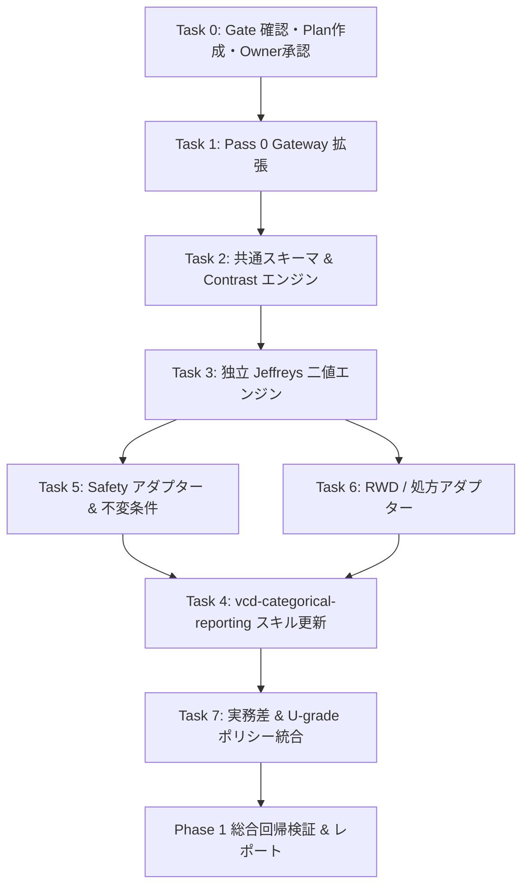

# Implementation Plan (Phase 1): Comparative Evidence Reporting v3

- **Document ID**: `implementation_plan_001_0923.md`
- **Target OpenSpec Change**: `comparative-evidence-reporting-v3`
- **Current Commit / Baseline**: `48b48aa` (On branch `main`)
- **Status**: Owner Approved (Transition from Planning to Phase 1 Implementation)
- **Date**: 2026-09-23

---

## 1. 概要と目的

本計画は、OpenSpec `comparative-evidence-reporting-v3` の仕様策定（Proposal, Specs, Design, Tasks）および Strict Validation 合格、Owner 承認を受け、**Phase 1 の実装を確実に推進するための実施計画**である。

### Phase 1 のスコープ（Vertical Slice）

1. **Pass 0 Consultation Gateway（Section 1）**:
   - 入力検証（非整数カウント・疎セル・非負性検査）
   - 被験者重複診断（PT・SOC単位の重複被験者検知）
   - 変数パターン認識（SOC/PT、person-time、weight等の自動検出）
   - 決定論的ルーティング出力（`routing_decision.json`）

2. **共有スキーマおよび Contrast エンジン（Section 2）**:
   - `comparative-draws-v1.json`（インメモリ不確実性ドロー契約）
   - `comparative-evidence-v1.json`（成果物スキーマ：`estimate.source` と `interval.method` の正規化）
   - `.agents/shared/comparative_contrasts.R`（RD, RR, IRD, IRR, 100人あたり過剰数、不変条件 $q_T+q_N+q_R=1.0$）
   - 実務領域解像度判定（U-grade: U0〜U3）

3. **独立 Jeffreys 二値エンジン（Section 3）**:
   - `.agents/shared/independent_beta_binomial.R`
   - Jeffreys 事前分布 $\text{Beta}(0.5, 0.5)$ による MCMC / 解析的ドロー
   - Zero-reference 診断（$RR$ の理論平均発散時に `mean = null`, `mean_is_finite = false`）
   - Prior sensitivity モード（`zero_cell`、`off`、`explicit`）

4. **`vcd-categorical-reporting` スキルの復活・再編（Section 4）**:
   - 旧テンプレートのレガシー互換維持（`legacy` 名前空間）
   - 比較エビデンス報告ワークフローへの更新
   - 完全自己完結型 HTML / Markdown 生成（Zero-External-Asset 原則）
   - 表現・解釈ガード（「差がない＝同等」言及禁止、方向確率単独の優越言及禁止）

5. **臨床安全（Safety）アダプター（Section 5）**:
   - `.agents/shared/safety_adapter.R`
   - Primary SOC $\rightarrow$ PT 階層集計
   - 被験者重複排除（同一被験者が複数PTを持ってもSOCで1回、PT内でも1回）
   - 不変条件アサーション：$\text{Count}(\text{SOC}) \ne \sum \text{Count}(\text{PT})$

6. **RWD / 処方アダプター（Section 6）**:
   - 任意階層対応汎用アダプター
   - 統計的不変性の自動検証（ドメイン装飾前後で統計値が完全一致すること）

7. **実務差（Practical Difference）ポリシー（Section 7）**:
   - デフォルト `primary_delta = null`（色付け・領域分類無効化）
   - 自然単位変換（`per_100`, `per_1000`, 割合）

---

## 2. 技術設計と主要契約（Review #4 準拠）

### 2.1 推定量と区間の意味論分離

```json
{
  "estimate": {
    "value": 0.042,
    "source": "posterior_median"
  },
  "interval": {
    "method": "posterior_eti",
    "level": 0.95,
    "lower": 0.008,
    "upper": 0.089
  }
}
```

- ベイズ解析では `source: "posterior_median"`、`method: "posterior_eti"`。
- ブートストラップ解析では `source: "observed_sample_estimate"`、`method: "bootstrap_percentile"`。

### 2.2 不確実性と領域解像度の厳格分離

- ベイズ事後確率: $P(RD > 0)$
- ブートストラップ支持比率: `bootstrap_support_fraction_rd_gt_zero`
- U-grade（U0〜U3）: $C = \max(q_T, q_N, q_R)$ に基づく領域分類の解像度指標であり、標本サイズやサンプリング精度、重症度とは区別する。

### 2.3 Zero-cell / Zero-reference 挙動

- 対照群イベントゼロ（$x_R = 0$）の場合：
  - $RR$ の事後中央値および分位点区間（ETI）は出力する。
  - $RR$ の理論平均は発散するため、`mean = null`, `mean_is_finite = false` を明示し、モンテカルロ標本平均による虚偽数値を算出・表示させない。
  - 診断バッジ `ZERO_REFERENCE` を付与する。

---

## 3. 実装ステップ（作業順序とタスク対応）



### ステップ 1: Specification and Ownership Gate（Task 0.1〜0.9）

- [x] 0.1 実装計画書作成（本書）
- [x] 0.2 OpenSpec ディレクトリ確認
- [x] 0.3 proposal, specs, design, tasks 確認
- [x] 0.4 ケイパビリティ宣言確認
- [x] 0.5 two-way-evidence-analysis 既存仕様の保全確認
- [x] 0.6 deterministic-r-dependencies 動的レジストリ契約確認
- [x] 0.7 evidence-run-layout 出力パス規約確認
- [x] 0.8 `openspec validate comparative-evidence-reporting-v3 --strict --json`（PASS 確認済み）
- [x] 0.9 Owner 明示承認受領（2026-09-23 ユーザー指示にて承認済み）

### ステップ 2: Pass 0 Gateway（Task 1.1〜1.8）

- 1.1〜1.7: `.agents/skills/vcd-pass0-consultation` のルーティングおよび入力検査ロジック拡張
- 1.8: `tests/test_pass0_routing.R` の実装と全テスト PASS 確認

### ステップ 3: 共有スキーマおよび Contrast エンジン（Task 2.1〜2.14）

- 2.1〜2.2: スキーマ定義（`schemas/comparative-draws-v1.json`, `schemas/comparative-evidence-v1.json`）
- 2.3〜2.13: `.agents/shared/comparative_contrasts.R` 実装（RD, RR, U-grade, ゼロセル診断等）
- 2.14: `tests/test_comparative_schemas.R` の実装と全テスト PASS 確認

### ステップ 4: 独立 Jeffreys 二値エンジン（Task 3.1〜3.14）

- 3.1〜3.11: `.agents/shared/independent_beta_binomial.R` 実装
- 3.12: ゴールデン回帰ケース（7ケース）の検証
- 3.13〜3.14: `tests/test_independent_beta_binomial.R` の実装と全テスト PASS 確認

### ステップ 5: 臨床安全（Safety）アダプター（Task 5.1〜5.12）

- 5.1〜5.10: `.agents/shared/safety_adapter.R` 実装（PT/SOC重複排除、NNH表現管理）
- 5.11〜5.12: `tests/test_safety_adapter.R` の実装と全テスト PASS 確認

### ステップ 6: RWD / 処方アダプター（Task 6.1〜6.5）

- 6.1〜6.4: `.agents/shared/rwd_adapters.R` 実装
- 6.5: `tests/test_domain_invariance.R` の実装とドメイン不変性 PASS 確認

### ステップ 7: `vcd-categorical-reporting` スキル更新（Task 4.1〜4.13）

- 4.1〜4.3: スキル定義更新、レガシー保全
- 4.4〜4.13: 比較エビデンス報告・自己完結HTML生成・解釈ガード

### ステップ 8: 実務差・不確実性ポリシー（Task 7.1〜7.7）

- 7.1〜7.7: 統合テストおよび `tests/test_practical_difference.R`

---

## 4. 検証およびテスト計画

| 検証領域 | テストスクリプト / 手法 | 合格基準 |
| :--- | :--- | :--- |
| **Pass 0 検査** | `Rscript tests/test_pass0_routing.R` | 重複被験者検知、非整数拒絶、ルーティング出力正常 |
| **スキーマ・契約** | `Rscript tests/test_comparative_schemas.R` | JSON Schema バリデーション合格、正規化フィールド検証 |
| **数理エンジン** | `Rscript tests/test_independent_beta_binomial.R` | ゴールデン7ケース完全一致、zero-reference で mean=null |
| **ドメイン不変性** | `Rscript tests/test_domain_invariance.R` | Safety/RWD/Prescription 通過前後で統計量完全一致 |
| **Safety 階層** | `Rscript tests/test_safety_adapter.R` | $\text{Count}(\text{SOC}) \ne \sum \text{Count}(\text{PT})$、被験者重複排除 |
| **成果物健全性** | 静的正規表現スキャン | HTML内に外部URL（http/https）なし、OS依存絶対パスなし |
| **OpenSpec 仕様** | `openspec validate comparative-evidence-reporting-v3 --strict --json` | 0 errors, 0 warnings |
