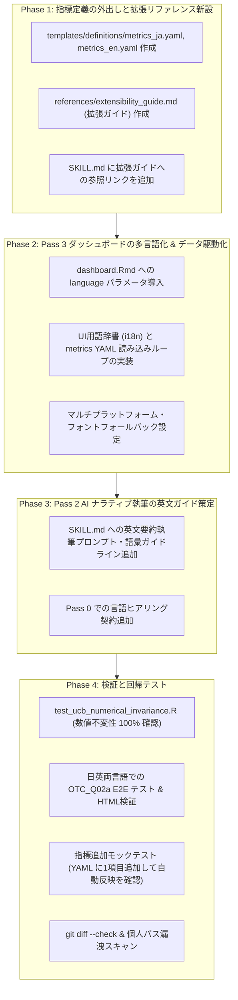

# 分析成果物・レポートの英語化（多言語対応）および用語解説拡張性の実装計画

- **作成日時**: 2026-09-09 17:35 (JST)
- **更新日時**: 2026-09-09 17:45 (JST)
- **作成者**: Antigravity Pair-Programming
- **ファイル名**: `docs/Artifacts/implementation_plan_009_0909.md`
- **ステータス**: 提案中・ユーザー承認待ち（Draft / Pending Approval）
- **対象リポジトリ**: `agentic-evidence-analysis`（正本リポジトリ）

---

## 1. 目的

本リポジトリ（`agentic-evidence-analysis`）の分析パイプライン（Pass 0〜Pass 3）において、従来の日本語中心の分析レポート（`executive_summary.md`, `dashboard.html` 等）に加え、**グローバル共同研究、学術論文、国際学会発表にそのまま活用できる高品質な「英語レポート出力（English Reporting Support）」** を正式機能として安全に提供する。

さらに、**「将来的な指標の追加・変更（例: ベイズファクター、FDR補正等の導入）」や「多言語辞書の拡張」が生じた際、レンダラー（`rmarkdown::render`）やテンプレートコード本体を汚染することなく、誰でも迷わず安全に拡張できるよう、用語・指標定義の外出し（構造化）と、スキル内リファレンス（拡張ガイド）の整備** を同時に行う。

同時に、本リポジトリの生命線である **「4軸統計計算コア」「数値不変性」「runライフサイクル（staging, sealed, supersede）」を 100% 不可侵として保護** し、既存の日本語分析環境に一切の後退・破壊的変更を与えないことを絶対条件とする。

---

## 2. 背景と実証実験の知見

先ほど実施した `examples/OTC_Q02a.csv`（OTC医薬品の購入理由・ブランド別カテゴリカルデータ）を用いた英語レポート生成の実証実験により、以下の成果と課題・要件が明確になった。

### 実証で得られた成果
1. **パイプラインの成立**:
   Pass 0（縦持ち整形・検分）$\rightarrow$ Pass 1（統計計算）$\rightarrow$ Pass 2（専門的英文要約の執筆と本番確定）$\rightarrow$ Pass 3（ダッシュボードHTMLレンダリングと封印）という一連のライフサイクルが英語成果物でも破綻なく完遂した。
2. **統計計算の独立性**:
   統計エンジン（`analysis.R`）が出力する中間JSON（`evidence_results.json`）のキー名や数値構造は言語非依存であり、数理ロジックに手を加えることなく英語レポートを構築できることが実証された。

### 浮き彫りになった課題と拡張性の要件
1. **ダッシュボードUI・用語解説のハードコード**:
   既存の `templates/dashboard.Rmd` には、UI見出しだけでなく「4軸セル診断の定義や判定基準」が埋め込まれており、将来新しい指標を追加したり解説を洗練させようとした際に Rmd の描画スクリプト自体を書き換えるリスクがある。
2. **レンダラー負荷をかけない外出しの必要性**:
   用語解説や指標定義をテンプレートから分離する際、複雑なパーサー再帰（knitr 子プロセス等）でレンダラーに負荷をかけることなく、シンプルかつ高速に読み込めるデータ構造（YAML またはプレーン Markdown）が求められる。
3. **「どこを直せばいいか」のリファレンス不足**:
   将来の保守者や AI エージェントが、指標追加や多言語辞書修正を行う際、触るべきファイルが一目でわかる「拡張ガイド（Extensibility Reference）」がスキル内に必要である。
4. **既定値（日本語）と数値不変性の絶対保護**:
   多言語化・拡張性の導入にあたり、既存の自動テスト（116件の UCBAdmissions 等）や通常利用において、デフォルト動作（日本語出力）が 1ビットたりとも損なわれてはならない。

---

## 3. 設計原則（Design Principles）

1. **プレゼンテーション層と統計計算層の完全分離（数値不変性の 100% 保護）**:
   英語化および用語定義の拡張は「Pass 2（AI ナラティブ執筆）」および「Pass 3（HTML レポート描画）」の関心事とし、Pass 1（`analysis.R`）の統計計算ロジック、検定統計量、Rao score statistic（Evidence Score）、BIC、Cramér's V、推定パラメータ、乱数シードには一切触れない。
2. **レンダラー低負荷・データ駆動（Zero-Overhead Data-Driven Rendering）**:
   指標定義や解説文は `yaml` またはプレーンな `md` として外出しし、Rmd 側では `yaml::read_yaml()` または `readLines()` で単純流し込みする。複雑なパーサー負荷をゼロにし、レンダラーの安定性を最優先する。
3. **開放閉鎖原則（Open-Closed Principle: 指標拡張への耐性）**:
   新しい指標（例: 新規不確実性区間やベイズ指標）が追加された場合、`dashboard.Rmd` の描画プログラムを触ることなく、定義ファイルの追記だけでダッシュボードに反映される構造とする。
4. **迷わせない導線設計（明示的な拡張リファレンス）**:
   スキルの `references/` 配下に「拡張ガイド（どこを触れば拡張できるか）」を配置し、`SKILL.md` から直接リンクする。
5. **既定値の後方互換性（Default to Japanese）**:
   `language` のデフォルト値は必ず `"ja"` とする。パラメータ省略時は従来の日本語レポートが出力される。

---

## 4. 対象範囲と仕様（Scope & Specifications）

### コンポーネント 1: 指標定義・用語解説の外出し（データ駆動化）
`dashboard.Rmd` 内の固定テキストを分離し、以下の定義ファイルを新設する：

- 配置場所: `.agents/skills/vcd-bayesian-evidence-analysis/templates/definitions/`
  - `metrics_ja.yaml`（日本語版：指標名、LaTeX数式、判定基準、解釈解説）
  - `metrics_en.yaml`（英語版：指標名、LaTeX数式、判定基準、解釈解説）

```yaml
# templates/definitions/metrics_en.yaml の例
- id: effect_size
  name: "Effect Size (log(O/E))"
  formula: "$\\log(O / E)$"
  criterion: "> 0: Over-represented, < 0: Under-represented"
  interpretation: "Sample-invariant metric reflecting practical deviation from independence."

- id: evidence_score
  name: "Evidence Score (Rao Score)"
  formula: "$T_i^{\\rm score} = \\frac{r_{P,i}^2}{1 - h_{ii}}$"
  criterion: "> 10: Decisive evidence against independence"
  interpretation: "Sample-dependent statistical evidence sensitive to sample size N."
```

- **Rmd での展開**:
  `rmarkdown::render` 実行時、数行のループで自動カード／テーブルとしてレンダリング。パーサー負荷は最小。

### コンポーネント 2: スキル内「将来の拡張性リファレンス」の新設
将来、指標を追加・変更したり、新しい言語に対応する際、開発者や AI が迷わないよう明確なリファレンスドキュメントを配置する。

- **新規作成**: `.agents/skills/vcd-bayesian-evidence-analysis/references/extensibility_guide.md`
  - **内容**:
    1. *新しい統計指標を追加・変更したい場合*:
       - `templates/definitions/metrics_{lang}.yaml` に新項目を追加する手順。
       - （Rmd 側の修正は不要であることの明記）。
    2. *レポートに新しい言語を追加したい場合*:
       - 新しい `metrics_{lang}.yaml` を作成し、`dashboard.Rmd` の `i18n` 辞書に UI 用語を追加する手順。
    3. *AI の要約執筆基準（Pass 2）を改定したい場合*:
       - `references/biostat_lexicon.md`（用語集）を修正する手順。
- **`SKILL.md` への反映**:
  - `## Extensibility & Customization` セクションを追加し、「指標定義の変更や言語追加の手順は [extensibility_guide.md](references/extensibility_guide.md) を参照」と明記。

### コンポーネント 3: Pass 3 ダッシュボードの多言語化（`dashboard.Rmd`）
- `templates/dashboard.Rmd` に `params$language`（`"ja"` または `"en"`）を追加。
- UI 見出し、タブ名、カードヘッダー、軸ラベルを軽量な `i18n` リストから取得。
- プロット描画時のフォント文字化け（豆腐）防止のため、日本語カテゴリ名を含む場合でも安全に描画できるシステムフォントフォールバックを設定。

### コンポーネント 4: Pass 2 専門的英文ナラティブの執筆基準
- `SKILL.md` に `language: "en"` 指定時のプロンプト方針および標準専門用語対応表（Effect Size, Evidence Score, Leverage, Stability Status 等）を明記。

---

## 5. 段階的実装ロードマップ（Phased Implementation Plan）



---

## 6. 非対象事項（Out of Scope / Non-Goals）

- **統計計算アルゴリズム・出力数値の変更**:
  対数線形モデル、Rao score statistic、Cramér's V、BIC、ディリクレ事後分布等の計算式やパラメータは一切変更しない。
- **中間データ JSON（`evidence_results.json`）のキー名変更**:
  システム内部およびスクリプト間で引き渡す JSON キー名は英語のまま固定。
- **既存の日本語封印済み run（Sealed Runs）の書き換え**:
  過去に生成された日本語レポートはそのまま保護し、一括再計算や書き換えは行わない。
- **レンダラーの外部依存追加**:
  Pandoc や R Markdown 標準機能で完結させ、TeXLive などの大がかりな外部エンジン（Sweave/Rnw）への移行は行わない。

---

## 7. 受入条件（Acceptance Criteria）

| 項目 | 検証内容 | 合格基準 |
| :--- | :--- | :--- |
| **AC-1: デフォルト後方互換** | `language` 未指定、または `"ja"` で実行 | 従来の日本語ダッシュボードおよび日本語要約が完全に出力されること |
| **AC-2: 英語ダッシュボード** | `language: "en"` で実行 | 見出し、タブ、軸ラベル、指標解説、要約がすべて英語で出力されること |
| **AC-3: 数値完全不変性** | 同一データ（例: UCBAdmissions）を日英両モードで実行 | 出力される全統計数値（Effect, Evidence, Leverage, $P$値, BIC）が 100% 一致すること |
| **AC-4: 指標拡張の容易性** | YAML に指標を1つ追加してレンダリング | `dashboard.Rmd` を変更せず、ダッシュボードの用語解説セクションに新指標が自動表示されること |
| **AC-5: 拡張リファレンス** | スキル内ドキュメントの配置 | `references/extensibility_guide.md` が存在し、変更手順が平易に解説されていること |
| **AC-6: フォント安全性** | 日本語カテゴリを含むデータを英語モードで描画 | プロット内外で文字化け（豆腐）が発生せず、正しく描画されること |
| **AC-7: ライフサイクル遵守** | 英語レポートの生成 | `staging` $\rightarrow$ `finalize_run_stage.R` $\rightarrow$ `sealed` の封印手順が正常に完了すること |
| **AC-8: パス・セキュリティ** | 生成された HTML / Markdown 内のリンクとパス | 相対パス規約が守られ、個人名やホスト固有絶対パスが一切漏洩していないこと |

---

## 8. 検証計画（Verification Commands）

```bash
# 1. 既存の数値不変性テスト (絶対防衛ライン)
Rscript tests/test_ucb_numerical_invariance.R

# 2. 既存のライフサイクル・可搬性テスト
Rscript tests/test_run_scope_lifecycle.R
Rscript tests/test_relocatable_run_lifecycle.R

# 3. 日英両言語での E2E 比較実行 (OTC_Q02a データ)
# - 日本語モード実行 -> output/otc_q02a_ja
# - 英語モード実行   -> output/otc_q02a_en
# 両者の evidence_results.json を diff して数値が完全一致することを確認

# 4. 指標拡張テスト
# metrics_en.yaml にダミー指標を追記し、HTML を render して自動表示されることを確認

# 5. 個人情報漏洩・絶対パス走査
git diff --check
```

---

## 9. 承認境界（Approval Boundary）

> [!IMPORTANT]
> **本ドキュメントは計画案（Proposal）です。**
> コードの改修（`metrics_*.yaml` の新設、`dashboard.Rmd` や `SKILL.md` の変更）は、ユーザーから本計画に対する明示的な承認（「承認します」「進めてください」等）を受けた後にのみ着手します。
