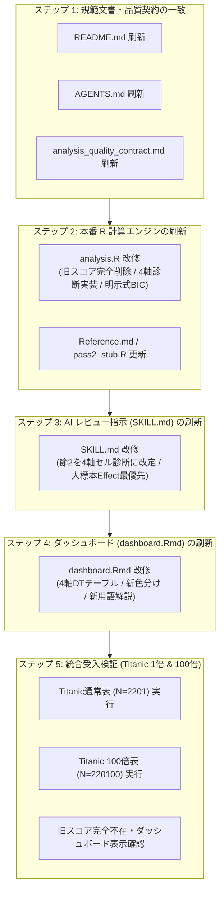

# 統計基盤検証成果の本番スキル完全統合・刷新計画書

- 作成日時: 2026-09-06 22:25 (JST)
- 対象ブランチ: `Angigravity` (Worktree: `agentic-evidence-analysis-antigravity`)
- 関連ドキュメント:
  - 採否報告書: [statistical_validation_001_0906.md](statistical_validation_001_0906.md)
  - 改善計画書: [statistical_foundation_refinement_plan_001_0906.md](statistical_foundation_refinement_plan_001_0906.md)
  - レビュー指摘記録: [review_feedback_001_0906.md](review_feedback_001_0906.md)
  - 局所セル診断知見: `HairEyeColor_local_cell_diagnostics_redesign.md`

---

## 1. エグゼクティブ・サマリー：不安の解消と先祖返りの真因

### 1.1 なぜ「先祖返り」したように見えたのか？
コードが壊れてロールバックしたのではなく、**「検証テストベッド」と「本番スキル」が完全に分離されていたこと**が原因です。

```
【現状の乖離構造】
1. テストベッド（tests/statistical_foundations/）
   └─ コミット 2713854 で完了。
   └─ 旧エビデンススコアを廃止し、4軸セル診断・Leverage補正Score・明示式BICを実証（ALL PASS）。
2. 本番スキル（.agents/skills/vcd-bayesian-evidence-analysis/）
   └─ 「本番無改変ルール」を守っていたため、昔のコード（旧エビデンススコア算出）のまま残存。
```

ユーザーから「スキルを利用してレポートを提示」と指示された際、未改修の **2. 本番スキル** を実行したため、廃止したはずの旧エビデンススコア（$r^2 - k \ln N$）がゾンビのように再出力され、エグゼクティブサマリーやダッシュボードに現れてしまいました。

### 1.2 本計画の目的
本計画は、**「検証テストベッドで実証された新統計基盤（4軸セル診断・Leverage補正Score・明示式BIC・Dirichlet推論）」を本番スキル（`.agents/skills/`）およびリポジトリ全体に完全に移植・統合し、リポジトリ内から旧エビデンススコアを完全に払拭（一掃）すること**を目的とします。

---

## 2. 確定した統計仕様（Single Source of Truth）

採否報告書 [statistical_validation_001_0906.md](statistical_validation_001_0906.md) に基づき、以下の通り指標を確定します。**曖昧な指標や未検証な概念は一切使用しません。**

### 2.1 廃止する指標（完全排除）
- ❌ **旧セルScore（$r_i^2 - k \ln N$）**: 局所LRTとの著しい乖離、大標本下でのエビデンス飽和（全セル正値化）、および Effect と Evidence の混同を引き起こすため、**完全廃止（利用禁止）**。
- ❌ **EBICによる大域ベイズファクター呼称**: 固定モデル空間での組合せ罰則根拠が薄弱なため、主要根拠としての呼称を停止（大標本比較用参考値に格下げ）。

### 2.2 採用・統合する新4軸セル診断体系
セル単位の診断は、単一スコアへの統合を廃止し、以下の **4軸独立フレームワーク（Effect × Evidence × Influence × Stability）** に統一します：

| 評価軸 | 採用指標 | 数式 / 定義 | 特性・大標本（$N$増大時）の挙動 | 役割・解釈 |
| :--- | :--- | :--- | :--- | :--- |
| **1. Effect（実質的効果量）** | **局所効果比**<br/>**標準化差**<br/>**割合差** | $\log(O_i / E_i)$<br/>$e_i = \frac{y_i - \hat{\mu}_i}{\sqrt{\hat{\mu}_i \cdot N}}$<br/>$(y_i - \hat{\mu}_i) / N$ | **標本サイズ $N$ に 100% 不変**<br/>（100倍拡大表でも完全同一値を保持） | **実務的・臨床的有意性の主判定**。<br/>期待値に対する実質的な過剰（$>0$, 青）／過少（$<0$, 赤）の強さ。 |
| **2. Evidence（証拠強度）** | **Leverage補正局所Score統計量**<br/>**局所対数P値** | $T_i^{\rm score} = \frac{r_{P,i}^2}{1 - h_{ii}}$<br/>$\ln p$ (upper tail) | **標本サイズ $N$ に正比例して増大**<br/>（検定統計量として機能） | **統計的有意性の判定**。<br/>セル指示変数追加に対する Rao のスコア統計量（自由度1のカイ二乗値）。局所LRT $\Delta G_i^2$ の高精度二次近似。 |
| **3. Influence（構造影響度）** | **Leverage (梃子力)** | $h_{ii} = \text{hatvalues}(fit)$ | 分割表の配置と周辺和で定まり、**$N$ に不変** | **モデル適合に対するセルの影響力**。<br/>高レバレッジセル（$h \to 1$）の検知・補正。 |
| **4. Stability（数値的安定性）** | **診断ステータス** | ゼロセル、$\hat{\mu} < 5$、過大レバレッジ | 標本サイズ増大で安定性向上 | `REGULAR`（正常） / `QUARANTINED`（小度数・特異性による隔離）。 |

### 2.3 モデル選択とベイズ推論
- **モデル選択**:
  - 3元表: 9候補対数線形モデル（M1〜M9）を適合し、**総度数 $N$ 基準の明示式 BIC**（$\mathrm{BIC} = G^2 - df \cdot \ln N$）で比較。
  - 2元表: 相互独立モデル（$A+B$）と飽和モデル（$A*B$）を適合。
- **ベイズ推論**:
  - 多項Dirichlet事後分布（20,000ドロー）に基づく、**層別条件付き割合および層間差（生存率差等）の推論**（同一ドローに基づく相関構造の完全維持）。
  - 全体効果量: **Cramér's V**（標本数不変の大域指標）。

---

## 3. 全体棚卸し結果：改修対象ファイル一覧

`.agents` 配下およびリポジトリ全体を徹底調査した結果、改修対象は以下の **8ファイル** に特定されました：

| 分類 | ファイルパス | 現状の課題 | 改修内容 |
| :--- | :--- | :--- | :--- |
| **ルート規範** | `README.md` | 旧エビデンススコアが「エビデンス判定基準」として記載 | 「4軸セル診断フレームワーク」および Leverage補正Scoreの解説へ全面刷新 |
| **ルート規範** | `AGENTS.md` | 「Evidence Score > 0」が Iron Law の判定基準に残存 | 新4軸体系（Effect, Evidence, Influence, Stability）および Dual-Filter 基準へ更新 |
| **共有契約** | `.agents/shared/analysis_quality_contract.md` | 旧エビデンススコアの列挙・禁止表現が残存 | 新4軸セル診断の読み分け・大標本下での Effect 優先ルールへ改訂 |
| **本番スキル** | `.agents/skills/vcd-bayesian-evidence-analysis/SKILL.md` | Pass 2 で「エビデンス・スコアの抽出」を強制指示 | プロンプト指示を「節2: 局所セル診断の4軸評価」へ改変、大標本モードの刷新 |
| **本番スキル** | `.agents/skills/vcd-bayesian-evidence-analysis/Reference.md` | 旧エビデンススコアの数式が記載 | 4軸セル診断および Leverage補正局所Score統計量 $T_i^{\rm score}$ の数理解説へ刷新 |
| **本番エンジン** | `.agents/skills/vcd-bayesian-evidence-analysis/templates/analysis.R` | `df$Evidence_Score` を算出、2モデルのみ適合 | 旧スコア完全削除、3元表9モデル適合、4軸セル診断出力、Dirichlet事後推論を実装 |
| **ダッシュボード** | `.agents/skills/vcd-bayesian-evidence-analysis/templates/dashboard.Rmd` | テーブル列が「エビデンス・スコア」、用語集が旧BIC類比 | 4軸テーブル（Effect, Score, Leverage, Status）、色分け、用語集の全面改訂 |
| **スタブ補助** | `.agents/skills/vcd-bayesian-evidence-analysis/templates/pass2_stub.R` | 旧スコア文字列を出力 | 4軸診断対応のスタブへ修正 |

---

## 4. 段階的・防衛的な実装手順（5ステップ・一本道ロードマップ）



---

## 5. 詳細タスクリスト（WBSと完了判定基準）

### ステップ 1: 規範文書・品質契約の刷新
- [ ] **1.1 ルート `README.md` の改訂**:
  - 「エビデンス判定基準」を「4軸セル診断フレームワーク」に刷新。
  - Effect（標本数不変）と Evidence（標本数比例）の峻別、Leverage補正Score統計量 $T_i^{\rm score}$ の定義を記載。
  - 完了基準: `grep -i "Evidence Score" README.md` で旧定義が残っていないこと。
- [ ] **1.2 ルート `AGENTS.md` の改訂**:
  - 「Evidence Judgment Criteria」のテーブルから `Evidence Score = r^2 - k*log(N)` を撤廃し、4軸基準に改定。
  - 完了基準: AGENTS.md が新4軸体系を Single Source of Truth として規定していること。
- [ ] **1.3 `.agents/shared/analysis_quality_contract.md` の改訂**:
  - AIレビュー標準構成の根拠列挙、禁止事項から旧エビデンススコアを排除し、4軸セル診断（Effect/Evidence分離）を明記。
  - 完了基準: 契約文書内のスコア記述が適正化されていること。

### ステップ 2: 本番 R 計算エンジン (`analysis.R`) の刷新
- [ ] **2.1 旧スコアロジックの完全削除**:
  - `df$Evidence_Score <- df$Residual^2 - threshold_l1`、`threshold_l1/l2/l3`、`n_evidence_cells`、`Intensity_Level` 等の旧スコア変数をすべてコードから削除。
- [ ] **2.2 モデル適合と明示式 BIC の実装**:
  - 3元表（3変数）の場合: `tests/statistical_foundations/fit_models.R` の検証済みロジックを取り入れ、9候補対数線形モデル（M1〜M9）の Poisson GLM を適合。総度数 $N$ 基準の明示式 BIC、自由度、対数尤度を算出。
  - 2元表（2変数）の場合: 相互独立モデルと飽和モデルを適合し、明示式 BIC を算出。
- [ ] **2.3 Leverage補正Score統計量と局所検定の実装**:
  - 基準モデル（相互独立 M1 または均一連関 M8）から Hat 行列対角成分 $h_{ii} = \text{hatvalues}(fit)$ を抽出。
  - 各セルの Leverage補正局所Score統計量 $T_i^{\rm score} = \frac{r_{P,i}^2}{1 - h_{ii}}$ を算出。
  - 上側対数P値 $\ln p$（`pchisq(..., lower.tail = FALSE, log.p = TRUE)`）を算出。
- [ ] **2.4 4軸セル診断の構造化出力**:
  - 各セルに `log_oe_ratio`（$\log(O/E)$）、`scaled_diff`（$e_i$）、`rate_diff`、`score_stat`（$T^{\rm score}$）、`log_p`、`leverage`（$h_{ii}$）、`stability_status`（`REGULAR` / `QUARANTINED`）を付与。
- [ ] **2.5 Dirichlet事後推論・条件付き割合差の実装**:
  - 多項事後標本（20,000ドロー）を生成し、条件付き割合差（生存率差等）の平均・95%信用区間・優位確率を算出。
- [ ] **2.6 `evidence_results.json` の新スキーマ出力**:
  - 新4軸構造（`models`, `cells`, `posterior`, `effects`）を出力。
- [ ] **2.7 関連ファイルの整合**:
  - `Reference.md` および `pass2_stub.R` を新4軸仕様に更新。

### ステップ 3: AI レビュー指示 (`SKILL.md`) の刷新
- [ ] **3.1 Pass 2 プロンプト指示の全面改訂**:
  - 「節2: エビデンス・スコアによる真の関連の抽出」を完全削除。
  - 「**節2: 局所セル診断の4軸評価（Effect / Evidence / Influence / Stability）**」に改変。
  - 大標本モード（$N > 1,000$）において、**標本数に不変な Effect（効果量）を最優先の意思決定根拠とし、Evidence はサンプル数不足による偽陽性でないことの確認に留める Dual-Filter ルール** を強制。
- [ ] **3.2 全体説明・用語契約の更新**:
  - SKILL.md 冒頭の「推論本体」説明から旧エビデンススコアを削除し、新4軸体系を明記。

### ステップ 4: ダッシュボード (`dashboard.Rmd`) の刷新
- [ ] **4.1 全セル・インタラクティブ・テーブル (DT) の改修**:
  - 列「エビデンス・スコア」を完全撤廃。
  - 列構成: `観測(O)`, `期待(E)`, `効果量 log(O/E)`, `標準化差 e_i`, `Score統計量 T_score`, `対数P値`, `Leverage h`, `診断状態`。
  - 色分け: 実質的効果量 $\log(O/E)$ の方向（過剰＝青、過少＝赤）に基づくスタイルに刷新。
- [ ] **4.2 トップ・サマリーカードの改修**:
  - 全体効果量 Cramér's V、最良モデル（BIC基準）、総標本数 $N$ と $\log(N)$、安定セル率を表示。
- [ ] **4.3 用語解説（Glossary）の全面更新**:
  - 旧BIC類比（$M_0/M_1$）の解説を撤廃。
  - Raoのスコア検定統計量（Leverage補正Score）、大標本下での効果量不変性、および4軸フレームワークの読み方を専門的に解説。

### ステップ 5: 統合受入検証（Titanic 通常表 & 100倍拡大表）
- [ ] **5.1 通常表 ($N=2,201$) の新スキル実行**:
  - Pass 1 $\to$ Pass 2 $\to$ Pass 3 を完遂。
- [ ] **5.2 100倍表 ($N=220,100$) の新スキル実行**:
  - Pass 1 $\to$ Pass 2 $\to$ Pass 3 を完遂。
- [ ] **5.3 成果物確認ゲート**:
  - `evidence_results.json` に旧エビデンススコアのキーが存在しないこと。
  - `executive_summary.md` が4軸構造に従い、旧スコアに言及していないこと。
  - `dashboard.html` が美しくレンダリングされ、新4軸テーブルと最新の用語集が表示されること。
  - 1倍表と100倍表で Effect（$\log(O/E)$ や Cramér's V）が完全一致し、Evidence（$T^{\rm score}$）のみが100倍化していることの確認。
