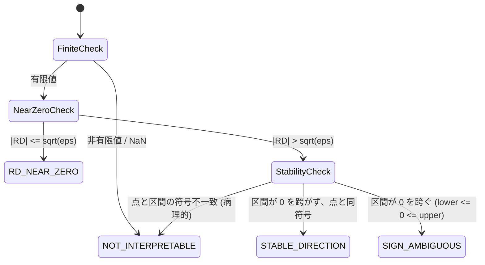

# 比較エビデンス推論の統計数理（Comparative Evidence Math）

created: 2026-09-27 09:20 (JST)
update: 2026-09-27 09:20 (JST)
author: Antigravity (Pair Programming Agent)
依拠仕様: `openspec/specs/comparative-evidence-reporting` (Section 2, 3, 7)
主スキル: `vcd-categorical-reporting`

本文書は、独立 2 群（または対照群 vs 各処置群）における二値転帰・頻度比較、臨床安全性（Safety: SOC/PT）、リアルワールドデータ（RWD）のスクリーニングにおいて採用されている**比較エビデンス推論の統計数理解説**である。

---

## 1. 独立 Jeffreys Beta-Binomial モデル

### 1.1 観測モデルと尤度

比較対象の 2 群を処置群（Target）$T$ および対照群（Reference）$R$ とする。各群の被験者総数を $n_g$、イベント発現例数を $x_g$（$g \in \{T, R\}$）とする。

各群の観測は独立な二項分布に従うと仮定する：
$$x_g \mid p_g \sim \mathrm{Binomial}(n_g, p_g), \quad x_g \in \{0, 1, \dots, n_g\}$$

観測尤度は以下で与えられる：
$$L(p_T, p_R \mid x_T, n_T, x_R, n_R) = \prod_{g \in \{T, R\}} \binom{n_g}{x_g} p_g^{x_g} (1 - p_g)^{n_g - x_g}$$

> [!IMPORTANT]
> **非整数カウント投入の禁止（厳密整数契約: `NON_INTEGER_COUNT`）**:
> 本モデルは厳密な二項尤度に基づく。丸めフォールバック（rounding）を行わず、厳密な整数値（$x = \lfloor x \rfloor$）のみを受け入れる。微小な浮動小数点差分（$5 + 10^{-9}$ 等）や IPTW 等の加重擬似度数（pseudo-counts）が渡された場合は即座に停止（`NON_INTEGER_COUNT`）する。加重データには `comparative-design-analysis`（IPTW 推論エンジン）を使用しなければならない。

### 1.2 主事前分布：Jeffreys 非情報事前分布

本ツールキットでは、客観的ベイズ推論（Objective Bayesian Inference）の標準として、二項パラメータの Fisher 情報量に比例する Jeffreys 事前分布を採用する：
$$p(p_g) \propto \sqrt{I(p_g)} = \frac{1}{\sqrt{p_g(1 - p_g)}} \propto p_g^{1/2 - 1} (1 - p_g)^{1/2 - 1}$$
すなわち、各群独立に以下を設定する：
$$p_g \sim \mathrm{Beta}\left(\frac{1}{2}, \frac{1}{2}\right)$$

### 1.3 共役事後分布と標本化

Beta 事前分布と二項尤度の共役性（Conjugacy）により、各群の事後分布は閉形式の Beta 分布となる：
$$p_g \mid x_g, n_g \sim \mathrm{Beta}\left(x_g + \frac{1}{2}, \; n_g - x_g + \frac{1}{2}\right)$$

事後ドロー（Posterior Draws）は、各群独立に $S$ 回（既定: $S = 4,000$）生成される：
$$p_T^{(s)} \sim \mathrm{Beta}(x_T + 0.5, n_T - x_T + 0.5), \quad p_R^{(s)} \sim \mathrm{Beta}(x_R + 0.5, n_R - x_R + 0.5), \quad s = 1, \dots, S$$

### 1.4 事前感度分析（Prior Sensitivity）

事前の影響を点検するため、一様事前分布 $\mathrm{Beta}(1, 1)$（Laplace 事前）に対する感度分析をサポートする（`prior_sensitivity.mode ∈ {zero_cell, off, explicit}`）。

- 既定の `zero_cell` モードでは、いずれかの群でイベントゼロ（$x_T = 0$ または $x_R = 0$）が発生した境界条件（`x_T == 0L || x_R == 0L`）において自動的に感度差を診断する（all-event $x_g = n_g$ は対象外）。

### 1.5 多項 Dirichlet との峻別

| 特性 | 独立 Beta-Binomial（本推論） | 多項 Dirichlet（分割表推論） |
| :--- | :--- | :--- |
| **データ構造** | 各群の分母 $n_T, n_R$ が固定された独立 2 群 | 全体総数 $N$ が固定された分割表（同時度数） |
| **パラメータ** | $(p_T, p_R) \in [0, 1]^2$（独立パラメータ） | $\mathbf{\pi} \in \Delta^{K-1}$（$\sum \pi_k = 1$ の単体上制約） |
| **適用場面** | コホート比較、臨床試験 2 群、安全性 PT 比較 | 2元・3元クロス集計表、全体連関構造探索 |

---

## 2. 対比（Contrast）の定義と点推定ソース契約

### 2.1 6大対比指標の定義

各事後ドロー $s$ において、以下の基本対比が算出される：

1. **リスク差（Risk Difference: RD）**:
   $$\mathrm{RD}^{(s)} = p_T^{(s)} - p_R^{(s)}$$
2. **相対リスク（Relative Risk: RR）**:
   $$\mathrm{RR}^{(s)} = \frac{p_T^{(s)}}{\max(p_R^{(s)}, 10^{-15})}$$
3. **100人あたり過剰（Excess per 100: E100）**:
   $$\mathrm{E100} = 100 \times \mathrm{RD}$$
   ※ RD の線形変換（自然単位への変換）であり、RD 点推定値から一意に派生する。
4. **絶対リスク差の逆数（Reciprocal Absolute RD）**:
   $$\mathrm{reciprocal\_absolute\_rd} = \frac{1}{|\mathrm{RD}|}$$
   ※ **二次解釈指標**。RD 点推定値の逆数であり、ドローの逆数要約（$\frac{1}{S}\sum \frac{1}{|\mathrm{RD}^{(s)}|}$）ではない（特異点発散防止）。
5. **方向支持指標（Direction Support）**:
   $$P(\mathrm{RD} > 0) = \frac{1}{S} \sum_{s=1}^S \mathbb{I}(\mathrm{RD}^{(s)} > 0)$$
6. **不確実性区間（95% 等裾信用区間: ETI）**:
   $$\mathrm{ETI}_{95\%} = \left[ q_{0.025}(\mathrm{RD}), \; q_{0.975}(\mathrm{RD}) \right]$$

### 2.2 推論セマンティクスと点推定ソース契約

本ツールキットでは、推論パラダイムに応じて点推定値の算出ソースと区間計算法を厳格に分離する：

| 項目 | ベイズ推論 (`inferential_semantics = "posterior"`) | リサンプリング推論 (`inferential_semantics = "bootstrap"`) |
| :--- | :--- | :--- |
| **点推定値ソース (`estimate.source`)** | `posterior_median`（事後中央値） | `observed_sample_estimate`（標本観測推定量） |
| **区間計算法 (`interval.method`)** | `posterior_eti`（等裾信用区間） | `bootstrap_percentile`（パーセンタイル区間） |
| **方向支持ラベル** | $P(\mathrm{RD} > 0)$ | `Bootstrap Support Fraction (RD > 0)` |

---

## 3. reciprocal RD（逆数）状態機械

絶対リスク差の逆数 $1/|\mathrm{RD}|$（NNT / NNH 類似指標）は、$RD \to 0$ において特異点（発散）を持つため、以下の**決定論的状態機械（Finite State Machine）**により挙動を確定する：

| 状態コード (`reciprocal_status`) | 条件 | 値契約（canonical） | 表示契約・ラベル |
| :--- | :--- | :--- | :--- |
| `STABLE_DIRECTION` | 95% 区間が 0 を跨がず、点と同符号 | `reciprocal_absolute_rd = 1/&#124;RD&#124;`（有限） | **Safety**: `target_excess` $\to$ **NNH-like**、`reference_excess` $\to$ **NNT-like** **非 Safety**: 単純に `1/&#124;RD&#124;` を表示 |
| `SIGN_AMBIGUOUS` | 95% 区間が 0 を跨ぐ（$L \le 0 \le U$） | 有限非ゼロ点なら `reciprocal_absolute_rd` を**保持**（status と値は独立） | 方向ラベルを抑制、`— (SIGN_AMBIGUOUS)` 表示 |
| `RD_NEAR_ZERO` | 点推定値が数値的ゼロ（$&#124;\mathrm{RD}&#124; \le \sqrt{\epsilon_{\mathrm{mach}}}$） | `reciprocal_absolute_rd = null`、`reciprocal_direction = "none"` | `— (RD_NEAR_ZERO)` |
| `NOT_INTERPRETABLE`（非有限） | `rd_point` / 区間のいずれかが非有限・NaN | `reciprocal_absolute_rd = null`、`reciprocal_direction = "none"` | `— (NOT_INTERPRETABLE)` |
| `NOT_INTERPRETABLE`（病理的方向不一致） | 点と区間がともに有限かつ点が非ゼロだが、区間が 0 を跨がず点と異符号（ブートストラップ点推定がパーセンタイル区間外など） | `reciprocal_absolute_rd = 1/&#124;RD&#124;` を**保持し得る**（値 null 化はしない）。表示抑制は status 側 | `— (NOT_INTERPRETABLE)`（方向ラベル・数値表示を抑制） |

> **契約分離**: `reciprocal_status`（表示可否）と `reciprocal_absolute_rd`（canonical 点の有限性）は独立。`NOT_INTERPRETABLE` は一律 `reciprocal_absolute_rd = null` ではない。runtime（`.agents/shared/comparative_contrasts.R`）は有限かつ $|RD| > \sqrt{\epsilon}$ なら先に reciprocal を算出し、その後 status を決定する。

---

## 4. 参照群イベントゼロ時の確定契約（Zero Reference Events）

対照群（参照群）のイベント発現数がゼロ（$x_R = 0$）のとき、相対リスクの理論的期待値は発散する：
$$E(\mathrm{RR}) = E\left[ \frac{p_T}{p_R} \right] = \infty \quad \left( \because p_R \sim \mathrm{Beta}(0.5, n_R + 0.5) \text{ において } E[p_R^{-1}] = \infty \right)$$

この数学的事実に基づき、本ツールキットは以下の挙動を確定する：

1. **点推定値と ETI の保全**: 事後中央値（Median）およびパーセンタイル等裾区間（95% ETI）は有限に求まるため、正しく算出・出力する。
2. **平均値の無効化と診断契約**（design / field 別 taxonomy。badge と nested `diagnostic` を混同しない）:
   - `mean = null`
   - `mean_is_finite = false`
   - **独立 Jeffreys / Matched Pair（`compute_comparative_contrasts` 経路）**: `diagnostics.badges` に `ZERO_REFERENCE` を付与（Matched Pair も shared contrast 経由のため同一 badge）
   - **Matched Set / IPTW（観測対照リスク 0）**: `relative_risk.diagnostic = "ZERO_REFERENCE_RISK"`（badge 名 `ZERO_REFERENCE` とは別フィールド）
   - **人年発症率（参照群イベント 0）**: `incidence_rate_ratio.diagnostic = "ZERO_REFERENCE_EVENTS"`
3. **主対比の誘導**: レポートにおいて相対リスク（RR）の数値的不安定性を明示し、差の尺度であるリスク差（RD）を主対比として解釈するよう案内する。

---

## 5. 実務領域（Practical Regions）と U-Grade（不確実性グレード）

### 5.1 3 つの実務領域

あらかじめ指定された臨床的・実務的関心閾値 $\Delta > 0$（`primary_delta`、例: 0.05）に対し、実数直線上の事後確率質量を 3 分割する：

$$\begin{aligned}
q_T &= P(\mathrm{RD} > \Delta \mid \text{data}) \quad &\text{(Target Excess: 処置群過剰)} \\
q_N &= P(-\Delta \le \mathrm{RD} \le \Delta \mid \text{data}) \quad &\text{(Practical Neutral: 実質的同等・中立)} \\
q_R &= P(\mathrm{RD} < -\Delta \mid \text{data}) \quad &\text{(Reference Excess: 対照群過剰)}
\end{aligned}$$

常に $q_T + q_N + q_R = 1.0$ が成立する。最大確率領域を支配的領域（`dominant_region`）とし、$C = \max(q_T, q_N, q_R)$ とする。

### 5.2 U-Grade（Uncertainty Resolution Grade）の定義

不確実性分布が特定の 1 領域にどれだけ収束しているか（解像度）を U0〜U3 の 4 段階で分類する：

| グレード | 条件 | 意味・解像度 |
| :---: | :--- | :--- |
| **U0** | $C \ge 0.95$ | **極めて高い解像度（Very High Resolution）**: 単一領域に 95% 以上の確率が集中 |
| **U1** | $0.80 \le C < 0.95$ | **高い解像度（High Resolution）**: 80%〜95% が単一領域に集中 |
| **U2** | $0.60 \le C < 0.80$ | **中程度の解像度（Moderate Resolution）**: 60%〜80% が集中、相応の不確実性が残存 |
| **U3** | $C < 0.60$ | **低い解像度 / 判定保留（Low / Indeterminate Resolution）**: 確率が複数領域に分散 |

> [!CAUTION]
> **概念の峻別**:
> U-Grade は「実務閾値に対する不確実性分布の収まり具合」を表す尺度であり、**臨床的重症度**や**標本サイズそのものの大きさ**とは直交する別次元の指標である。

---

## 6. 12 列ダッシュボード提示階層（Presentation Hierarchy）

比較エビデンス・ダッシュボード要約表は、以下の正本 12 列で構成され、概念の独立性を保つ（旧結合列「100人あたり差 / NNT・NNH-like」は独立した第 6 列・第 7 列に分離）：

| 列番号 | 列名 | 搬送データ契約（実在 `summary_df` 列のみ） | 役割・制約 |
| :---: | :--- | :--- | :--- |
| 1 | **テーマ** | `theme` | 層別比較キー（解析対象テーマ） |
| 2 | **比較** | `target_arm`, `reference_arm` | 比較群の識別表示 |
| 3 | **記述N (T / R)** | `target_total`, `reference_total` | 各群の被験者総数（分母） |
| 4 | **記述イベント数 (T / R)** | `target_events`, `reference_events` | 各群のイベント発現例数 |
| 5 | **RD 推定値 [区間]** | `rd_estimate`, `rd_interval_lower`, `rd_interval_upper` | **主対比**（絶対差の大きさ） |
| 6 | **100人あたり差 (E100)** | `excess_per_100` | 自然単位表現（100人あたり過剰数、RD 点推定から一意に派生） |
| 7 | **NNT・NNH-like** | `reciprocal_absolute_rd`, `reciprocal_status`, `reciprocal_direction` | 二次解釈（E100 と分離、`STABLE_DIRECTION` のみ方向表示、他は抑制） |
| 8 | **RR 推定値 [区間]** | `rr_estimate`, `rr_interval_lower`, `rr_interval_upper` | 比の大きさ（参照ゼロ時は平均 `null` 確定） |
| 9 | **方向支持指標** | `direction_support` ($P(\mathrm{RD} > 0)$ または Bootstrap 比率) | 方向支持の強さ（因果的優越の主張禁止） |
| 10 | **実務領域・U-Grade** | `dominant_region`, `u_grade` | 実務領域解像度（セル内限定着色、U3 は無彩色） |
| 11 | **精度指標 (ESS / 区間幅)** | `target_ess`, `reference_ess`, `rd_interval_width` | 連続精度指標（標本規模・区間幅） |
| 12 | **診断バッジ** | `badges` | 数値安定性・境界警告（`ZERO_REFERENCE` 等） |

> **疑似列名の禁止**: 表示用の合成ラベルや旧文書の presentation alias を `summary_df` 列として記載してはならない。搬送列は上表の実在フィールドのみとし、canonical `summary_df` はちょうど 40 fields（`comparative_reporting.R`）である。

---

## 7. 規制・安全性ガイドラインと免責契約

1. **探索的多重性免責（Multiplicity Disclaimer）**:
   - 多数の有害事象（PT）の一括スクリーニングでは、FWER（ファミリーワイズ第1種過誤率）や FDR（偽発見率）は厳格に制御されていない。事後確率や U-Grade は探索的スクリーニングのための優先度付け指標である。
2. **安全性データの重複排除規約（Safety SOC/PT Invariant）**:
   - MedDRA 等の集計において、同一被験者が同一 SOC 内で複数の異なる PT を発現した場合、SOC 件数は「当該 SOC を発現した被験者数」としてユニークに集約される（Deduplicated）。したがって、$\text{SOC 件数} \le \sum \text{構成 PT 件数}$ となることが正常仕様である。

---

## 8. 一次文献（Primary References）

1. **Jeffreys, H. (1946)**. "An invariant form for the prior probability in estimation problems." *Proceedings of the Royal Society of London. Series A*, 186(1007), 453–461.
2. **Gelman, A., Carlin, J. B., Stern, H. S., Dunson, D. B., Vehtari, A., & Rubin, D. B. (2013)**. *Bayesian Data Analysis* (3rd ed.). Chapman and Hall/CRC. (Chapter 2: Single-parameter models).
3. **Agresti, A., & Min, Y. (2005)**. "Frequentist performance of Bayesian confidence intervals for comparing proportions in $2 \times 2$ contingency tables." *Biometrics*, 61(2), 515–523.
4. **American Statistical Association (ASA) (2016)**. "Statement on Statistical Significance and P-Values." *The American Statistician*, 70(2), 129–133.
