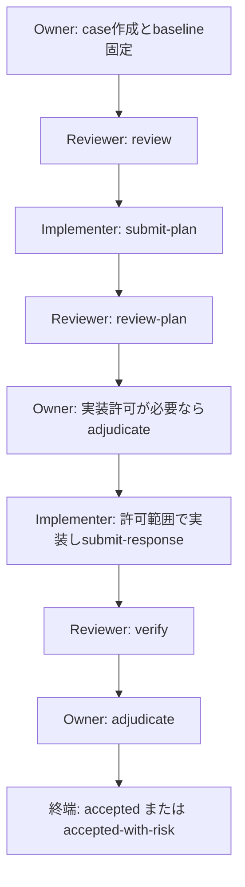

# Quality Loop 初回運用マニュアル

created: 2026-09-12 23:37 (JST)
update: 2026-09-12 23:37 (JST)
author: Codex (GPT-5)

---

## 1. このマニュアルの結論

Quality Loop は、単なるコードレビュー機能ではありません。重要な変更について、**何を守るのか（baseline）**、**誰が何を確認したのか（Evidence）**、**誰が変更を許可し最終判断したのか（Owner）**を分けて残すための運用です。

Reviewer が作業を始める唯一のキック条件は、公開CLIの `status` に次が表示されることです。

```text
next_role: reviewer
next_action: review | review-plan | verify | assess-risk
```

表示がなければ、Reviewer はレビューを開始しません。まず status が案内する次Roleに従います。自然言語の「レビューして」「許可します」は有用な依頼ですが、案件正本の役割・handoff・revisionを置き換えません。

## 2. どんな時に Quality Loop を使うか

### 使うとよい場面

- 統計的な表示、計算、データ契約などを誤ると意思決定に影響する変更。
- 複数の人・役割で、要求、実装、検証、最終判断を明確に分けたい変更。
- 変更可能なパスを限定し、許可外変更を確実に検出したい変更。
- 実装者のテストだけでは足りず、独立した検証とOwnerのリスク判断を残したい変更。

### 通常のレビューで十分な場面

- 読み取り専用の文書点検、リンク確認、相談、設計案の比較。
- 軽微な表記修正で、Owner裁定・変更許可・第三者Evidenceを案件化する必要がないもの。
- まだPurpose、影響範囲、受入基準が固まっていない探索段階。

Quality Loop を使わないことは品質を軽視する意味ではありません。失敗影響と必要な証跡に比例させます。通常のレビュー、OpenSpec、Git commit/pushは、Quality Loopの開始・検証・終端裁定と別の状態です。

## 3. 3つの役割と越えてはいけない境界

| 役割 | 主な責務 | してはいけないこと |
| --- | --- | --- |
| Owner | Purpose・Risk Context・受入基準を決める。実装許可の範囲を裁定し、最終リスク判断を行う。 | ReviewerやImplementerのEvidenceを推測して代筆しない。 |
| Implementer | 許可されたFindingとパスに限定して変更を実装し、PlanやResponseとEvidenceを提出する。 | 許可外の変更を混ぜない。自己申告だけでFindingを解消済みとしない。 |
| Reviewer | baselineに照らしてPlanまたは実装を独立に確認し、Finding・検証結果・残余リスクを記録する。 | 対象実装や案件正本を直接編集しない。Owner裁定を代行しない。 |

Reviewerが使う結果語彙は、`verified`、`remediated`、`not-verified`、`unverified`、`finding-withdrawn`、`converted-to-suggestion`、`not-applicable` です。Reviewerは `accepted`、`rejected`、`closed` を使いません。これらの終端判断はOwnerの裁定です。

## 4. まず覚える状態遷移

通常の流れは次のように読めます。実際の次操作は必ず status を正とし、この図だけで操作を決めません。



重要なのは、次の3つを同じものとして扱わないことです。

1. **Plan合意**: Reviewerが修正方針を baseline に照らして確認した状態。実装済みではない。
2. **実装許可**: Ownerが `implementation_authorization.allowed`、`finding_ids`、`allowed_targets` を登録した状態。Plan合意とは別ゲートである。
3. **独立verifyとOwner裁定**: Reviewerが実装を独立検証した後、Ownerが受入または残余リスクを裁定する状態。テスト通過やcommitだけでは到達しない。

## 5. Reviewerを開始する前の準備

Reviewerに依頼する前に、Ownerまたは案件作成者は次を準備します。

- `case_id` と `case-root`
- 対象revisionと現在のhandoff
- Purpose（何を守りたいか）
- Intended Use（誰が何の判断に使うか）
- Risk Context（失敗時に何が起こるか）
- 要求、対象範囲、受入基準
- baselineとなるコミット、ファイル、仕様、既存Evidence

その上で、Reviewerは必ず公開CLIで読み取り専用の status を確認します。

```bash
/Users/myamaguchi/.agents/skills/quality-review/bin/quality-review-cli \
  --case-root <case-root> status --case-id <case-id>
```

確認する項目は次の6つです。

| 項目 | 意味 | Reviewerの扱い |
| --- | --- | --- |
| `case_revision` | 現在の案件版 | 入力の `expected_case_revision` にそのまま使う。 |
| `handoff.handoff_id` | 現在の受け渡しID | 入力の `previous_handoff_id` にそのまま使う。 |
| `next_role` | 次に操作できる役割 | `reviewer` 以外なら停止する。 |
| `next_action` | Reviewerがすべき1操作 | `review`、`review-plan`、`verify`、`assess-risk` のどれかだけを実行する。 |
| `open_findings` / `open_issues` | 未解決事項 | 事実とEvidenceを確認し、勝手に消さない。 |
| `implementation_authorization` | 実装の許可範囲 | Implementer工程では `allowed`、Finding ID、対象パスの3点を照合する。 |

`next_role` が `implementer` ならReviewerは `review-plan` を先回りして実行しません。`next_role: null` は終端または遷移待ちであり、新しいReviewer操作はありません。

## 6. Reviewerの4操作

### 6.1 `review`: 初回レビュー

**開始条件**: `next_role=reviewer` かつ `next_action=review`。

目的は、baselineに対する初回のFindingを作ることです。要求を勝手に増やさず、Purpose・Intended Use・Risk Context・受入基準に追跡できる観測事実だけを扱います。

Findingには少なくとも、要求またはPurposeとの対応、観測事実、影響、期待状態、検証方法、Evidence参照を含めます。軽微で仕様外の改善は強制Findingにせず、`improvement-proposal` として分離します。

Critical/HighのFindingは通常、ImplementerのResponse Planを必要とします。Mediumは波及リスクや曖昧性があればPlanを要求し、単純な修正だけなら直接Responseへ進められます。

### 6.2 `review-plan`: Implementerの修正計画レビュー

**開始条件**: `next_role=reviewer` かつ `next_action=review-plan`。

目的は、ImplementerのPlanがFindingを本当に解消できるか、変更範囲・副作用・検証方法が十分かを確認することです。ここで確認するのは**方針**であり、実装結果ではありません。

- Findingへの対応が曖昧なら、必要な範囲でPlan revisionを求める。
- 計画が妥当でも、Ownerによる実装許可が別に必要な案件では、`implementation_authorization` が有効かを確認する。
- Plan合意だけを根拠に、`verified` や「修正済み」とは記録しない。

### 6.3 `verify`: 実装後の独立検証

**開始条件**: `next_role=reviewer` かつ `next_action=verify`。

目的は、Implementerの自己申告を独立に再確認することです。Reviewerは、対象Responseとは別の新しい Invocation ID を使います。

特に変更があった場合、次の3つを必ず突き合わせます。

```text
Implementerの changed_targets
Ownerが許可した allowed_targets
Reviewerが独立に観測した observed_changed_targets
```

一致しない変更は `undeclared-change-detected` として拒否します。「理由がある」だけでは許容しません。変更を戻すか、Implementerに提出内容を訂正させます。

Implementerの反証Evidenceで元Findingの前提が崩れたなら、固執せず `finding-withdrawn` または `converted-to-suggestion` を選びます。確認できない事項は `unverified` または `evidence-gap` とし、推測で `verified` にしません。

### 6.4 `assess-risk`: 残余リスクの評価

**開始条件**: `next_role=reviewer` かつ `next_action=assess-risk`。

目的は、未解決のmaterial Findingを全て対象にして、残余リスクを客観的に整理することです。これはOwnerの最終裁定ではありません。

追加修正の便益が小さく、環境制約などにより早くリスク評価へ進む合理性がある場合は、未解決Criticalがないことを確認した上で、`early_risk_assessment: true` と理由を明示して移行できます。

## 7. CLI操作時の安全な共通ルール

`quality-review` は案件正本を直接編集せず、公開CLIだけで操作します。CLI入力には、statusで得た現在値を使います。

```text
previous_handoff_id     = status の handoff.handoff_id
expected_case_revision = status の case_revision
invocation_id          = この1操作専用の新しい値
```

概念上の呼出しは次の形です。

```bash
/Users/myamaguchi/.agents/skills/quality-review/bin/quality-review-cli \
  --case-root <case-root> <review|review-plan|verify|assess-risk> \
  --case-id <case-id> --input <入力JSONまたはJSONファイル>
```

同じ応答で複数のReviewer操作を連続実行しません。成功時は出力された `next_role`、`next_action`、handoffをそのまま次工程へ渡します。失敗時は `error_code` と `remediation` を読み、case正本を手で直して迂回しません。

## 8. Owner・Implementerへの依頼文テンプレート

### 8.1 初回レビューを依頼する

```text
Quality Loop案件の初回レビューを依頼します。

- case-root: <case-root>
- case_id: <case-id>
- 対象revision: statusで確認してください
- baseline: <コミット・仕様・対象ファイル>
- Purpose: <守る目的>
- Intended Use: <利用者と判断用途>
- Risk Context: <失敗時の影響>
- 要求・受入基準: <参照先または要約>

最初に公開CLIでstatusを確認してください。next_role=reviewer かつ
next_action=review の場合だけ、公開CLIで初回reviewを1回実行してください。
それ以外なら変更せず、表示された次Roleと次Actionを報告してください。
```

### 8.2 Planレビューを依頼する

```text
Implementerが提出したResponse Planをレビューしてください。

- case-root: <case-root>
- case_id: <case-id>
- 対象Finding: <Finding ID>
- baselineと受入基準: <参照先>

最初にstatusを確認し、next_role=reviewer かつ next_action=review-plan
のときだけreview-planを1回実行してください。Plan合意と実装許可を
混同せず、必要ならimplementation_authorizationも確認してください。
```

### 8.3 独立verifyを依頼する

```text
Implementerの修正提出に対する独立verifyをしてください。

- case-root: <case-root>
- case_id: <case-id>
- 対象Finding: <Finding ID>
- Implementerが申告したchanged_targets: <一覧または参照>
- Ownerの許可範囲: statusのimplementation_authorizationを確認
- 実行済みEvidence: <テスト、差分、出力、記録の参照>

最初にstatusを確認し、next_role=reviewer かつ next_action=verify
のときだけverifyを1回実行してください。自己申告だけでverifiedにせず、
許可対象・申告対象・独立観測対象を照合してください。
```

### 8.4 Reviewerではない状態だった時の依頼文

```text
公開CLIのstatusを確認してください。Reviewer操作は行わず、
case_revision、next_role、next_action、handoff_id、open_findingsを
そのまま報告し、次Roleが実行すべき1操作だけを案内してください。
```

## 9. 初回運用でよくある混同と復旧方法

| 状況 | 正しい理解 | 次の行動 |
| --- | --- | --- |
| 「Planが承認されたから実装できる」 | Plan合意とOwner実装許可は別の可能性がある。 | `implementation_authorization.allowed`、Finding ID、対象パスを確認する。 |
| 「テストが通ったからReviewerも完了」 | テストはImplementer Evidenceであり、独立verifyとは別。 | statusが `reviewer / verify` になるまで待ち、独立に再確認する。 |
| `next_role=implementer` なのにReviewerがレビューしたい | 役割の順番を飛ばすとhandoffとrevisionの整合が壊れる。 | 変更せず、Implementerの次操作を案内する。 |
| `next_role=null` | 終端または次操作なしである。 | 新しいreviewを実行しない。必要なら新規案件または正式な再開手順を検討する。 |
| Evidenceが不足している | 不明な点を推測して通すべきではない。 | `unverified` または `evidence-gap` と記録し、必要Evidenceを明示する。 |
| 申告外の変更を見つけた | 内容が良さそうでも許可・監査の契約違反である。 | `undeclared-change-detected` として拒否し、復元または提出訂正を求める。 |
| Reviewerが「accepted」と書きたくなる | それはOwner裁定の語彙である。 | Reviewer語彙で検証結果・残余リスクだけを記録する。 |

## 10. 操作前・操作後チェックリスト

### 操作前

- [ ] これは通常のレビューではなくQuality Loopが必要な変更か。
- [ ] `case_id`、`case-root`、baseline、Purpose、Intended Use、Risk Context、受入基準があるか。
- [ ] 公開CLIのstatusを今この時点で確認したか。
- [ ] `next_role=reviewer` か。
- [ ] `next_action` は4操作のいずれか1つか。
- [ ] `previous_handoff_id` と `expected_case_revision` をstatusから転記したか。
- [ ] この操作専用の新しい Invocation ID を用意したか。

### 操作後

- [ ] CLI出力の `next_role`、`next_action`、handoffをそのまま保存・報告したか。
- [ ] Findingがbaseline・観測事実・影響・期待状態・検証方法・Evidenceへ追跡できるか。
- [ ] 確認できない点を `verified` としていないか。
- [ ] 変更がある場合、許可対象・申告対象・独立観測対象を照合したか。
- [ ] Owner裁定、commit、push、OpenSpec archiveをReviewer作業と混同していないか。

## 11. 今回の観測例

この節は一般的な状態遷移仕様ではなく、2026-09-12に確認した事実です。将来は必ず公開CLIで再確認してください。

### 11.1 `QMS-THREE-WAY-DASHBOARD-001`

参照メモは `/tmp/qms_three_way_dashboard_001_meta_20260912.md`（実行時一時メタデータ）です。ここでは、`review → submit-plan → review-plan → submit-response → verify → adjudicate` の流れを観測しました。また、ReviewerによるPlan合意後もOwnerの実装許可が自動で有効化されず、許可範囲の登録と再handoffが必要になった経緯が記録されています。

この例から一般化できる安全原則は、「Plan合意」「Ownerの実装許可」「独立verify」「Owner終端裁定」を別状態として確認すること」です。一方、Owner裁定後にどのnext actionへ遷移するかはCoreのバージョンや案件状態に依存し得るため、この履歴を固定手順として使いません。

### 11.2 `QA-CRR-001`

本マニュアル作成前に公開CLIで確認した status は、revision 16、`accepted-with-risk`、`next_role: null`、`next_action: null`、open findingsなしでした。この状態は、Reviewer操作を開始するトリガーが存在しない終端例です。

この例が示す安全原則は、「過去にReviewer工程があった案件でも、現在のstatusがReviewerを指定しなければレビューを実行しない」です。

## 12. 迷った時の最短判断

次の順に確認すれば、ほとんどの誤操作を防げます。

1. これはQuality Loopを要する変更か。
2. caseとbaselineはあるか。
3. 公開CLIのstatusは何を指示しているか。
4. 自分は `next_role` か。
5. `next_action` は何か。
6. その1操作だけを、現在revisionとhandoffで実行できるか。
7. 実行後に返った次Roleへ、判断を渡せるか。

この順で答えられない時は、Quality Loop操作を実行せず、statusの出力と不足情報を報告してください。それが最も安全な次の一手です。

## 13. 参照元と関連文書

- 本マニュアルの作成計画: [implementation_plan_016_0912.md](../Archives/20260913_195758_003/sources/implementation_plan_016_0912.md)
- 初回ダッシュボード案件の運用メモ: `/tmp/qms_three_way_dashboard_001_meta_20260912.md`
- Reviewer工程の操作契約: 外部 / ユーザー環境の `quality-review` スキル（本リポジトリの canonical 9 skills には含まれない。具体パスは環境依存）

このマニュアルは操作手順の理解を目的とする補助Artifactであり、個別案件の status、handoff、Evidence、Owner裁定の正本を置き換えません。
