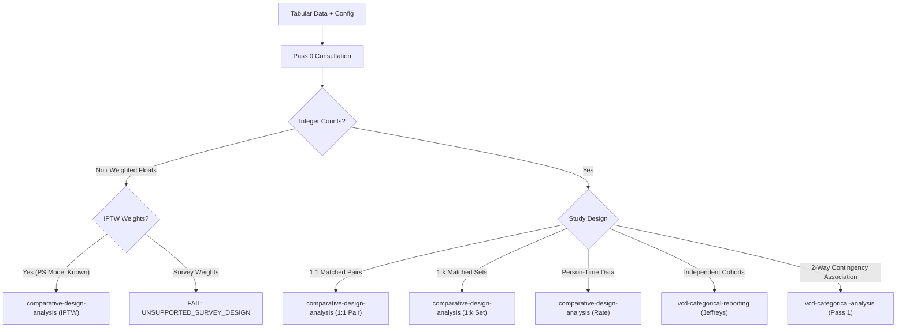

# Technical Design: Comparative Evidence Reporting v3

## 1. Context and Architectural Principles

This document formalizes the architecture for comparative statistical evidence analysis within `agentic-evidence-analysis`. The design establishes a rigorous separation across seven conceptual layers:
\[
\boxed{
\begin{matrix}
\text{Domain Context} & \text{(Safety / RWD / Prescription)} \\
\ne & \\
\text{Study Design} & \text{(Independent / 1:1 Matched / 1:k Matched / IPTW / Person-Time)} \\
\ne & \\
\text{Inference Model} & \text{(Beta-Binomial / Dirichlet / Gamma-Poisson / Bootstrap)} \\
\ne & \\
\text{Contrast Metrics} & \text{(RD, Excess per Natural Unit, RR, Direction Support, Delta Profile)} \\
\ne & \\
\text{Region Resolution} & \text{(Practical-Region Resolution Grade U0–U3 across Active Uncertainty Distribution)} \\
\ne & \\
\text{Numerical Precision} & \text{(ETI Width, Bootstrap Percentile Width, ESS, Sample Sizes)} \\
\ne & \\
\text{Human Decision} & \text{(Clinical / Regulatory Review, Historical Precedent Audit)}
\end{matrix}
}
\]

### Core Principles

1. **P-Value & Threshold Independence**: Avoid mechanical thresholding, unadjusted multiplicity acceptance, or single-metric truth scores.
2. **Strict Inferential & Interval Decoupling**:
   \[
   \text{Bayesian Posterior Probability} \ne \text{Bootstrap Support Fraction}
   \]
   \[
   \text{Bayesian Credible Interval (ETI)} \ne \text{Bootstrap Percentile Interval}
   \]
   \[
   \text{Posterior Median} \ne \text{Observed Sample Estimate}
   \]
   The common runtime interface uses the neutral term **uncertainty draws**. Point estimates declare `estimate.source = "posterior_median" | "observed_sample_estimate"`. All uncertainty intervals explicitly record `interval: { method: "posterior_eti" | "bootstrap_percentile", ... }`.
3. **Zero-Event Mathematical Integrity & Prior Sensitivity**:
   - Zero-event numerators are analyzable under proper Bayesian shrinkage. An empty denominator ($n=0$) is strictly unanalyzable.
   - When reference events $x_R = 0$, theoretical expectation $E(RR) = \infty$; the system reports median and 95% quantile interval, setting `mean = null` and `mean_is_finite = false`.
   - 一様事前分布 $\text{Beta}(1.0, 1.0)$ との感度比較は `prior_sensitivity: { mode: "zero_cell" | "off" | "explicit" }`（既定 `"zero_cell"`）に従う。RD 中央値差・方向支持差・U-grade の変化を記録し、未承認の二値 `robust` 判定を出力しない。主解析の U-grade は変更しない。
4. **Summary-First Ephemeral Draws**: To preserve scalability when screening thousands of terms, raw Monte-Carlo draws remain ephemeral by default (`persist_raw_draws: false`). Permanent deliverables consist of summary profiles and audit metadata.
5. **Deterministic Offline Execution**: All analyses execute deterministically without runtime package installation, network dependencies, or local absolute file paths.

---

## 2. Statistical Architecture and Mathematics

### 2.1 Independent Jeffreys Beta-Binomial Model

For unadjusted binary comparisons across independent cohorts (Target $T$ and Reference $R$):
\[
x_g \sim \text{Binomial}(n_g, p_g), \quad g \in \{T, R\}
\]
Primary Jeffreys prior:
\[
p_g \sim \text{Beta}(0.5, 0.5)
\]
Posterior distribution:
\[
p_g \mid x_g, n_g \sim \text{Beta}(x_g + 0.5, \, n_g - x_g + 0.5)
\]
Optional sensitivity prior: $p_g \sim \text{Beta}(1.0, 1.0)$ evaluated when `prior_sensitivity.mode = "zero_cell"` and zero events are observed.
Deterministic sampling generates $S$ uncertainty draws: $\{p_T^{(s)}, p_R^{(s)}\}_{s=1}^S$.

### 2.2 Contrast Transformations, Estimate Sources, and Interval Semantics

From joint uncertainty draws, contrast metrics are derived:

- **Primary Estimate**:

  ```yaml
  estimate:
    value: <float>
    source: posterior_median | observed_sample_estimate
  ```

  Bayesian models use `posterior_median`. Bootstrap models use `observed_sample_estimate` computed directly from the original unresampled dataset.
- **Risk Difference (RD)**: $RD^{(s)} = p_T^{(s)} - p_R^{(s)}$
- **Excess per Natural Unit**:
  - Machine field: `excess_per_unit`
  - Domain rendering: Safety subject risk renders as `additional_subjects_per_100_treated` ($RD \times 100$).
- **Relative Risk (RR)**: $RR^{(s)} = p_T^{(s)} / p_R^{(s)}$
- **Direction Support**:
  - Posterior: $P(RD > 0)$
  - Bootstrap: `bootstrap_support_fraction_rd_gt_zero`
- **Interval Representation**:

  ```yaml
  interval:
    lower: <float>
    upper: <float>
    level: 0.95
    method: posterior_eti | bootstrap_percentile
    inferential_semantics: posterior | bootstrap
  ```

### 2.3 Practical Difference and Region Resolution Grade (U0–U3)

Given an approved non-zero practical threshold $\delta > 0$, the container `practical_region_support` records:

```yaml
practical_region_support:
  inferential_semantics: posterior | bootstrap
  target_excess: <float>     # q_T
  practical_neutral: <float> # q_N
  reference_excess: <float>  # q_R
```

- Invariant: $q_T + q_N + q_R = 1.0$.
- Semantics: For Bayes, these are **posterior probabilities**; for bootstrap, they are **bootstrap support fractions**.

The **Practical-Region Resolution Grade** evaluates how decisively the active uncertainty distribution falls into one of the three discrete practical regions:
\[
C = \max(q_T, \, q_N, \, q_R)
\]
Mapping: U0 ($C \ge 0.95$), U1 ($0.80 \le C < 0.95$), U2 ($0.60 \le C < 0.80$), U3 ($C < 0.60$).
Continuous precision is reported separately via `rd_interval_width`, `log_rr_interval_width`, and ESS.

When `primary_delta` is `null` (`mode: "none"`), practical region classification and associated cell hues are disabled. The system still reports direction support and an informative, configurable **Delta Profile Matrix**.

### 2.4 Person-Time Incidence Rate Model

For exposure data with event count $x_g$ and person-time $T_g$:
\[
X_g \sim \text{Poisson}(\lambda_g T_g)
\]
Under Jeffreys rate prior $\pi(\lambda_g) \propto \lambda_g^{-1/2}$, the exact posterior under **shape-rate** parameterization is:
\[
\lambda_g \mid x_g, T_g \sim \text{Gamma}\left(x_g + 0.5, \, T_g\right)
\]
From rate draws $\{\lambda_T^{(s)}, \lambda_R^{(s)}\}_{s=1}^S$:

- **Incidence Rate Difference (IRD)**: $IRD^{(s)} = \lambda_T^{(s)} - \lambda_R^{(s)}$
- **Incidence Rate Ratio (IRR)**: $IRR^{(s)} = \lambda_T^{(s)} / \lambda_R^{(s)}$
- Domain rendering: `additional_events_per_100_person_years`.
- Semantics: `estimate.source = "posterior_median"`, `interval.method = "posterior_eti"`.

Section 11 accepts non-negative integer event counts and finite positive exposure denominators in one common unit (`person_years` or `person_months`). Event counts may exceed exposure time; the denominator is not a binomial cohort size. The shared contrast module provides a rate-specific transformation and emits `comparative-rate-evidence-v1` with `incidence_rate_difference` and `incidence_rate_ratio`; it does not place rates under binary-risk fields. The logical `comparative-draws-v1` interface records `design = "person_time"`, shape-rate posterior parameters, units, counts, and exposures in `person_time_metadata`. Raw draws remain ephemeral unless explicitly requested.

`additional_events_per_100_person_years` multiplies the posterior median IRD by 100 for person-year inputs or by 1200 for person-month inputs. When reference events are zero, the reference posterior shape is 0.5 and the theoretical IRR mean diverges; output sets `mean = null`, `mean_is_finite = false` while retaining posterior median and ETI. For positive reference counts, the independent-Gamma theoretical mean is $(x_T+0.5)/T_T \times T_R/(x_R-0.5)$. Output explicitly records the constant-rate assumption and that within-subject recurrent-event clustering is not modeled.

---

## 3. Design-Aware Inference Engine

The design-aware engine encapsulates complex observational designs into the logical `comparative-draws-v1` interface:

### 3.1 1:1 Matched-Pair Analysis

Matched pairs with binary outcomes yield a $2 \times 2$ paired contingency table $\mathbf{n} = (n_{11}, n_{10}, n_{01}, n_{00})$.
Cell probabilities follow a Dirichlet posterior under Jeffreys-type prior $\boldsymbol{\alpha} = (0.5, 0.5, 0.5, 0.5)$:
\[
\mathbf{p} \mid \mathbf{n} \sim \text{Dirichlet}\left(n_{11} + 0.5, \, n_{10} + 0.5, \, n_{01} + 0.5, \, n_{00} + 0.5\right)
\]
Marginal risks and contrasts:
\[
p_T^{(s)} = p_{11}^{(s)} + p_{10}^{(s)}, \quad p_R^{(s)} = p_{11}^{(s)} + p_{01}^{(s)}, \quad RD^{(s)} = p_{10}^{(s)} - p_{01}^{(s)}
\]
主 OR は discordant-pair マッチドオッズ比（McNemar オッズ比）として
\[
OR_{discordant}^{(s)} = \frac{p_{10}^{(s)}}{p_{01}^{(s)}}
\]
を用いる。ペア内アウトカム連関は別の記述量
\[
OR_{association}^{(s)} = \frac{p_{11}^{(s)}p_{00}^{(s)}}{p_{10}^{(s)}p_{01}^{(s)}}
\]
として `intra_pair_association_or` にのみ格納し、主オッズ比と混同しない。Semantics: `inferential_semantics = "posterior"`, `estimate.source = "posterior_median"`, `interval.method = "posterior_eti"`.

### 3.2 1:k Matched-Set Analysis (ATT-Weighted Estimator & Cluster Bootstrap)

- **Structure & Non-Replacement**: $J$ matched sets, each containing 1 treated subject ($Y_{Tj}$) and $k_j \ge 1$ controls ($Y_{Rj\ell}, \ell=1,\dots,k_j$) matched without replacement. The engine requires unique subject identifiers (`subject_id`) across all sets.
- **Observed Sample Point Estimates (ATT)**:
  \[
  \hat{p}_{T,obs} = \frac{1}{J}\sum_{j=1}^J Y_{Tj}, \quad \hat{p}_{R,obs} = \frac{1}{J}\sum_{j=1}^J \bar{Y}_{Rj} = \frac{1}{J}\sum_{j=1}^J \left(\frac{1}{k_j}\sum_{\ell=1}^{k_j} Y_{Rj\ell}\right)
  \]
  Assigned to `estimate.value` with `estimate.source = "observed_sample_estimate"`. For the reference cohort, `estimate_semantics = "att_set_weighted_risk"`, while raw descriptive counts are held in `matched_set.raw_target_counts` and `matched_set.raw_reference_counts`.
- **Replicate Resampling & Conditional Scope**:
  Atomic cluster bootstrap of entire matched sets with replacement.
  \[
  \text{bootstrap\_scope} = \{\text{type: "conditional\_on\_fixed\_matched\_sets"}, \text{rematching\_within\_replicate: false}, \text{propensity\_model\_refit: false}\}
  \]
  This procedure is explicitly conditional on the realized matched sets and is not a bootstrap of the matching estimator itself. Abadie & Imbens (2008) show why ordinary bootstrap inference for nearest-neighbor matching estimators cannot generally be assumed valid.
- **Governed Zero-Denominator RR Policy & Precision Metrics Atomicity**:
  - If observed $\hat{p}_{R,obs} = 0$: `relative_risk$estimate = null`, `interval = null`, `mean = null`, `mean_is_finite = false`, with diagnostic `ZERO_REFERENCE_RISK`. To maintain semantic atomicity, RR-derived precision metrics (`precision_metrics.log_rr_interval_width` and `precision_metrics.rr_interval_fold_range`) are also suppressed to `null`.
  - If observed $\hat{p}_{R,obs} > 0$ but bootstrap replicate $p_R^{*(b)} = 0$ occurs (`undefined_replicates > 0`): `relative_risk$interval = null`, `mean = null`, `mean_is_finite = false` (conservative policy; RD remains the stable primary contrast) with diagnostic `PARTIAL_UNDEFINED_BOOTSTRAP_REPLICATES`, and RR-derived precision metrics are likewise suppressed to `null`. `rr_bootstrap_diagnostics` records `defined_replicates`, `undefined_replicates`, and `defined_fraction`.
- **ATT-Weighted Covariate Balance (SMD)**:
  Weights: $w_{Tj} = 1$, $w_{Rj\ell} = 1/k_j$.
  \[
  \bar{X}_T = \frac{1}{J}\sum_{j=1}^J X_{Tj}, \quad \bar{X}_R = \frac{1}{J}\sum_{j=1}^J \sum_{\ell=1}^{k_j} \frac{1}{k_j} X_{Rj\ell}
  \]
  Weighted second central moments (normalized by analysis weight $J$):
  \[
  s_T^2 = \frac{1}{J}\sum_{j=1}^J (X_{Tj} - \bar{X}_T)^2, \quad s_R^2 = \frac{1}{J}\sum_{j=1}^J \sum_{\ell=1}^{k_j} \frac{1}{k_j}(X_{Rj\ell} - \bar{X}_R)^2
  \]
  \[
  s_{pooled} = \sqrt{\frac{s_T^2 + s_R^2}{2}}, \quad SMD = \frac{\bar{X}_T - \bar{X}_R}{s_{pooled}}
  \]
  Zero-variance classification (scale-invariant under unit transformations $SMD(cX) = SMD(X)$):
  - If $s_{pooled} = 0$ and $\bar{X}_T - \bar{X}_R = 0$: `smd = 0.0`, `status = "ZERO_VARIANCE_ZERO_DIFFERENCE"`.
  - If $s_{pooled} = 0$ and $\bar{X}_T - \bar{X}_R \ne 0$: `smd = null`, `status = "ZERO_VARIANCE_NONZERO_DIFFERENCE"`.
  - Otherwise: `smd = computed`, `status = "OK"`. Unmatched SMD is omitted from the matched engine.

### 3.3 IPTW Propensity Score Analysis (Exact Formulas & Arm-Specific Truncation)

- Point Estimate: Computed from unresampled dataset using observed weights (`estimate.source = "observed_sample_estimate"`).
- Replicate Resampling: Executes patient-level bootstrap resampling with propensity score refitting inside _every_ replicate (`iptw_mode = "refit_ps"`).
- Weight Formulas:
  - **Unstabilized ATE**: $w_i^{ATE} = \frac{A_i}{e_i} + \frac{1-A_i}{1-e_i}$
  - **Unstabilized ATT**: $w_i^{ATT} = A_i + (1-A_i)\frac{e_i}{1-e_i}$
  - **Stabilized ATE**: $sw_i^{ATE} = A_i \frac{P(A=1)}{e_i} + (1-A_i)\frac{P(A=0)}{1-e_i}$
  - **Scaled ATT**: $sw_i^{ATT} = A_i + (1-A_i)\frac{e_i}{1-e_i}\frac{P(A=1)}{P(A=0)}$ governed by `att_weight_scaling.mode = "conventional" | "marginal_odds_scaled"`
- Weight Truncation: Percentile truncation (e.g. 1st / 99th percentiles) applied to the final computed weights separately by treatment arm.
- Propensity-score boundary policy: clamp effective scores to configurable `ps_boundary = c(lower, upper)` (default `c(1e-6, 1 - 1e-6)`). Preserve raw and effective score summaries and record the boundary, clipping counts, and raw range in IPTW evidence/draw metadata; positivity overlap is evaluated from raw scores.
- Input unit: one row per subject. When `subject_id_col` is supplied, missing or repeated identifiers are rejected. Repeated-measurement data require an explicit upstream design transformation.
- Convergence: callers may set finite `max_failure_rate` in `[0, 1)`; the value and observed failure diagnostics are emitted in outputs.
- ATT stabilization: `stabilization = TRUE` requires `att_scaling_mode = "marginal_odds_scaled"`; conventional ATT is selected with `stabilization = FALSE`.
- Output semantics: raw event counts and denominators are retained only in `iptw.raw_patient_counts`; weighted cohort risks do not expose raw `events`/`total` fields. Downstream report labels are selected from `inferential_semantics` and interval method.
- Report provenance: a design-aware evidence override is the source of weighted estimates, raw descriptive counts, and ESS. Supplied aggregate report counts must match the override raw counts or fail with `EVIDENCE_REPORT_PROVENANCE_MISMATCH`. Reports label raw counts as descriptive and ESS separately; Fisher exact compatibility is disabled for overrides unless requested through a separate compatibility option.
- Bootstrap PS clipping is summarized over successful refits using replicate count with any clipping, low/high totals, and maximum per-replicate clipped fraction.
- The governed default for `max_failure_rate` is `0.05` in API, metadata, documentation, and tests. Bootstrap resampling duplicates are expected by design and are not treated as pseudo-replication warnings. No `<10` display masking policy is adopted in this change.
- Semantics: `inferential_semantics = "bootstrap"`, `interval.method = "bootstrap_percentile"`.

---

## 4. Pass 0 Gateway and Routing Logic

Pass 0 inspects tabular input and generates `routing_decision.json`.



### 4.1 Repeated observational rows and clustering boundary

`independent_binary` with `analysis_unit = "subject"` may use an explicit `repeated_rows` policy containing the subject ID, group, and binary outcome column names, `event_rule = "any_event"`, `confirmed = true`, and `no_other_subject_dependence_confirmed = true`. Optional `cluster_cols` and `matched_cols` declare noncanonical dependency columns; Pass 0 merges them with heuristic aliases (including `facility_id`, `hospital_id`, `matched_group_id`) before guarding. Pass 0 checks that each subject has one stable target/reference group, all outcomes are observed 0/1 values, and no matched-set or higher-level cluster structure is discarded. It then derives one binary status per subject (`any(outcome == 1)`), records per-arm subject events and totals in `routing_decision.subject_level_counts`, emits a canonical `engine_input` handoff (`independent_binary_counts_v1`), and routes those counts to the independent Beta-Binomial engine. The original rows and input hash are retained; Pass 0 does not rewrite the input file or silently collapse unconfirmed data.

If subjects share a site/cluster identifier, a cluster ID varies within a subject, a matched-set identifier is present, undeclared dependence confirmation is missing, or a treatment group changes within a subject, Pass 0 fails before independent-subject routing. A future cluster-level bootstrap interface must declare the atomic cluster identifier, cluster membership validation, resampling with replacement of whole clusters, the estimator/refitting scope within each replicate, and diagnostics for cluster count, failed replicates, and interval semantics. This interface is a design contract only; no cluster bootstrap estimator is implemented in Section 12. GLMM and GEE estimation require a separate OpenSpec change with their own estimands, correlation assumptions, and verification contract.

Runtime-only Pass 0 invariants (kept outside Draft-07 schema): pairwise-distinct `subject_id_col` / `group_col` / `outcome_col`, distinct `target` / `reference` labels, and existence of declared dependency columns in the input frame.

R representation normalization for dependency columns (`cluster_cols` / `matched_cols`): a length-1 R character vector (or longer character vector / string list) is an accepted **native** input form for Pass 0 runtime configuration. Canonical serialized JSON and schema validation MUST always use a JSON **array** of strings (for example `["custom_site"]`), never a bare JSON string. Runtime `normalize_declared_cols()` adapts the native form; examples, fixtures, and persisted config artifacts MUST emit arrays so the JSON contract stays unambiguous.

---

## 5. Clinical Safety & Domain Adapters

### 5.1 Clinical Safety (MedDRA) Adapter

- **Primary Reporting Hierarchy**: Primary SOC $\rightarrow$ PT.
- **Deduplication Invariant**: Subjects experiencing multiple distinct PTs under a single SOC are counted exactly once for that SOC.
- **Domain Label**: `additional_subjects_per_100_treated`.
- **Descriptive Pooling**: Multi-study summaries are designated as `descriptive_pooled`.
- **Cross-Theme Dependency**: Each PT analysis is a valid marginal subject-level analysis. Cross-PT dependence is not jointly modeled; batch screening disclaimer is mandatory.

---

## 6. Evidence-Decision Review Engine

The `evidence-decision-review` engine audits concordance between statistical profiles and human expert decisions:

1. **Decision-Label-Free Feature Vectors**: Feature vectors are extracted strictly from statistical summaries into `evidence-feature-v1`, partitioning mandatory `core` metrics (RD estimate/interval width, direction support, resolution grade, sample totals, zero-reference and quarantine counts) from optional `delta_dependent` attributes (practical-region probabilities when `primary_delta` is set). Clinical decision codes and regulatory labels are Fail-Fast excluded (`DECISION_LABEL_IN_FEATURE_SOURCE`).
2. **Exploratory Clustering & Stability** (Phase B/C):
   - Primary: Gower distance with hierarchical agglomerative clustering.
   - Secondary: Standardized K-means restricted strictly to continuous numerical features.
   - Cluster stability is evaluated via patient-level bootstrap co-clustering when individual rows are available; otherwise explicitly reported as `stability_status = "NOT_ASSESSED"`, `reason = "CROSS_THEME_DEPENDENCE_UNAVAILABLE"`.
3. **Gower Distance with Frozen Ranges & Contribution Clipping** (Phase B / 13.4): Pure-R pairwise/matrix Gower in `evidence_gower.R` uses versioned `frozen-reference-range-v1` (`frozen_reference_range`), computing $d_j = \min(1, |x_i - x_j| / R_j)$ from **original** observations (contribution clipping only; no input-value clipping to `[min,max]` before differencing) and logging `GOWER_REFERENCE_RANGE_EXCEEDED` if values overflow. Partial feature selection is supported only via explicit `keys=`; every selected key (or every shared clustering key when `keys=NULL`) MUST have a frozen-range entry (`FROZEN_RANGE_MISSING_FEATURE` otherwise). `gower_distance_matrix()` validates frozen range, schema versions, and key coverage before the diagonal shortcut (including `n=1`). Default fixture: `schemas/fixtures/frozen_reference_range_default_v1.json`.
3b. **Hierarchical Agglomerative Clustering** (Phase B / 13.5): Pure-R `stats::hclust` in `evidence_cluster.R` over the Gower matrix. Canonical default linkage is **`average`** (also allow `complete` / `single`; reject Ward/centroid/median/mcquitty for Gower geometry). Partition policy is **`fixed_k`** with explicit integer `k` (no automatic K). Assignments are exploratory grouping aids only (`exploratory_only=true`, `decision_rule=false`). Until 13.13, emit `stability_status="NOT_ASSESSED"` with `reason="CROSS_THEME_DEPENDENCE_UNAVAILABLE"`. Precedent retrieval remains later Phase B.
3c. **Optional Standardized K-means** (Phase B / 13.6): Pure-R `stats::kmeans` in `evidence_cluster.R`, restricted to continuous (`type=numeric`) features with column standardization. Explicit `keys=` rejecting any categorical or zero-variance column (`KMEANS_NON_CONTINUOUS_FEATURE` / `KMEANS_ZERO_VARIANCE_FEATURE`); `keys=NULL` auto-filters to numeric then drops constant columns. After scaling, require `k <= n_distinct` standardized rows (`KMEANS_INSUFFICIENT_DISTINCT_CASES`; 13.6.R1). Default `nstart=10`, explicit `algorithm="Hartigan-Wong"`, `iter.max=10`, optional `seed`, `fixed_k` only. Same exploratory-only governance as HAC; `promote_cluster_to_regulatory_action()` always Fail-Fast (`CLUSTER_ASSIGNMENT_NOT_REGULATORY`) (13.14).
3d. **Historical Precedent Binding & Retrieval** (Phase B / 13.7–13.8): Cases conform to `historical-precedent-case-v1` with mandatory `versions.dictionary_release_version`, `versions.delta_policy_version`, and `versions.feature_schema_version`. Decision labels live only in `decision_context`. `compare_precedent_versions()` exposes mismatches; `retrieve_nearest_precedents()` ranks by Gower distance and returns full decision context plus decision-state counts without prescribing a regulatory outcome. `require_version_match=TRUE` filters incompatibles (`PRECEDENT_NO_COMPATIBLE_CASES` if empty).
4. **Append-Only Tamper-Evident Ledger** (Phase C): Maintains an audit log linking previous record SHA-256 hashes, decision states, rationale markdown, and JST timestamps.
5. **Discordance Advisory** (Phase C): Flags divergence as a **QA Review Candidate** without imposing automated decisions.

Skill layout (Phase A): recommended root `evidence_runs/evidence_decision_review/run_<id>/` with primary artifact `evidence_feature.json` registered through `run_scope` manifest roles for `evidence-decision-review`. `RUN_SCOPE_SUPPORTED_SKILLS` includes the slug so `read_run_control()` accepts its `run_meta.json`. `complete_evidence_decision_feature_run()` binds `results_manifest_sha256` into run metadata. `clustering_feature_keys` is a persisted allowlisted enum in canonical order (core, then delta when `present=true`); `delta_dependent` states are atomic via schema `if/then` and runtime checks.

---

## 7. Artifact Layout and Persistence Contract

All skills comply with `evidence-run-layout`:

```text
evidence_runs/<skill_slug>/run_<canonical_id>[_N]/
  ├── run_meta.json                  # Canonical execution metadata
  ├── input_hash.sha256              # Verifiable data provenance
  ├── comparative_evidence.json      # Structured summary metrics
  ├── comparative_summary.csv        # Tabular output
  ├── report.html                    # Self-contained offline dashboard
  └── report.md                      # Human/LLM readable narrative
```

- **Raw Draw Persistence**: `persist_raw_draws` defaults to `false`. Raw draws are held in memory during execution and discarded after contrast derivation, eliminating multi-megabyte JSON bloat.
