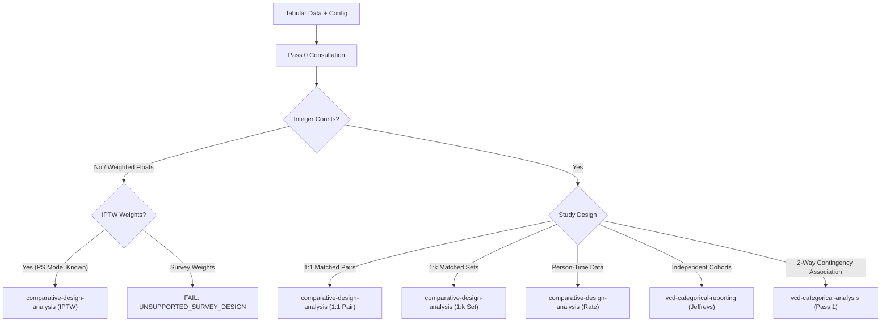

# Technical Design: Comparative Evidence Reporting v3

## 1. Context and Architectural Principles

This document formalizes the architecture for comparative statistical evidence analysis within `agentic-evidence-analysis`. The design establishes a rigorous separation across seven conceptual layers:
\[
\boxed{
\begin{matrix}
\text{Domain Context} & \text{(Safety / RWD / Prescription)} \\
\ne & \\
\text{Study Design} & \text{(Independent / 1:1 Matched / 1:k Matched / IPTW / Person-Time)} \\
\ne & \\
\text{Inference Model} & \text{(Beta-Binomial / Dirichlet / Gamma-Poisson / Bootstrap)} \\
\ne & \\
\text{Contrast Metrics} & \text{(RD, Excess/100, RR, Direction Support, Delta Profile)} \\
\ne & \\
\text{Region Resolution} & \text{(Practical-Region Resolution Grade U0–U3)} \\
\ne & \\
\text{Numerical Precision} & \text{(ETI Width, Effective Sample Size, Sample Sizes)} \\
\ne & \\
\text{Human Decision} & \text{(Clinical / Regulatory Review, Historical Precedent Audit)}
\end{matrix}
}
\]

### Core Principles
1. **P-Value & Threshold Independence**: Avoid mechanical thresholding, unadjusted multiplicity acceptance, or single-metric truth scores.
2. **Strict Semantic Decoupling**: Bayesian posterior probabilities and bootstrap resample frequencies SHALL NOT be conflated. The common runtime interface uses the term **uncertainty draws**.
3. **Zero-Event Mathematical Integrity**: A zero-event numerator ($x=0$) is analyzable under proper Bayesian shrinkage. An empty denominator ($n=0$) is strictly unanalyzable. When reference events $x_R = 0$, theoretical expectation $E(RR) = \infty$; the system reports median and 95% ETI, setting `mean = null` and `mean_is_finite = false`.
4. **Summary-First Ephemeral Draws**: To preserve scalability when screening thousands of terms, raw Monte-Carlo draws remain ephemeral by default (`persist_raw_draws: false`). Permanent deliverables consist of summary profiles and audit metadata.
5. **Deterministic Offline Execution**: All analyses execute deterministically without runtime package installation, network dependencies, or local absolute file paths.

---

## 2. Statistical Architecture and Mathematics

### 2.1 Independent Jeffreys Beta-Binomial Model
For unadjusted binary comparisons across independent cohorts (Target $T$ and Reference $R$):
\[
x_g \sim \text{Binomial}(n_g, p_g), \quad g \in \{T, R\}
\]
Prior distribution:
\[
p_g \sim \text{Beta}(0.5, 0.5) \quad (\text{Jeffreys Objective Prior})
\]
Posterior distribution:
\[
p_g \mid x_g, n_g \sim \text{Beta}(x_g + 0.5, \, n_g - x_g + 0.5)
\]
Deterministic Monte-Carlo sampling generates $S$ uncertainty draws: $\{p_T^{(s)}, p_R^{(s)}\}_{s=1}^S$.

### 2.2 Contrast Transformations
From joint uncertainty draws, contrast metrics are derived:
- **Risk Difference (RD)**:
  \[
  RD^{(s)} = p_T^{(s)} - p_R^{(s)}
  \]
- **Excess Events per Natural Unit**:
  \[
  \text{Excess}_{100}^{(s)} = RD^{(s)} \times 100, \quad \text{Excess}_{1000}^{(s)} = RD^{(s)} \times 1000
  \]
- **Relative Risk (RR)**:
  \[
  RR^{(s)} = \frac{p_T^{(s)}}{p_R^{(s)}}
  \]
- **Direction Support**:
  \[
  P(RD > 0) = \frac{1}{S} \sum_{s=1}^S \mathbb{I}(RD^{(s)} > 0)
  \]
  *(For bootstrap models, reported strictly as `bootstrap_support_fraction_rd_gt_zero`)*.

### 2.3 Practical Difference and Region Resolution Grade (U0–U3)
Given an approved non-zero practical threshold $\delta > 0$:
- **Target Excess Region**: $q_T = P(RD > \delta)$
- **Practical Neutral Region**: $q_N = P(|RD| \le \delta)$
- **Reference Excess Region**: $q_R = P(RD < -\delta)$
Invariant: $q_T + q_N + q_R = 1.0$.

The **Practical-Region Resolution Grade** evaluates how decisively the uncertainty distribution falls into one of the three discrete practical regions:
\[
C = \max(q_T, \, q_N, \, q_R)
\]
Mapping:
- **U0 (Decisive Resolution)**: $C \ge 0.95$
- **U1 (Substantial Resolution)**: $0.80 \le C < 0.95$
- **U2 (Moderate Resolution)**: $0.60 \le C < 0.80$
- **U3 (Indeterminate Resolution)**: $C < 0.60$

> [!IMPORTANT]
> U-grade measures posterior resolution among prespecified practical-difference regions. It is **not** a generic measure of sampling precision, clinical severity, or data quality.

Continuous numerical precision is reported separately via:
- `rd_eti_width`: $q_{0.975}(RD) - q_{0.025}(RD)$
- `log_rr_eti_width`: $q_{0.975}(\log RR) - q_{0.025}(\log RR)$
- `effective_sample_size`: Design-specific ESS.

When `primary_delta` is `null` (`mode: "none"`), practical region classification and associated cell hues are disabled. The system still reports direction support and an informative, configurable **Delta Profile Matrix** over candidate thresholds.

### 2.4 Person-Time Incidence Rate Model
For exposure data with event count $x_g$ and person-time $T_g$:
\[
X_g \sim \text{Poisson}(\lambda_g T_g)
\]
Under the Jeffreys rate prior $\pi(\lambda_g) \propto \lambda_g^{-1/2}$, the exact posterior under the **shape-rate** parameterization is:
\[
\lambda_g \mid x_g, T_g \sim \text{Gamma}\left(x_g + 0.5, \, T_g\right)
\]
From rate draws $\{\lambda_T^{(s)}, \lambda_R^{(s)}\}_{s=1}^S$:
- **Incidence Rate Difference (IRD)**: $IRD^{(s)} = \lambda_T^{(s)} - \lambda_R^{(s)}$
- **Incidence Rate Ratio (IRR)**: $IRR^{(s)} = \lambda_T^{(s)} / \lambda_R^{(s)}$

*Limitation*: Simple Poisson rate inference assumes constant hazard and conditionally independent events. Within-subject recurrent event clustering or overdispersion is not resolved by this conjugate model.

---

## 3. Design-Aware Inference Engine

The design-aware engine encapsulates complex observational designs into the logical `comparative-draws-v1` interface:

### 3.1 1:1 Matched-Pair Analysis
Matched pairs with binary outcomes yield a $2 \times 2$ paired contingency table:
\[
\mathbf{n} = (n_{11}, n_{10}, n_{01}, n_{00})
\]
Cell probabilities follow a Dirichlet posterior under Jeffreys-type prior $\boldsymbol{\alpha} = (0.5, 0.5, 0.5, 0.5)$:
\[
\mathbf{p} \mid \mathbf{n} \sim \text{Dirichlet}\left(n_{11} + 0.5, \, n_{10} + 0.5, \, n_{01} + 0.5, \, n_{00} + 0.5\right)
\]
Marginal risks and contrasts:
\[
p_T^{(s)} = p_{11}^{(s)} + p_{10}^{(s)}, \quad p_R^{(s)} = p_{11}^{(s)} + p_{01}^{(s)}, \quad RD^{(s)} = p_{10}^{(s)} - p_{01}^{(s)}
\]
Semantics: `inferential_semantics = "posterior"`.

### 3.2 1:k Matched-Set Analysis
- Resamples entire matched sets atomically with replacement.
- Target estimand is ATT-like (treatment group reference).
- Computes stratum-weighted event proportions per bootstrap replicate.
- Evaluates post-match balance (standardized mean differences, SMD).
- Semantics: `inferential_semantics = "bootstrap"`.

### 3.3 IPTW Propensity Score Analysis
- Executes patient-level bootstrap resampling.
- **PS Model Refitting**: Refits the propensity score model inside *every* bootstrap replicate (`iptw_mode = "refit_ps"`).
- Supported Estimands: Average Treatment Effect (ATE) and Average Treatment Effect on the Treated (ATT).
- Computes stabilized weights $w_i$ and records effective sample size (ESS), maximum weight, and balance diagnostics.
- Issues warning if balance exceeds operational thresholds (e.g. SMD > 0.1) or if replicate failure exceeds configured limits.
- Semantics: `inferential_semantics = "bootstrap"`.

---

## 4. Pass 0 Gateway and Routing Logic

Pass 0 inspects tabular input and generates `routing_decision.json`.



### Routing Invariants & Guards
1. **Survey Weight Guard**: Complex survey sample weights trigger `UNSUPPORTED_SURVEY_DESIGN` and fail fast.
2. **Duplicate Subject Guard**: Pass 0 inspects and quantifies duplicate subject occurrences within PT and SOC. It does not silently deduplicate data; it proposes an approved counting rule (`at_least_one_qualifying_event_per_subject`) and requires user confirmation.
3. **Explicit Delta State**: Pass 0 supports `practical_difference: { mode: "none", primary_delta: null }` as a valid, non-blocking state.

---

## 5. Clinical Safety & Domain Adapters

### 5.1 Clinical Safety (MedDRA) Adapter
- **Primary Reporting Hierarchy**: Primary SOC $\rightarrow$ PT.
- **Deduplication Invariant**: Subjects experiencing multiple distinct PTs under a single SOC are counted exactly once for that SOC. SOC event counts SHALL NOT equal the sum of child PT event counts.
- **Study-Specific vs Pooled**: Study-specific inference is canonical. Pooled aggregations across trials are designated as `descriptive_pooled`, explicitly documenting that trial-level heterogeneity is not modeled.
- **Multiplicity Warning**: Batch screening across hundreds of PTs includes a mandatory narrative disclaimer stating that posterior direction probabilities do not provide automatic familywise error control.

### 5.2 RWD & Prescription Adapters
- Generic parent-child theme mapping (`parent_theme -> item_theme`).
- Domain decorators map statistical fields to domain terminology without altering canonical numerical metrics.

---

## 6. Evidence-Decision Review Engine

The `evidence-decision-review` engine audits concordance between statistical profiles and human expert decisions:
1. **Decision-Label-Free Feature Vectors**: Feature vectors are extracted strictly from objective statistical summaries (`rd_median`, `rd_eti_width`, `direction_support`, sample size, ESS). Clinical verdict codes and decision labels are strictly excluded.
2. **Gower Distance Precedent Retrieval**: Calculates dissimilarity across mixed continuous and ordinal features. When `primary_delta` is `null`, missing practical-region probabilities are safely handled by Gower weighting.
3. **Audit Ledger**: Maintains an `append-only, tamper-evident decision ledger` recording previous state, new state, rationale, JST timestamp, and evidence checksum.
4. **Discordance Notification**: If a provisional decision diverges from historical precedent consensus, the engine emits an advisory flagging the case as a **QA Review Candidate**. It SHALL NOT classify the divergence as an error or automate regulatory actions.

---

## 7. Artifact Layout and Persistence Contract

All skills comply with `evidence-run-layout`:
```text
evidence_runs/<skill_slug>/run_<canonical_id>[_N]/
  ├── run_meta.json                  # Canonical execution metadata
  ├── input_hash.sha256              # Verifiable data provenance
  ├── comparative_evidence.json      # Structured summary metrics
  ├── comparative_summary.csv        # Tabular output
  ├── report.html                    # Self-contained offline dashboard
  └── report.md                      # Human/LLM readable narrative
```
- **Raw Draw Persistence**: `persist_raw_draws` defaults to `false`. Raw draws are held in memory during execution and discarded after contrast derivation, eliminating multi-megabyte JSON bloat.
